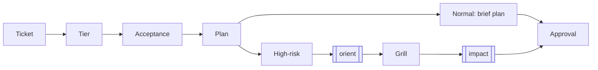
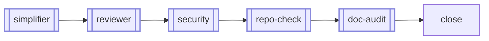

# canon

<div align="center">

### Plan. Build. See it.

Two commands and a local board. Your agent forgets — your repo shouldn't.

[](https://www.npmjs.com/package/canon-skills)
[](LICENSE)


</div>

[](docs/index.html)

One-time setup:

```bash
npx canon-skills@latest          # installs canon to ~/.canon
cd /path/to/your-project
~/.canon/skills.sh add sprint
```

> Installs to `~/.canon` by default — override with `CANON_HOME=<path> npx canon-skills@latest` or `npx canon-skills@latest <path>`.

Daily workflow:

```bash
sprint start "add OAuth login"   # plan the work, create a local ticket
sprint-check                     # open the board in your browser
sprint complete                  # review, verify, close
```

That's the day-to-day surface. Setup wires the tools once; after that, your agent does the work and canon keeps it in your repo — not your prompt history.

## The Board

`sprint-check` reads your `.tickets/` folder, `HANDOFF.md`, and `git log`, and opens a local kanban board in your browser. No account, no remote, no commit — the work is already there. It shows git state, current focus, recent commits, ticket status, and sprint docs at a glance, and tickets link to commits automatically.

<details open>
<summary><strong>Demo</strong></summary>

A full, README-linked tour with refreshed dark-mode clips lives in [`docs/index.html`](docs/index.html).

### Screenshots / clips

#### Board

<a href="docs/index.html#board"></a>

#### Ticket Search

<a href="docs/index.html#board"></a>

#### Ticket Detail

<a href="docs/index.html#ticket-detail"></a>

#### Doc Editing

<a href="docs/index.html#doc-editing"></a>

#### Plan Incomplete

<a href="docs/sprint-check.md#ticket-completeness"></a>

#### Commit Context

<a href="docs/index.html#commit-context"></a>

</details>

Phase-based frameworks give you a multi-command methodology to learn. canon gives you two commands and a board you can see.

**[Full feature tour →](docs/sprint-check.md)** — dark mode, ticket detail, in-place doc editing, commit intelligence, drag-to-update, completeness checks.

## What Makes canon Different

Most agent frameworks tell the model what process to follow. canon gives the
process local memory, visible state, and hard gates.

- **Session continuity.** `HANDOFF.md`, the active ticket, open tickets, and a
  small set of recent or file-related closed tickets give a returning agent
  enough context to resume without replaying the whole project history.
- **Knowledge capture.** When the agent finds a non-obvious constraint mid-build,
  capture records it in `HANDOFF.md ## Discoveries` immediately, before context
  compaction or a session break can lose it.
- **Risk-aware planning.** Simple work stays light. High-impact work runs impact
  analysis before code, and every HIGH risk becomes a required Acceptance test.
- **Visible workflow.** `sprint-check` turns the repo-local state into a board:
  readiness, search, inline docs, current focus, git status, and commit context
  are inspectable by developers and reviewers.
- **Mechanical close gate.** The CLI refuses to close while Acceptance or Test
  Plan items are unchecked. The agent still owns judgment; canon owns the gate.

## The Two Commands

**`sprint start "<what>"`** — Make your agent plan before it codes.

Creates a ticket, defines acceptance criteria, and writes the plan before touching source. Normal changes stay light; high-risk changes add subsystem mapping, gray-area resolution, five-dimension impact analysis, and adversarial review. The plan lives in `.tickets/<id>/` and survives context resets.

**`sprint complete`** — Block the merge until every box is checked.

Runs the close path: simplify → review → security → repo/doc audit → acceptance check → close. Refuses to proceed while any acceptance or test-plan item is unchecked. The CLI gates the state; the agent verifies the tests and judges whether criteria are met.

Each sprint produces two docs — no more, no less:

| Doc | Contains |
|---|---|
| `acceptance.md` | Done criteria · test plan · QA sign-off |
| `plan.md` | Approach · decisions made along the way |

Both are plain markdown in `.tickets/<id>/` and are injected into the agent's context at every session start — so a context reset or a fresh session never loses the thread. Projects can track that workflow state in git or keep it local; canon itself keeps its working tickets ignored.

**Gated, not vibes.** The CLI owns state: one active sprint at a time, and `sprint complete` refuses to close while any acceptance or test-plan box is still unchecked — a checklist-state check in code, not a judgment call. The CLI gates the boxes; the agent verifies the tests and judges whether criteria are truly met before checking them. The agent owns the judgment — the gate owns the close. The board surfaces the same check early: cards flag `incomplete` in red when criteria or test-plan sections have no real items, and opening the doc shows an inline warning — so problems show up while you're still working, not as a close-time surprise.

## Code Archaeology

**`tkt why <file>`** — Ask why this file was built this way.

Scans `git log` for ticket IDs in commit messages, then reads each ticket's `plan.md` for decisions made during that sprint. When commits predate ticket IDs, it falls back to keyword matching against ticket titles.

```
t-34en  [closed]  Harden sprint-check board against cross-origin reads
  → Dropped CORS; Host allowlist gates every request
t-91r9  [closed]  Clarify close-gate scope: CLI gates checklist, agent verifies
```

Your repo accumulates intent, not just history. A new agent — or you, six months later — can ask *why* before touching anything.

## How Sprint Works

`sprint start` scales planning to the risk:



`sprint complete` gates the close:



Double-bordered nodes are sub-skills the agent runs inside the flow — you don't invoke them. **[Full lifecycle →](docs/sprint-check.md#how-sprint-works)**

## Why

Define your standards once; every project inherits them via `@`-import — Claude Code, Codex, and Pi, in sync. Update the canon repo, every project picks it up on the next session. No copies, no drift, no setup ritual per project. The `efficiency` standard is wired automatically when you register `sprint`. **[How this works →](docs/how-it-works.md)**

Every non-trivial change starts with a ticket. Two docs — `acceptance.md` (done criteria + test plan) and `plan.md` (approach + decisions) — live in `.tickets/<id>/` as plain markdown. A future agent reading that folder knows *why* something was built and what trade-offs were ruled out, not just what the diff says. Your repo accumulates intent, not just history.

canon enforces its own standards. The test suite runs and blocks before every commit — no advisory reminders, no honor system. What ships is what passed.

## Setup

| Tool | Required | For |
|---|---|---|
| Claude Code / Codex / Pi | At least one | running the agent |
| Git | Yes | clone/update canon |
| Node.js ≥ 16 | `npx` install only | install |
| Python 3 | `sprint-check` + hooks | the board |

**Windows 11:** canon's CLI tools are bash scripts — run them inside WSL2 (Ubuntu). See **[fresh-machine-test.md → Windows 11](guides/fresh-machine-test.md#windows-11-wsl2)** for the full setup path.

Register canon in another project:

```bash
~/.canon/skills.sh add sprint          # plan → build → ship (includes wrapup, handoff)
~/.canon/skills.sh add context-check   # optional: context-budget audits
```

- **[Full setup guide →](guides/AI-Agents-Setup.md)** — per-agent wiring, the live-reference model, verification.
- **[Todo walkthrough →](examples/canon-todo-walkthrough)** — the full flow end to end, from empty board to shipped app.
- **[All docs, by what you're doing →](docs/README.md)** — learn, set up, reference, why.

## Contributing

Add or refine a skill — see **[CONTRIBUTING.md](CONTRIBUTING.md)**.

---

> canon /ˈkænən/ — the standard your agent follows across projects.

*Make it canon.*
