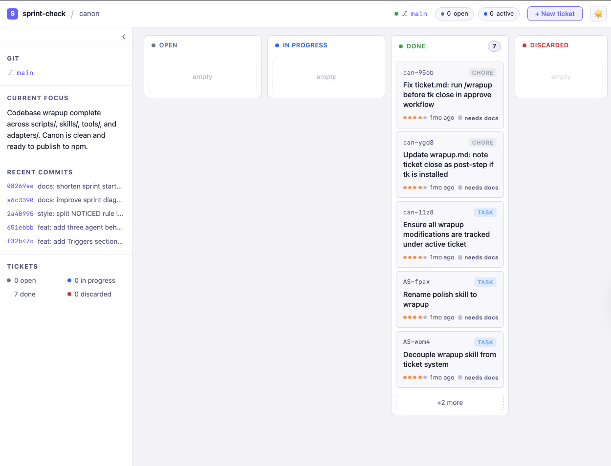
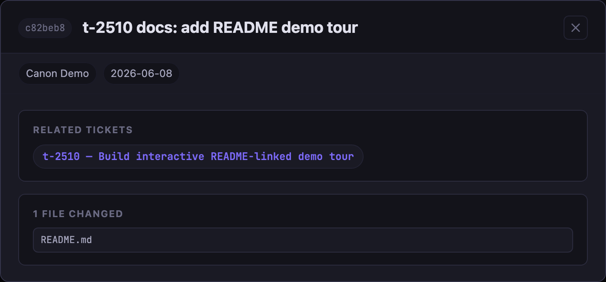
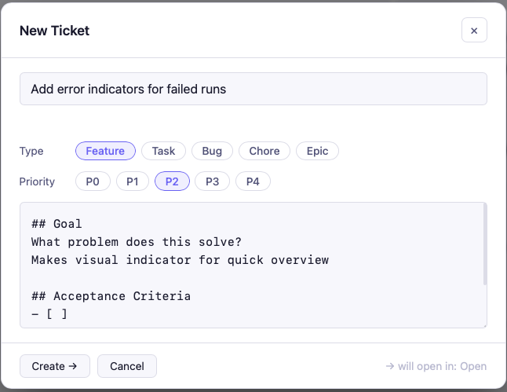
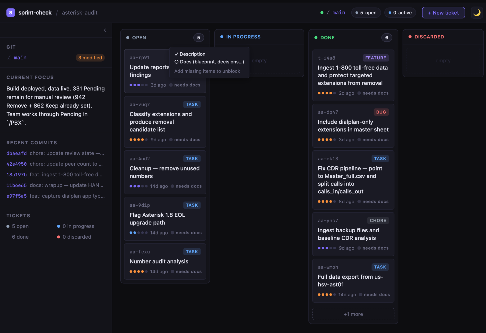

# canon

> Your agents are capable. Canon makes them yours.

Stop re-explaining your standards on every new project. Stop watching Claude drift back to its defaults mid-session. Stop reconfiguring the same quality checks from scratch.

canon is a shared skill library for AI coding agents. Define your standards once. Every project inherits them automatically — Claude Code, Codex, and Pi, all in sync.

```bash
# Install
npx canon-skills@latest

# Wire a project
$SKILLS/skills.sh add sprint
```

That's it. Your agent now plans before it codes, runs a quality gate before closing tickets, and picks up where you left off — every session starts with the full context of what's in progress, what decisions were made, and what was recently shipped.

---

## Why I built canon

Most agent repos I tried gave me homework. A vocabulary of slash commands to memorize. An invocation order that wasn't written down anywhere. A setup ritual to repeat on every new project. The overhead of operating the framework started eating into the time I'd saved by using an agent.

I wanted the opposite: define my standards once, have every agent read them automatically, and never think about configuration again. Open a session — your agent already knows how you work, what's in progress, and what decisions were made last week.

The second problem was visibility. As a solo builder, when I'm deep in a session and need to know what's in flight, I don't want to push commits to GitHub just to see a diff, spin up a Jira board, or maintain a project in three browser tabs that requires a remote repo to even exist. I just want to see my work — right now, in the repo, without ceremony.

That's sprint-check: a kanban board that reads your `.tickets/` folder and `git log` directly, opens in a browser tab, and requires nothing else — no account, no remote, no commit. The same instinct behind canon: the best tool for a solo developer is one that disappears.

---

## Why not just paste instructions into CLAUDE.md?

You can. Most people do — until they have five projects, each with a slightly different copy, all drifting apart. Canon solves this with a **live-reference model**: skills live in one repo and are `@`-imported directly into each project's config. Update once, every project picks it up on the next session start. No copies. No drift. No tribal knowledge trapped in one engineer's config.

---

## What's inside

| Skill | What it does |
|---|---|
| `sprint` | plan → build → ship. Creates a ticket automatically on start, closes it on complete — no manual ticketing. Maps the subsystem, grills gray areas, rates impact, generates a test plan. Approved plans persist to `plan.md` — survives context resets. |
| `wrapup` | Quality pipeline on demand: simplify → review → security, scoped to what you just changed. |
| `code-reviewer` | Structured review across 7 dimensions: correctness, maintainability, security, edge cases, coverage. |
| `security-review` | High-confidence vulnerability detection — traces data flow before flagging anything. |
| `handoff` | Session context that survives agent switches, resets, and context window exhaustion. |
| `efficiency` | Token-efficiency rules for AI agents. Opinionated but battle-tested. |
| `sprint-check` | Local kanban dashboard. Reads `.tickets/`, `HANDOFF.md`, and `git log`. Runs in any browser. |

---

## sprint-check — the local kanban board

No server. No account. No SaaS. Just run:

```bash
sprint-check
```

It reads your project's `.tickets/` folder and `git log` and opens a local kanban board in your browser. Columns update in real time. Tickets link to commits automatically.

Tickets don't need to be created manually. Every `sprint start` creates one. Every `sprint complete` closes it. Open the board mid-session and your work is already there — no entry, no tagging, no context-switching.

### The board



The sidebar shows git state, current focus from `HANDOFF.md`, recent commits, and a ticket summary — everything your agent and you need at a glance.

### Dark mode


Toggle between light and dark with the button in the top-right corner.

### Commit intelligence



Click any commit in the sidebar to see what changed and which ticket it likely belongs to — matched by ticket ID in the commit message or by keyword when no ID is present.

### Create tickets from the board



`+ New ticket` opens a form pre-filled with a structured template. Type, priority, goal, and acceptance criteria — then `Create`. The ticket lands in `.tickets/` as a markdown file, immediately visible to your agent.

### Ticket completeness



Hover a ticket card to see what's missing — description, blueprint, decisions. The board surfaces gaps before they block your agent mid-sprint, with a direct prompt to add what's needed.

---

## The contrast

Most agent frameworks want you to learn a new abstraction layer. Canon is markdown files and one bash script.

| | canon | typical agent framework |
|---|---|---|
| Language | Markdown + bash | Python / TypeScript |
| Install | `git clone` | `pip install` + config |
| Dependencies | None | Many |
| Agent support | Claude Code, Codex, Pi | Framework-specific |
| Customization | Edit a `.md` file | Subclass an abstract base |
| Updates | `git pull` | Version bumps + migration |
| Works offline | Yes | Usually not |

---

## Quick start

**1. Install**

```bash
npx canon-skills@latest
# Clones the repo to ~/Developer/canon and runs setup.
# Existing install? It pulls the latest changes instead.
```

Or clone directly:

```bash
git clone https://github.com/sunitghub/canon.git ~/Developer/canon
~/Developer/canon/skills.sh init
```

**2. Register skills in a project**

```bash
cd /path/to/your-project

$SKILLS/skills.sh add sprint        # plan → build → ship workflow
$SKILLS/skills.sh add wrapup        # quality gate
$SKILLS/skills.sh add handoff       # session context
$SKILLS/skills.sh addall            # or register everything at once
```

**3. Start a session**

Your agent reads the registered skills and follows them — no prompt engineering, no system prompt editing, no copy-pasting.

---

## The CLI

```
skills.sh list                     List all available skills
skills.sh add <skill> [dir]        Register a skill into a project (default: cwd)
skills.sh addall [dir]             Register all skills
skills.sh remove <skill> [dir]     Unregister a skill
skills.sh status [dir]             Show what's registered in a project
skills.sh init                     Wire Claude Code hooks to this canon install
skills.sh help <skill>             Show full documentation for a skill
```

---

## How the live-reference model works

`skills.sh add` writes one line into your project's config — not a copy of the skill, a reference:

```
# CLAUDE.md
@/Users/you/Developer/canon/skills/sprint.md

# AGENTS.md
| sprint | dev | /Users/you/Developer/canon/skills/sprint.md |
```

Claude Code reads `CLAUDE.md` at session start. The `@` prefix tells it to load the referenced file in full — which is the live skill from the canon repo. When canon updates, the next session picks up the change automatically. No re-registration.

Configuration is living, not static. Conventions learned during a sprint flow back into `AGENTS.md` on close — the codebase teaches the agent, and the agent remembers.

---

## Prerequisites

| Tool | Required | Install |
|---|---|---|
| Claude Code / Codex / Pi | Yes — at least one | [claude.ai/code](https://claude.ai/code) |
| Node.js ≥ 16 | For `npx` install only | [nodejs.org](https://nodejs.org) |
| RTK | No — recommended | `brew install rtk` |

---

## Full setup guide

[`guides/AI-Agents-Setup.md`](guides/AI-Agents-Setup.md) — prerequisites, per-agent wiring, project registration, verification, and the full sprint + wrapup workflow.

---

*Make it canon.*
