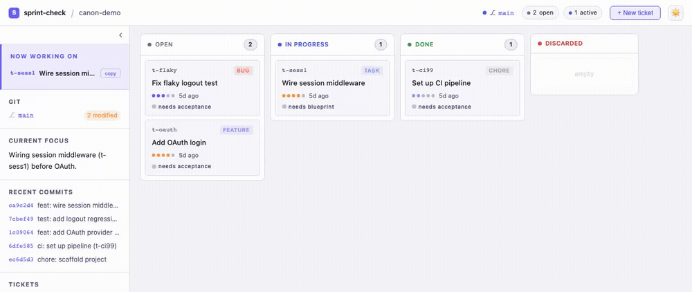
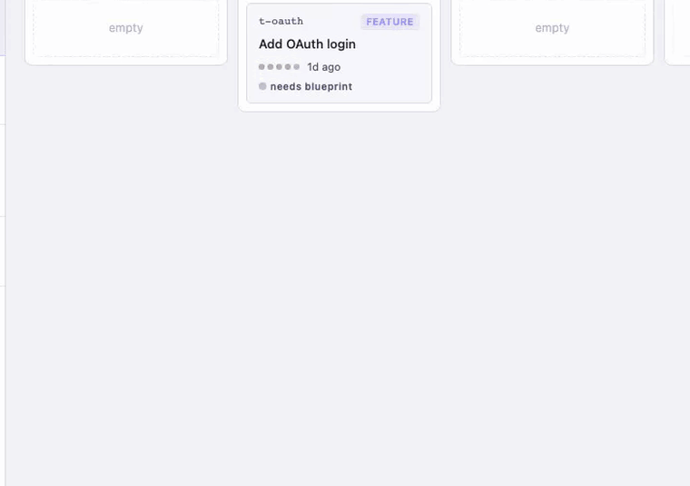
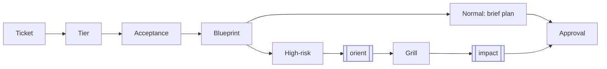
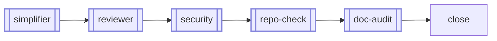

# canon

<div align="center">

### Plan. Build. See it.

Two commands and a local board. Your agent forgets — your repo shouldn't.

[](https://www.npmjs.com/package/canon-skills)
[](LICENSE)


</div>



One-time setup:

```bash
npx canon-skills@latest          # installs canon to ~/.canon
cd /path/to/your-project
~/.canon/skills.sh add sprint
```

> Installs to `~/.canon` by default — override with `CANON_HOME=<path> npx canon-skills@latest` or `npx canon-skills@latest <path>`.

Daily workflow:

```bash
sprint start "add OAuth login"   # plan the work, create a local ticket
sprint-check                     # open the board in your browser
sprint complete                  # review, verify, close
```

That's the day-to-day surface. Setup wires the tools once; after that, your agent does the work and canon keeps it in your repo — not your prompt history.

## The Board

`sprint-check` reads your `.tickets/` folder, `HANDOFF.md`, and `git log`, and opens a local kanban board in your browser. No account, no remote, no commit — the work is already there. It shows git state, current focus, recent commits, ticket status, and sprint docs at a glance, and tickets link to commits automatically.



*Edit acceptance, plan, and decision docs right on the board — checklists, headings, and code from one toolbar, saved straight to your repo. No switch to an editor.*

Phase-based frameworks give you a multi-command methodology to learn. canon gives you two commands and a board you can see.

**[Full feature tour →](docs/sprint-check.md)** — dark mode, ticket detail, in-place doc editing, commit intelligence, drag-to-update, completeness checks.

## The Two Commands

- **`sprint start "<what>"`** — creates a local ticket, has your agent classify the work as normal or high-risk, define acceptance, and write a plan before touching source. Normal changes stay light; high-risk changes add subsystem mapping, gray-area resolution, five-dimension impact analysis, and mitigation tests. The plan lives in `.tickets/<id>/` and survives context resets.
- **`sprint complete`** — runs the close path: simplify → review → security → repo/doc audit → acceptance check → close → commit & push prompt.

A ticket is a folder, not a card — ticket, acceptance, plan, and decisions, all markdown in your repo. When context resets — or a fresh session starts — the agent reads `HANDOFF.md` (auto-injected at session start) and reopens the ticket folder, and picks up where it left off.

**Gated, not vibes.** The CLI owns state: one active sprint at a time, and `sprint complete` refuses to close while any acceptance or test-plan box is still unchecked — a checklist-state check in code, not a judgment call. The CLI gates the boxes; the agent verifies the tests and judges whether criteria are truly met before checking them. The agent owns the judgment — the gate owns the close.

## How Sprint Works

`sprint start` scales planning to the risk:



`sprint complete` gates the close:



Double-bordered nodes are sub-skills the agent runs inside the flow — you don't invoke them. **[Full lifecycle →](docs/sprint-check.md#how-sprint-works)**

## Why

Define your standards once; every project inherits them via `@`-import — Claude Code, Codex, and Pi, in sync. Update the canon repo, every project picks it up on the next session. No copies, no drift, no setup ritual per project. The `efficiency` standard is wired automatically when you register `sprint`.

## Setup

| Tool | Required | For |
|---|---|---|
| Claude Code / Codex / Pi | At least one | running the agent |
| Node.js ≥ 16 | `npx` install only | install |
| Python 3 | `sprint-check` + hooks | the board |

Register canon in another project:

```bash
~/.canon/skills.sh add sprint          # plan → build → ship (includes wrapup, handoff)
~/.canon/skills.sh add context-check   # optional: context-budget audits
```

- **[Full setup guide →](guides/AI-Agents-Setup.md)** — per-agent wiring, the live-reference model, verification.
- **[Todo walkthrough →](examples/canon-todo-walkthrough)** — the full flow end to end, from empty board to shipped app.
- **[All docs, by what you're doing →](docs/README.md)** — learn, set up, reference, why.

## Contributing

Add or refine a skill — see **[CONTRIBUTING.md](CONTRIBUTING.md)**.

---

> canon /ˈkænən/ — the standard your agent follows across projects.

*Make it canon.*
