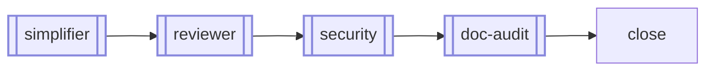
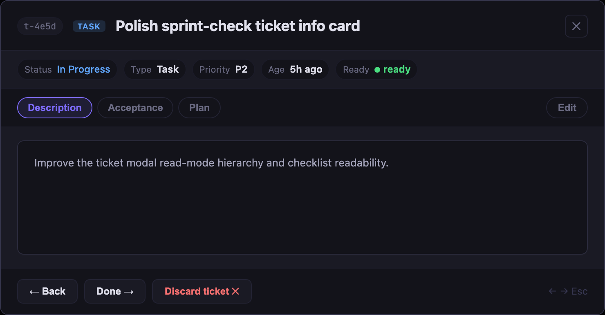

# canon

The average person can hold about four items in active working memory. Most agent sessions need more than that before you write a line of code.

*canon /ˈkænən/ — an established rule or principle; the authoritative standard a team agrees to follow.*

> Your agents are capable. Canon makes them yours.

Canon has one workflow command `sprint`, with `start` and `complete` as lifecycle verbs.

Stop re-explaining your standards on every new project. Stop watching Claude drift back to its defaults mid-session. Stop reconfiguring the same quality checks from scratch. Stop piecing together what's in flight from git log and open tabs.

canon is a shared skill library for AI coding agents. Define your standards once. Every project inherits them automatically — Claude Code, Codex, and Pi, all in sync.

```bash
# Install
npx canon-skills@latest

# Register skills in a project
~/Developer/canon/skills.sh add sprint
```

Skills are live references, not copies. `skills.sh add sprint` adds live imports to your project's agent config:

```
# CLAUDE.md
@/Users/you/Developer/canon/standards/efficiency.md
@/Users/you/Developer/canon/skills/sprint.md

# AGENTS.md
| sprint | dev | /Users/you/Developer/canon/skills/sprint.md |
```

Claude Code resolves it at session start, reading directly from canon. Update canon — every project picks it up on the next `git pull`.

One workflow command covers the full lifecycle: `sprint`. Its lifecycle actions
are normal shell commands from `canon/tools`, so every supported agent calls the
same state machine:

| | |
|---|---|
| `sprint start` | Creates/starts the ticket, records it as active, scaffolds sprint files — then the agent maps the codebase, surfaces ambiguities, rates risk, writes a plan, and waits for approval before touching code. |
| `sprint complete` | Validates sprint checklists before close — the agent runs quality pipeline, doc refresh, ticket close, commit & push prompt. Done. |

Everything else — tickets, active sprint state, session context, quality gates,
handoff across resets — is wired into that lifecycle. You don't learn a command
sequence. You describe what you want to build.

---

## Why canon

Most agent repos I tried gave me homework. A vocabulary of slash commands to memorize. An invocation order that wasn't written down anywhere. A setup ritual to repeat on every new project. The overhead of operating the framework started eating into the time I'd saved by using an agent.

I wanted the opposite: define my standards once, have every agent read them automatically, and never think about configuration again. Open a session — your agent already knows how you work, what's in progress, and what decisions were made last week.

The second problem was visibility. As a solo builder, when I'm deep in a session and need to know what's in flight, I don't want to push commits to GitHub just to see a diff, spin up a Jira board, or maintain a project in three browser tabs that requires a remote repo to even exist. I just want to see my work — right now, in the repo, without ceremony.

That's sprint-check: a kanban board that reads your `.tickets/` folder and `git log` directly, opens in a browser tab, and requires nothing else — no account, no remote, no commit. The same instinct behind canon: the best tool for a developer is one that disappears.

If you're on a team, the problems compound. Each engineer maintains their own agent config, each drifting in a different direction. Onboarding a new teammate means handing them a setup guide that's already out of date. When someone discovers a better pattern mid-sprint, it stays in their head or a Slack thread — not in every future session. Canon gives teams a shared source of truth: fork it to your org, have everyone clone from there, and there's one place where what the team has learned actually lives. One engineer pushes an update — every teammate picks it up on the next `git pull`. No config drift, no stale copies, no setup guide that's already out of date by the time someone reads it.

---

## Why not just paste instructions into CLAUDE.md?

You can. Most people do — until they have five projects, each with a slightly different copy, all drifting apart. Canon solves this with a **live-reference model**: skills live in one repo and are `@`-imported directly into each project's config. Update once, every project picks it up on the next session start. No copies. No drift. No tribal knowledge trapped in one engineer's config.

---

## What's inside

In practice you register one workflow skill: `sprint`. The rest is wired in automatically.

| Skill | What it does | Example |
|---|---|---|
| `sprint` | plan → build → ship. The CLI creates the ticket, tracks the active sprint, scaffolds files, and validates close. The agent maps the subsystem, grills gray areas, rates impact, and generates a test plan. Approved plan written to `.tickets/<id>/plan.md` — survives context resets. | *"sprint start — add OAuth login"* |
| &nbsp;&nbsp;↳ `wrapup` | Quality pipeline at sprint complete (also runs on demand): simplify → review → security → doc refresh, then always prompts to commit & push. | *"sprint complete"* |
| &nbsp;&nbsp;&nbsp;&nbsp;↳ `code-reviewer` | Structured review across 7 dimensions: correctness, maintainability, readability, efficiency, security, edge cases, and test coverage. | *"review my changes"* |
| &nbsp;&nbsp;&nbsp;&nbsp;↳ `security-review` | High-confidence vulnerability detection — traces data flow before flagging anything. | *"security review the auth module"* |
| &nbsp;&nbsp;↳ `handoff` | Session context that survives agent switches, resets, and context window exhaustion. | *auto-runs on session end* |
| `efficiency` | Token-efficiency rules for AI agents. Opinionated but battle-tested. | *loaded automatically via `@` import* |
| `context-check` | Audit the always-on context budget — imports, active skills, hooks, memory. Appends findings to `standards/context-findings.md` on explicit confirmation. | *"check my context budget"* |
| `doc-audit` | Audit user-facing docs for overstated claims, missing prerequisites, and scope inflation. Appends findings to `standards/doc-findings.md` on explicit confirmation. | *"audit the README"* |
| `sprint-check` | Local kanban dashboard. Reads `.tickets/`, `HANDOFF.md`, and `git log`. Runs in any browser. | *"show me what's in flight"* |

---

## How sprint works

One workflow command drives the lifecycle. The CLI handles deterministic state; sub-skills are called by the agent at each stage — no manual orchestration.

### sprint start


### ↓ Build

> The agent runs `capture` when non-obvious discoveries appear — saved to `HANDOFF.md`

### sprint complete



> Double-bordered nodes (`orient`, `impact-analysis`, `capture`, `code-simplifier`, `code-reviewer`, `security-review`, `doc-audit`) are sub-skills loaded from canon automatically — not invoked separately.

---

## Tickets

Every `sprint start` creates a ticket in `.tickets/<id>/ticket.md` and records it as active in `.tickets/ACTIVE`. Every `sprint complete` closes it after required sprint checklist items are resolved. No manual ticketing, no external service, no account.

A ticket is a folder, not a card — it holds the ticket, approved plan, decisions made mid-sprint, and any QA or research notes, all as markdown files. When context resets mid-session, the agent opens the ticket and picks up exactly where it left off.

Most tools track work in a service you have to open. Canon tracks it in your repo, where your agent already is.

---

## sprint-check — the local kanban board

No server. No account. No SaaS. Just run:

```bash
sprint-check
```

It reads your project's `.tickets/` folder and `git log` and opens a local kanban board in your browser. Tickets link to commits automatically.

Tickets don't need to be created manually. Every `sprint start` creates one and every `sprint complete` closes it after validation. Open the board mid-session and your work is already there — no entry, no tagging, no context-switching.

### The board


The sidebar shows git state, current focus from `HANDOFF.md`, recent commits, and a ticket summary — everything you and your agent need at a glance.

### Dark mode


Toggle between light and dark with the button in the top-right corner.

### Ticket detail



Click any ticket to see its status, type, priority, readiness, description, and attached docs in one place.

### Commit intelligence


Click any commit in the sidebar to see what changed and which ticket it likely belongs to — matched by ticket ID in the commit message or by keyword when no ID is present.

### Create tickets from the board


`+ New ticket` opens a form pre-filled with a structured template. Type, priority, goal, and acceptance criteria — then `Create`. The ticket lands in `.tickets/<id>/ticket.md`, immediately visible to your agent.

### Ticket completeness


Hover a ticket card to see what's missing — description, blueprint, decisions. The board surfaces gaps before they block your agent mid-sprint, with a direct prompt to add what's needed.

### Drag to update status


Drag any ticket card between columns to update its status instantly. No clicks, no dropdowns — the board writes the change back to `.tickets/` immediately.

### Attach docs to a ticket


Click `+ New doc` on any ticket to attach a structured document. The board suggests the right type based on ticket status:

| Doc | Suggested when | Use it to |
|---|---|---|
| **Blueprint** | Ticket is open, or in progress with no blueprint yet | Plan approach, scope, and open questions before building |
| **Decisions** | Ticket is in progress or closed | Record choices made, trade-offs, and why alternatives were ruled out — visible to future agents |
| **QA** | Ticket is in progress or closed | Write the test plan and sign-off checklist before closing |
| **Notes** | Any status | Freeform scratchpad — research, links, observations, anything that doesn't fit the others |

Docs land in `.tickets/<id>/` as markdown files and are read automatically by your agent at sprint start.

---

## The contrast

Frameworks like GSD Redux are powerful phase-based systems: initialize, discuss, plan, execute, verify, ship, repeat. That works when you want a full methodology.

Canon optimizes for the common case: most dev work should not require remembering a command sequence. Register `sprint` once. Then use one workflow command:

- `sprint start` to plan and begin work
- `sprint complete` to verify, wrap up, and close

The sub-skills still exist — orient, impact analysis, capture, review, security, doc audit — but the user does not invoke them in order. The agent does.

| | canon | popular frameworks |
|---|---|---|
| Install | One command (`npx canon-skills@latest`) | Separate install per platform |
| Things to learn | One workflow command: `sprint` | Multi-command phase workflow |
| Built with | Markdown + bash | Methodology plugins |
| External services | None | Often tied to platform/plugin state |
| Updates | `git pull` in one repo | Plugin release per platform |
| Agent support | Claude Code, Codex, Pi | Broader (Cursor, Gemini, Copilot + more) |
| State lives in | Your repo (`.tickets/`, `HANDOFF.md`) | Plugin state |
| Audits itself | Yes (`context-check`, `doc-audit`) | No |

---

## Quick start

**1. Install**

```bash
npx canon-skills@latest
# Clones the repo to ~/Developer/canon and runs setup.
# Existing install? It pulls the latest changes instead.
```

Or clone directly:

```bash
git clone https://github.com/sunitghub/canon.git ~/Developer/canon
~/Developer/canon/skills.sh init
```

**2. Register skills in a project**

```bash
cd /path/to/your-project

~/Developer/canon/skills.sh add sprint        # plan → build → ship (includes wrapup, handoff)
```

**3. Start a session**

Your agent reads the registered skills and follows them — no prompt engineering, no system prompt editing, no copy-pasting.

---

## The CLI


`skills.sh help <skill>` prints the full skill documentation in the terminal — discover what any skill does without opening a file.

---

## How the live-reference model works

`skills.sh add` adds live imports to your project's config — not a copy of the skill, references:

```
# CLAUDE.md
@/Users/you/Developer/canon/standards/efficiency.md
@/Users/you/Developer/canon/skills/sprint.md

# AGENTS.md
| sprint | dev | /Users/you/Developer/canon/skills/sprint.md |
```

Claude Code reads `CLAUDE.md` at session start. The `@` prefix tells it to load the referenced file in full — which is the live skill from the canon repo. When canon updates, the next session picks up the change automatically. No re-registration.

Configuration is living, not static. When a sprint surfaces a durable convention, the agent proposes an `AGENTS.md` update before close — the codebase teaches the agent, and the agent remembers.

---

## Prerequisites

| Tool | Required | Install |
|---|---|---|
| Claude Code / Codex / Pi | Yes — at least one | [claude.ai/code](https://claude.ai/code) |
| Node.js ≥ 16 | For `npx` install only | [nodejs.org](https://nodejs.org) |
| Python 3 | For `sprint-check` and hook setup helpers | [python.org](https://python.org) |

---

## Full setup guide

[`guides/AI-Agents-Setup.md`](guides/AI-Agents-Setup.md) — prerequisites, per-agent wiring, project registration, verification, and the full sprint + wrapup workflow.

---

*Make it canon.*
