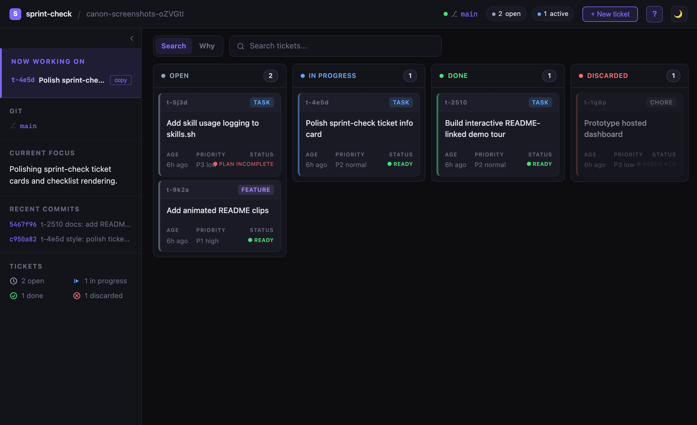
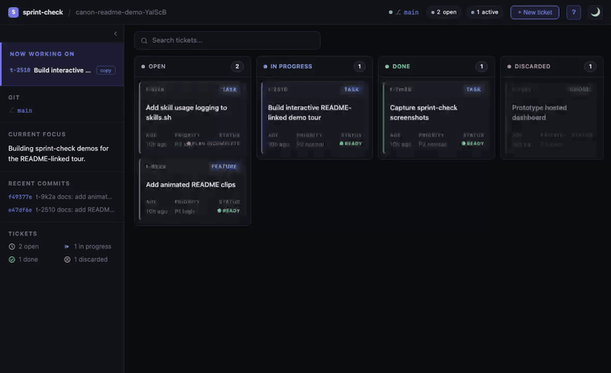
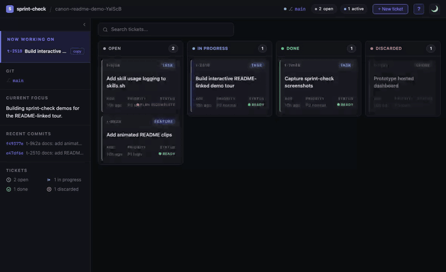
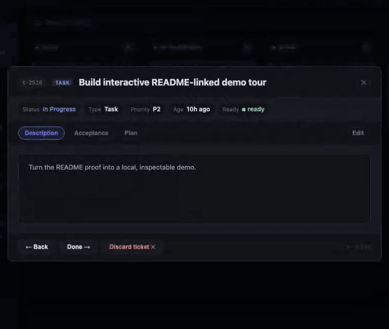
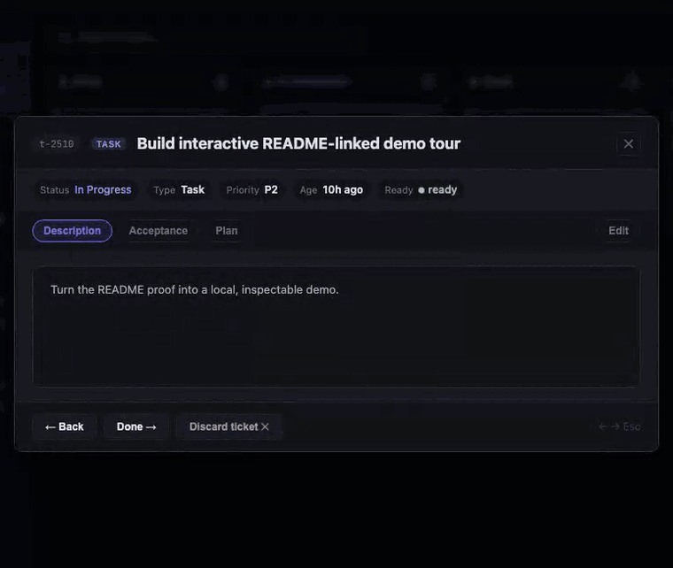
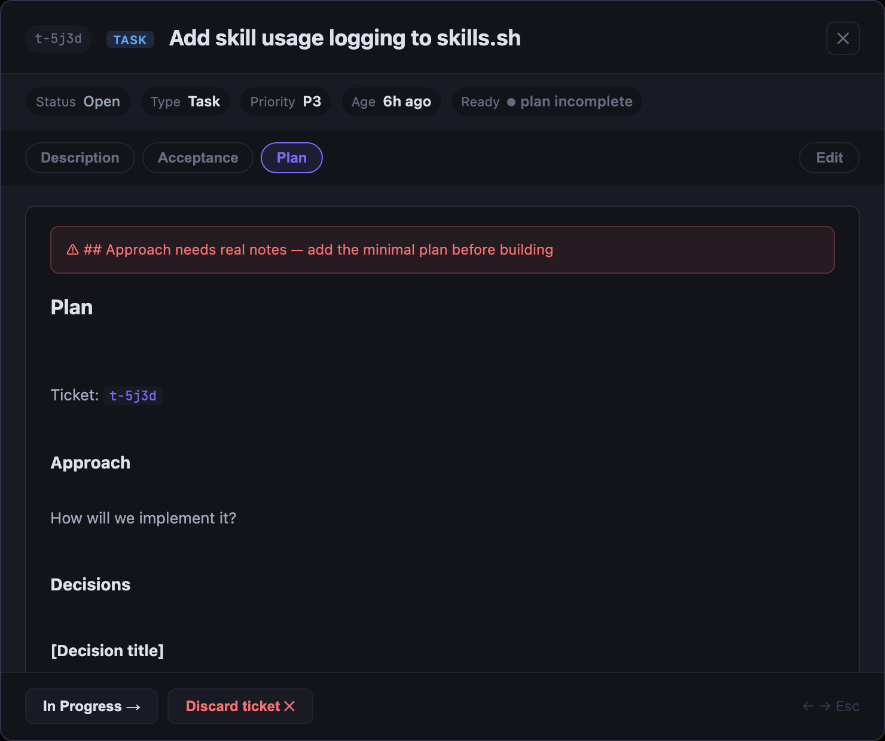
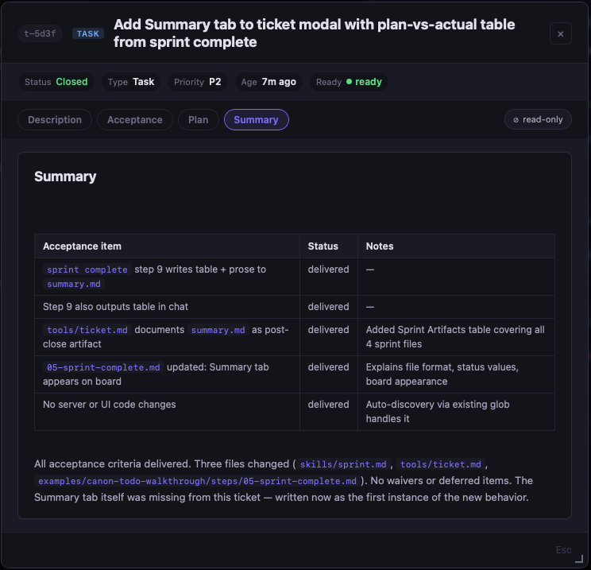
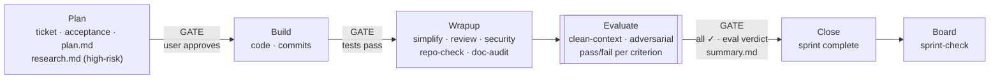

# canon

<div align="center">

### Plan. Build. See it.

Two commands and a local board. Your agent forgets — your repo shouldn't.

*Don't let your agent self-review.*

[](LICENSE)


</div>

[](docs/index.html)

<div align="center"><em>An agent workflow harness.</em></div>

One-time setup:

```bash
# curl|bash — installs to ~/.canon
curl -fsSL https://raw.githubusercontent.com/sunitghub/canon-skills/main/install.sh | bash
# or to a custom path:
# CANON_HOME=/path/to/dir bash <(curl -fsSL https://raw.githubusercontent.com/sunitghub/canon-skills/main/install.sh)

cd /path/to/your-project
~/.canon/tools/skills.sh add sprint
```

If the installer prompts to add `~/.canon/tools` to PATH, answer `y`, then run
the printed `source ~/.zshrc` or `source ~/.bashrc` command before using bare
`skills.sh`, `sprint`, or `sprint-check`.

To uninstall — cleans up agent hooks and removes canon skill symlinks from all registered projects:

```bash
skills.sh uninstall
rm -rf ~/.canon
```

Daily workflow:

> `sprint start` and `sprint-check` require `~/.canon/tools` on your PATH. The installer and `skills.sh add` can add it to your shell rc file, then you need to run the printed `source ...` command or open a new shell.
> Run these from the project root. In practice, ask your AI agent to run `sprint start` and `sprint complete` after it has `cd`'d into that repo; run `sprint-check` when you want the local board.

```bash
sprint start "add OAuth login"   # agent: plan the work, create a local ticket
sprint-check                     # you/agent: open the board in your browser
sprint complete                  # agent: review, verify, close
```

That's the day-to-day surface. Setup wires the tools once; after that, your agent does the work and canon keeps it in your repo — not your prompt history.

Guided walkthrough:

```bash
~/.canon/scripts/copy-todo-walkthrough.sh <dest_folder_path>
cd <dest_folder_path>
~/.canon/tools/skills.sh add sprint
```

Build the Todo walkthrough in a disposable folder when you want to understand
canon end to end without adding local sprint state to the canon checkout.

## What Makes canon Different

The agent that wrote the code is the worst possible reviewer of that code. canon enforces a structural separation that most tools skip.

1. **Adversarial close review.** Before a sprint closes, a fresh subagent — restricted to Read and Bash, with no implementation history — grades each acceptance criterion against the actual code. It writes a machine-generated `evaluator-run-id` as its first action; a `SubagentStop` hook logs the real `agent_id` to `.claude/subagent-runs.jsonl`, making the field auditable rather than self-reported. Each criterion gets a pass, fail, or partial verdict with a `file:line` cite. A fail blocks close.
2. **Delivery receipt.** When a sprint closes, the agent writes a plan-vs-actual table — one row per acceptance criterion, showing whether it was delivered, waived, deferred, or partial. Deviations can't be buried in prose. The **Summary** tab on the board makes this permanent and queryable.
3. **Mechanical close gate.** The CLI refuses to close while Acceptance or Test Plan items are unchecked, `summary.md` is missing, the Wrapup Gates record is absent, or the evaluator run-id field is missing. Gates don't make agents smarter — they make certain failures impossible.

   *The CLI enforces state and close gates; the agent and evaluator judge whether the work behind those gates is true. The board surfaces problems early.*

4. **Parallel subsystem research.** High-risk sprints spawn one Explore subagent per independent subsystem concurrently — wall-clock research time scales with the largest subsystem, not the total.
5. **Session continuity.** `HANDOFF.md`, the active ticket, and recent closed tickets give a returning agent enough context to resume without replaying project history.
6. **Knowledge capture.** Non-obvious constraints found mid-build go to `HANDOFF.md ## Discoveries` immediately — before compaction or a session break can lose them.
7. **Risk-aware planning.** Simple work stays light. High-impact work runs impact analysis before code; every HIGH risk becomes a required Acceptance test.
8. **Queryable intent.** Every sprint records decisions, acceptance criteria, and rejected alternatives as plain markdown — the board surfaces the plan behind a file without touching `git log`.

## The Board

`sprint-check` reads your `.tickets/` folder, `HANDOFF.md`, and `git log`, and opens a local kanban board in your browser. No account, no remote, no commit — the work is already there. It shows git state, current focus, recent commits, ticket status, and sprint docs at a glance, and tickets link to commits automatically.

<details>
<summary><strong>Demo</strong> <sub>— click to expand</sub></summary>

A full, README-linked tour with refreshed dark-mode clips lives in [`docs/index.html`](docs/index.html).

### Screenshots / clips

#### Board

<a href="docs/index.html#board"></a>

#### Ticket Search

<a href="docs/index.html#board"></a>

#### Ticket Detail

<a href="docs/index.html#ticket-detail"></a>

#### Doc Editing

<a href="docs/index.html#doc-editing"></a>

#### Plan Incomplete

<a href="docs/sprint-check.md#ticket-completeness"></a>

#### Eval Report — run by a fresh agent with no implementation history


#### Acceptance & Wrapup Gates


#### Sprint Summary — Plan vs. Actual



Every acceptance criterion, its outcome, and any deviations — permanently on the ticket.

</details>

Compared to common alternatives:
- **CLAUDE.md alone** — injects context but has no lifecycle gate; the agent can skip planning or close without review.
- **Linear + Cursor Rules** — external tracker plus editor conventions; state lives outside the repo and drifts as the project evolves.
- **Plandex** — LLM-native planning and execution, but cloud-dependent and no per-project repo-local audit trail.

**[Full feature tour →](docs/sprint-check.md)** — dark mode, ticket detail, in-place doc editing, commit intelligence, drag-to-update, completeness checks.

## The Two Commands

**`sprint start "<what>"`** — Make your agent plan before it codes.

Creates a ticket, defines acceptance criteria, and writes the plan before touching source. Normal changes stay light; high-risk changes add parallel subsystem mapping (one agent per independent subsystem, run concurrently), gray-area resolution, five-dimension impact analysis, any required human checkpoint, and adversarial review. The plan lives in `.tickets/<id>/` and survives context resets.

**`sprint complete`** — Block close until every box is checked.

Runs the close path: simplify → review → security → repo/doc audit → **evaluator** → acceptance check → close. The evaluator is a fresh subagent — Read and Bash tools only, no implementation history — that grades each acceptance criterion against the actual code. It writes a machine-generated `evaluator-run-id` before grading; the CLI blocks close if the field is absent. A fail or partial verdict also blocks close.

When the sprint closes, the agent writes `summary.md` — a plan-vs-actual table, one row per acceptance criterion, showing whether each was delivered, waived, deferred, or partial. Deviations must appear in the table; the agent can't bury them in prose. The **Summary** tab on the ticket board makes this permanent and queryable: find out whether the spec was fully met without scrolling through chat history.

Each sprint produces up to five docs:

| Doc | Written | Contains |
|---|---|---|
| `acceptance.md` | sprint start | Done criteria · test plan · QA sign-off |
| `plan.md` | sprint start | Approach · decisions made along the way |
| `research.md` | high-risk / brownfield | Objective truth: relevant files, system model, constraints, unknowns (optional) |
| `eval-report.md` | sprint complete (normal+) | Adversarial criterion grades · pass/fail with file:line evidence |
| `summary.md` | sprint complete | Plan-vs-actual table · close prose |

All are plain markdown in `.tickets/<id>/` and are injected into the agent's context at every session start — so a context reset or a fresh session never loses the thread. Projects can track that workflow state in git or keep it local; canon itself keeps its working tickets ignored.

**Gated, not vibes.** The CLI owns state. `sprint complete` refuses to close while any acceptance or test-plan box is unchecked, `summary.md` is missing, or the `## Wrapup Gates` record is absent. The board surfaces the same checks early — cards flag `incomplete` in red before close-time.

Layering is intentional: `sprint complete` is CLI-enforced; planning, audits,
test judgment, and clean-context evaluation are agent-required; `sprint-check`
is board-surfaced visibility while the work is still in progress.

## Code Archaeology

**Why mode** — Ask why this file was built this way.

Switch the `sprint-check` query control from `Search` to `Why`, enter a
project-relative file path, and the board shows the tickets and Plan decisions
behind that file without leaving the kanban view. Keyboard shortcut:
`why:path/to/file`.

<a href="docs/sprint-check.md#ticket-search"></a>

CLI path: `tkt why <file>` scans `git log` for ticket IDs in commit messages,
then reads each ticket's `plan.md` for decisions made during that sprint. When
commits predate ticket IDs, it falls back to keyword matching against ticket
titles.

`git log` tells you what changed. `.tickets/` tells you why — decisions made, alternatives rejected, the acceptance bar set. The board makes it searchable without touching git history. A new agent, or you six months later, gets the full picture before touching a line.

## How Sprint Works



High-risk sprints add orient (with parallel subagents when multiple subsystems are in scope), grill, and impact analysis between Plan and Build. Double-bordered nodes are sub-skills the agent runs — you don't invoke them. **[Full lifecycle →](docs/sprint-check.md#how-sprint-works)**

## Why canon

Define your standards once; every project inherits them via symlinked skills directories — Claude Code, Codex, and Pi, in sync. Update the canon repo, every project picks it up on the next session. No copies, no drift, no setup ritual per project. **[How this works →](docs/setup.md)**

Every non-trivial change starts with a ticket. Each sprint produces up to five docs: `acceptance.md` (done criteria + test plan), `plan.md` (approach + decisions), `eval-report.md` (adversarial criterion grades written at close for non-trivial sprints), and `summary.md` (plan-vs-actual at close). High-risk and brownfield sprints add `research.md`: objective compression of what the system does before any plan is written. A future agent reading that folder knows *why* something was built, what trade-offs were ruled out, and whether the spec was fully met.

canon enforces its own standards. Where Claude Code hooks are wired, the test suite runs and blocks before commit — no advisory reminders, no honor system. What ships is what passed.

Gates don't make agents smarter. They make certain failures impossible — and turn the ones that remain into data.

## Setup

| Tool | Required | For |
|---|---|---|
| Claude Code / Codex / Pi | At least one | running the agent |
| Git | Yes | clone/update canon |
| Bash | Yes | curl installer |
| Python 3 | `sprint-check` + hooks | the board |

**Windows 11:** canon's CLI tools are bash scripts — run them inside WSL2 (Ubuntu). See **[fresh-machine-test.md → Windows 11](docs/fresh-machine-test.md#windows-11-wsl2)** for the full setup path.

Register canon in another project:

```bash
~/.canon/tools/skills.sh add sprint          # plan → build → ship (includes wrapup, handoff)
~/.canon/tools/skills.sh add context-check   # optional: context-budget audits
```

- **[Full setup guide →](docs/setup.md)** — install, hook wiring, skill lifecycle, reference commands.
- **[Production incident playbook →](docs/production-incident-playbook.md)** — Detect → Diagnose → Contain → Fix → Prevent. The five-stage protocol for when an AI agent misbehaves in production.
- **[Todo walkthrough →](examples/canon-todo-walkthrough)** — copy it to a disposable folder and walk the full flow, from empty board to shipped app.
- **[check-offline skill example →](examples/check-offline)** — a worked skill + evals example: scans HTML prototypes for CDN dependencies that break offline.

## Contributing

Add or refine a skill — see **[CONTRIBUTING.md](CONTRIBUTING.md)**. For the full skill authoring lifecycle (lint → eval → register), see **[docs/agent-playbook.md → Skill lifecycle](docs/agent-playbook.md#skill-lifecycle)**.

---

> canon /ˈkænən/ — the standard your agent follows across projects.

*Make it canon.*
