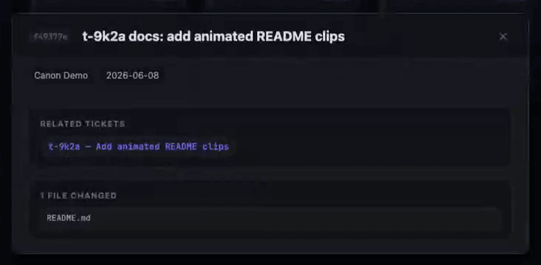
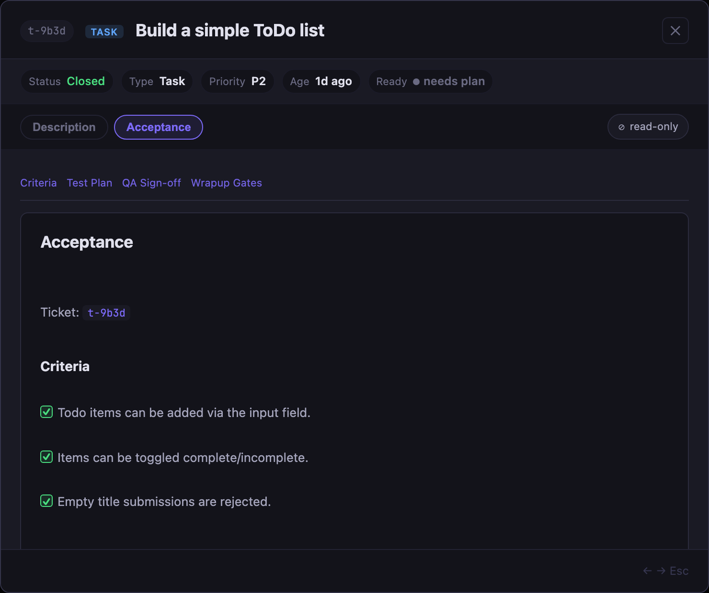
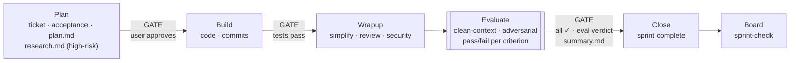

# canon

<div align="center">

### Plan. Build. See it.

Two commands and a local board. Your agent forgets — your repo shouldn't.

[](LICENSE)


</div>

[](docs/index.html)

One-time setup:

```bash
# curl|bash — installs to ~/.canon
curl -fsSL https://raw.githubusercontent.com/sunitghub/canon-skills/main/install.sh | bash
# or to a custom path:
# CANON_HOME=/path/to/dir bash <(curl -fsSL https://raw.githubusercontent.com/sunitghub/canon-skills/main/install.sh)

cd /path/to/your-project
skills.sh add sprint
```

To uninstall — cleans up agent hooks and removes canon @-imports from all registered projects:

```bash
skills.sh uninstall
rm -rf ~/.canon
```

Daily workflow:

> `sprint start` and `sprint-check` require `~/.canon/tools` on your PATH. The curl installer wires this automatically; `skills.sh add` will offer to add it if it's missing.
> Run these from the project root. In practice, ask your AI agent to run `sprint start` and `sprint complete` after it has `cd`'d into that repo; run `sprint-check` when you want the local board.

```bash
sprint start "add OAuth login"   # agent: plan the work, create a local ticket
sprint-check                     # you/agent: open the board in your browser
sprint complete                  # agent: review, verify, close
```

That's the day-to-day surface. Setup wires the tools once; after that, your agent does the work and canon keeps it in your repo — not your prompt history.

Guided walkthrough:

```bash
~/.canon/scripts/copy-todo-walkthrough.sh <dest_folder_path>
cd <dest_folder_path>
skills.sh add sprint
```

Build the Todo walkthrough in a disposable folder when you want to understand
canon end to end without adding local sprint state to the canon checkout.

## What Makes canon Different

Most agent tools tell you what the agent did. canon records what it promised — and whether it delivered.

1. **Delivery receipt.** When a sprint closes, the agent writes a plan-vs-actual
   table: one row per acceptance criterion, showing whether it was delivered,
   waived, deferred, or partial. Deviations can't be buried in prose. The
   **Summary** tab on the board makes this permanent and queryable.
2. **Mechanical close gate.** The CLI refuses to close while Acceptance or Test
   Plan items are unchecked, `summary.md` is missing, or the Wrapup Gates record
   is absent. Gates don't make agents smarter — they make certain failures
   impossible.
3. **Adversarial close review.** Before a sprint closes, a fresh agent — with no
   implementation history — grades the actual code against `acceptance.md`. The
   evaluator starts from a clean context window, so it can't be biased by the
   implementation choices it never saw. Each acceptance criterion gets a pass,
   fail, or partial verdict with a file:line cite. A fail blocks close.
4. **Session continuity.** `HANDOFF.md`, the active ticket, and a small set of
   related closed tickets give a returning agent enough context to resume without
   replaying the whole project history.
5. **Knowledge capture.** When the agent finds a non-obvious constraint mid-build,
   capture records it in `HANDOFF.md ## Discoveries` immediately — before context
   compaction or a session break can lose it.
6. **Risk-aware planning.** Simple work stays light. High-impact work runs impact
   analysis before code, and every HIGH risk becomes a required Acceptance test.
7. **Queryable intent.** Every sprint records decisions, acceptance criteria, and
   rejected alternatives as plain markdown. Ask why a file was built the way it
   was — the board surfaces the plan and decisions behind it without touching
   `git log`.

## The Board

`sprint-check` reads your `.tickets/` folder, `HANDOFF.md`, and `git log`, and opens a local kanban board in your browser. No account, no remote, no commit — the work is already there. It shows git state, current focus, recent commits, ticket status, and sprint docs at a glance, and tickets link to commits automatically.

<details>
<summary><strong>Demo</strong> <sub>— click to expand</sub></summary>

A full, README-linked tour with refreshed dark-mode clips lives in [`docs/index.html`](docs/index.html).

### Screenshots / clips

#### Board

<a href="docs/index.html#board"></a>

#### Ticket Search

<a href="docs/index.html#board"></a>

#### Ticket Detail

<a href="docs/index.html#ticket-detail"></a>

#### Doc Editing

<a href="docs/index.html#doc-editing"></a>

#### Plan Incomplete

<a href="docs/sprint-check.md#ticket-completeness"></a>

#### Commit Context

<a href="docs/index.html#commit-context"></a>

#### Completed Sprint Acceptance



#### Sprint Summary — Plan vs. Actual


Every acceptance criterion, its outcome, and any deviations — permanently on the ticket.

</details>

Compared to common alternatives:
- **CLAUDE.md alone** — injects context but has no lifecycle gate; the agent can skip planning or close without review.
- **Linear + Cursor Rules** — external tracker plus editor conventions; state lives outside the repo and drifts as the project evolves.
- **Plandex** — LLM-native planning and execution, but cloud-dependent and no per-project repo-local audit trail.

**[Full feature tour →](docs/sprint-check.md)** — dark mode, ticket detail, in-place doc editing, commit intelligence, drag-to-update, completeness checks.

## The Two Commands

**`sprint start "<what>"`** — Make your agent plan before it codes.

Creates a ticket, defines acceptance criteria, and writes the plan before touching source. Normal changes stay light; high-risk changes add subsystem mapping, gray-area resolution, five-dimension impact analysis, any required human checkpoint, and adversarial review. The plan lives in `.tickets/<id>/` and survives context resets.

**`sprint complete`** — Block the merge until every box is checked.

Runs the close path: simplify → review → security → repo/doc audit → **evaluator** → acceptance check → close. The evaluator is a fresh agent — no implementation history — that grades each acceptance criterion against the actual code from a clean context window. A fail or partial verdict blocks close. The CLI gates the state; the evaluator and agent verify the work.

When the sprint closes, the agent writes `summary.md` — a plan-vs-actual table, one row per acceptance criterion, showing whether each was delivered, waived, deferred, or partial. Deviations must appear in the table; the agent can't bury them in prose. The **Summary** tab on the ticket board makes this permanent and queryable: find out whether the spec was fully met without scrolling through chat history.

Each sprint produces up to four docs:

| Doc | Written | Contains |
|---|---|---|
| `acceptance.md` | sprint start | Done criteria · test plan · QA sign-off |
| `plan.md` | sprint start | Approach · decisions made along the way |
| `research.md` | high-risk / brownfield | Objective truth: relevant files, system model, constraints, unknowns (optional) |
| `eval-report.md` | sprint complete (normal+) | Adversarial criterion grades · pass/fail with file:line evidence |
| `summary.md` | sprint complete | Plan-vs-actual table · close prose |

All are plain markdown in `.tickets/<id>/` and are injected into the agent's context at every session start — so a context reset or a fresh session never loses the thread. Projects can track that workflow state in git or keep it local; canon itself keeps its working tickets ignored.

**Gated, not vibes.** The CLI owns state. `sprint complete` refuses to close while any acceptance or test-plan box is unchecked, `summary.md` is missing, or the `## Wrapup Gates` record is absent. The board surfaces the same checks early — cards flag `incomplete` in red before close-time.

## Code Archaeology

**Why mode** — Ask why this file was built this way.

Switch the `sprint-check` query control from `Search` to `Why`, enter a
project-relative file path, and the board shows the tickets and Plan decisions
behind that file without leaving the kanban view. Keyboard shortcut:
`why:path/to/file`.

<a href="docs/sprint-check.md#ticket-search"></a>

CLI path: `tkt why <file>` scans `git log` for ticket IDs in commit messages,
then reads each ticket's `plan.md` for decisions made during that sprint. When
commits predate ticket IDs, it falls back to keyword matching against ticket
titles.

`git log` tells you what changed. `.tickets/` tells you why — decisions made, alternatives rejected, the acceptance bar set. The board makes it searchable without touching git history. A new agent, or you six months later, gets the full picture before touching a line.

## How Sprint Works



High-risk sprints add orient, grill, and impact analysis between Plan and Build. Double-bordered nodes are sub-skills the agent runs — you don't invoke them. **[Full lifecycle →](docs/sprint-check.md#how-sprint-works)**

## Why canon

Define your standards once; every project inherits them via `@`-import — Claude Code, Codex, and Pi, in sync. Update the canon repo, every project picks it up on the next session. No copies, no drift, no setup ritual per project. The `efficiency` standard is wired automatically when you register `sprint`. **[How this works →](docs/how-it-works.md)**

Every non-trivial change starts with a ticket. Three required docs — `acceptance.md` (done criteria + test plan), `plan.md` (approach + decisions), and `summary.md` (plan-vs-actual at close) — live in `.tickets/<id>/` as plain markdown. High-risk and brownfield sprints add an optional `research.md`: objective compression of what the system does before any plan is written. A future agent reading that folder knows *why* something was built, what trade-offs were ruled out, and whether the spec was fully met.

canon enforces its own standards. The test suite runs and blocks before every commit — no advisory reminders, no honor system. What ships is what passed.

Gates don't make agents smarter. They make certain failures impossible — and turn the ones that remain into data.

## Setup

| Tool | Required | For |
|---|---|---|
| Claude Code / Codex / Pi | At least one | running the agent |
| Git | Yes | clone/update canon |
| Bash | Yes | curl installer |
| Python 3 | `sprint-check` + hooks | the board |

**Windows 11:** canon's CLI tools are bash scripts — run them inside WSL2 (Ubuntu). See **[fresh-machine-test.md → Windows 11](guides/fresh-machine-test.md#windows-11-wsl2)** for the full setup path.

Register canon in another project:

```bash
skills.sh add sprint          # plan → build → ship (includes wrapup, handoff)
skills.sh add context-check   # optional: context-budget audits
```

- **[Full setup guide →](guides/AI-Agents-Setup.md)** — per-agent wiring, the live-reference model, verification.
- **[Todo walkthrough →](examples/canon-todo-walkthrough)** — copy it to a disposable folder and walk the full flow, from empty board to shipped app.
- **[All docs, by what you're doing →](docs/README.md)** — learn, set up, reference, why.

## Contributing

Add or refine a skill — see **[CONTRIBUTING.md](CONTRIBUTING.md)**.

---

> canon /ˈkænən/ — the standard your agent follows across projects.

*Make it canon.*
