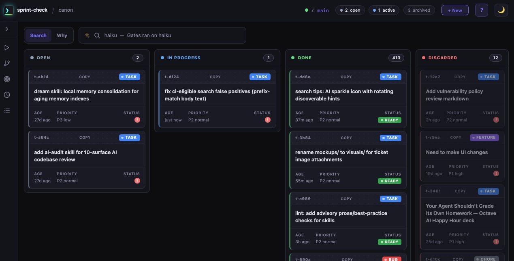
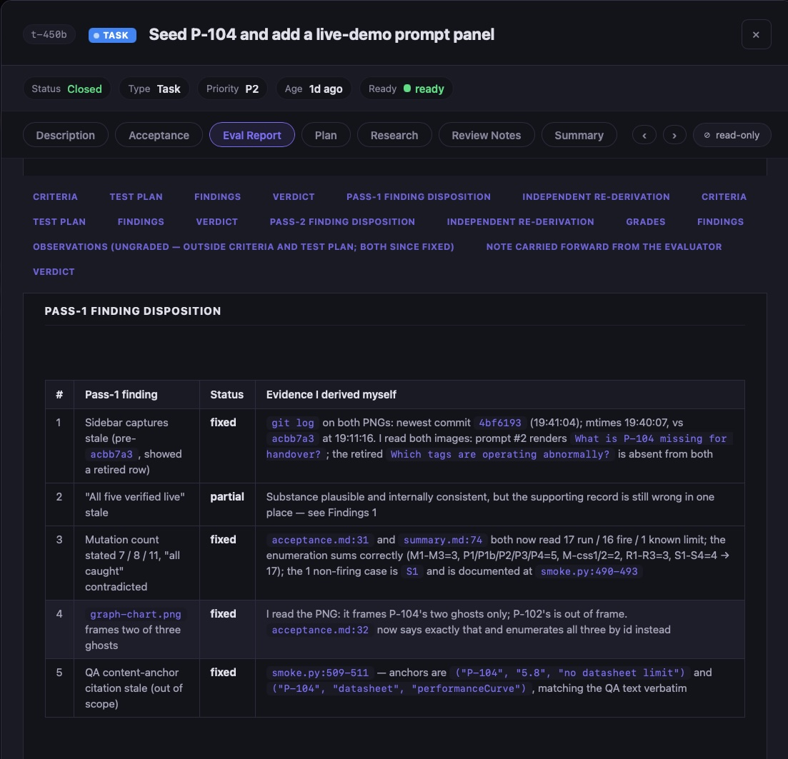
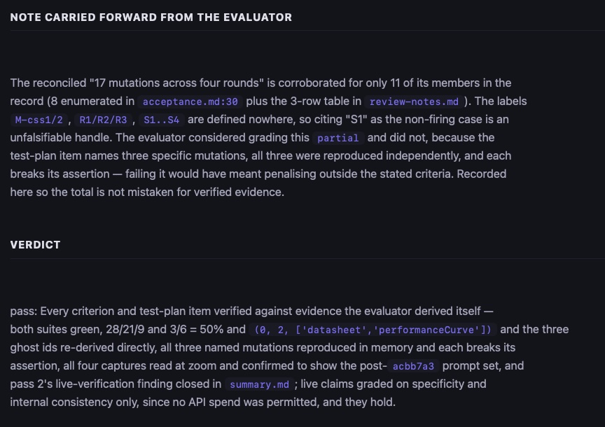
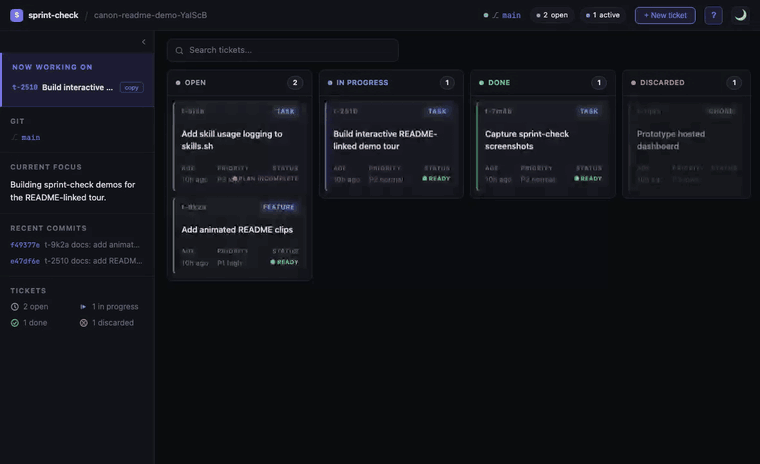
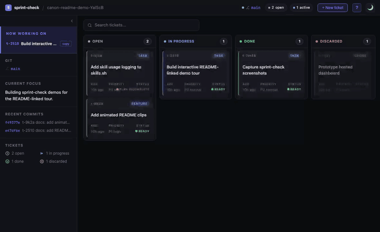
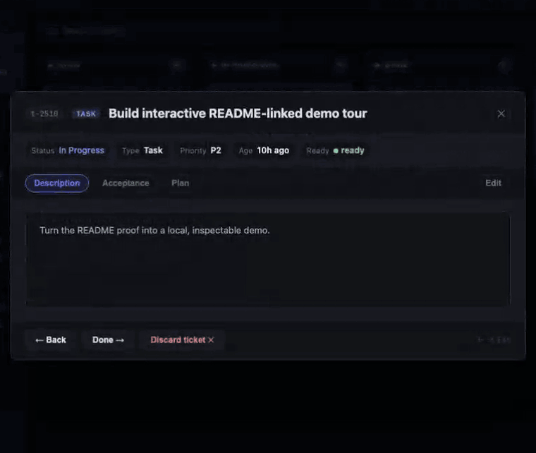
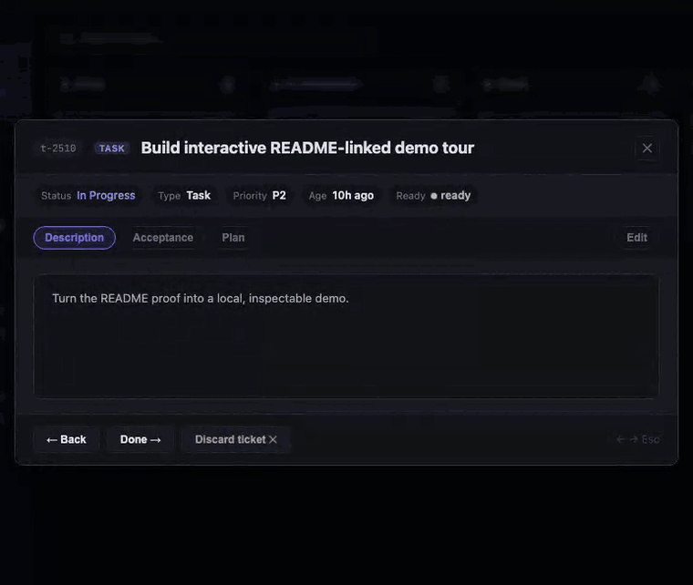
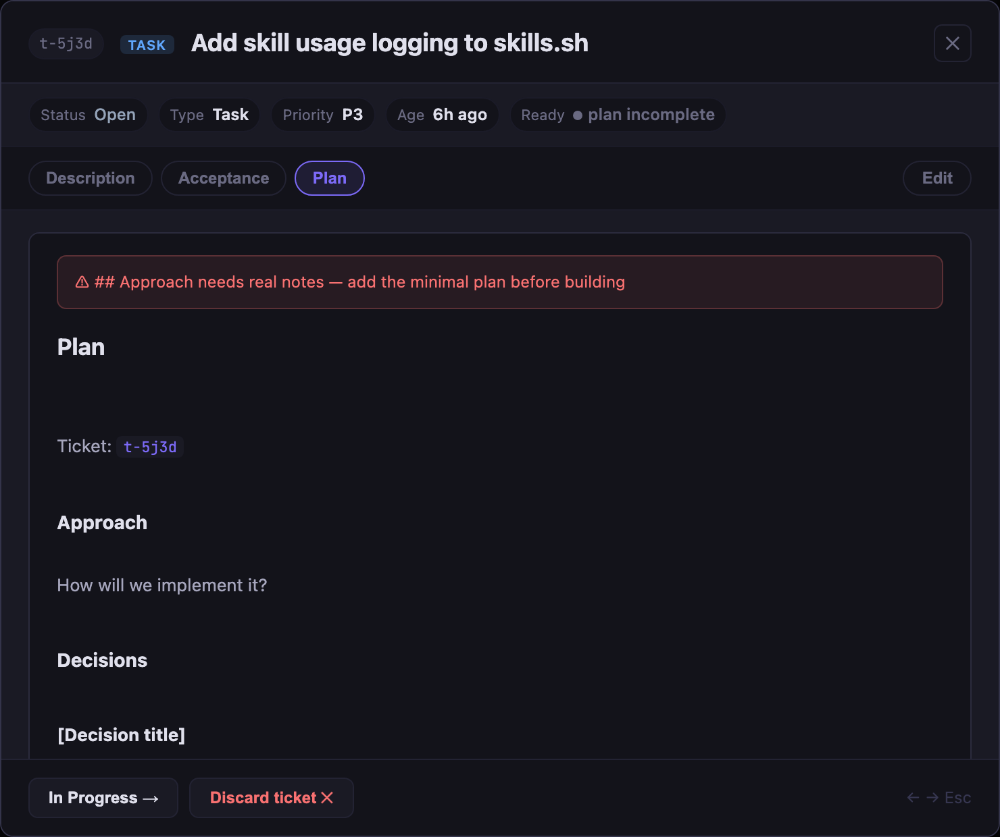
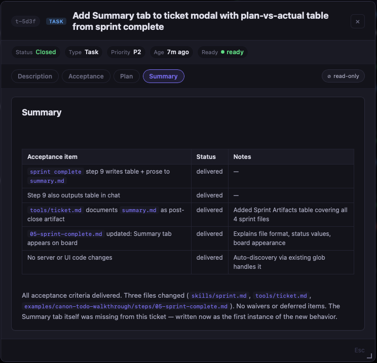
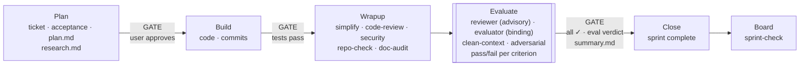

# canon

<div align="center">

### Plan. Build. See it.

Two commands and a local board. Your agent forgets — your repo shouldn't.

*Don't let your agent self-review.*

[](LICENSE)


</div>

[](docs/index.html)

<div align="center"><em>Your agent plans in the repo, and a second agent checks its work.</em></div>

One-time setup:

```bash
# curl|bash — installs to ~/.canon
curl -fsSL https://raw.githubusercontent.com/sunitghub/canon-skills/main/install.sh | bash
# or to a custom path:
# CANON_HOME=/path/to/dir bash <(curl -fsSL https://raw.githubusercontent.com/sunitghub/canon-skills/main/install.sh)

cd /path/to/your-project
~/.canon/tools/skills.sh add sprint
```

If the installer prompts to add `~/.canon/tools` to PATH, answer `y` and run the
printed `source` command before using bare `skills.sh`, `sprint`, or
`sprint-check` — see **[Full setup guide →](docs/setup.md)** for the full steps.

To uninstall — cleans up agent hooks and removes canon skill symlinks from all registered projects:

```bash
skills.sh uninstall
rm -rf ~/.canon
```

Daily workflow:

> `sprint start` and `sprint-check` require `~/.canon/tools` on your PATH. The installer and `skills.sh add` can add it to your shell rc file, then you need to run the printed `source ...` command or open a new shell.
> Run these from the project root. In practice, ask your AI agent to run `sprint start` and `sprint complete` after it has `cd`'d into that repo; run `sprint-check` when you want the local board.

```bash
sprint start "add OAuth login"   # agent: plan the work, create a local ticket
sprint-check                     # you/agent: open the board in your browser
sprint complete                  # agent: review, verify, close
```

That's the day-to-day surface. Setup wires the tools once; after that, your agent does the work and canon keeps it in your repo — not your prompt history.

Guided example: read [`examples/restaurant-bill-split/README.md`](examples/restaurant-bill-split/README.md)
and give its starting prompt to your agent in a disposable folder — it walks through a fresh
sprint end to end without adding local sprint state to the canon checkout.

## What Makes canon Different

**The agent that wrote the code is the worst possible reviewer of that code.** Most harnesses ask the
same agent to check its own work. canon makes that structurally impossible.

1. **A second agent, with no memory of building it.** Before a sprint closes, a fresh subagent —
   Read and Bash only, no implementation history — grades every acceptance criterion against the
   actual code, with a `file:line` cite per verdict. It has no idea why any choice was made, so it
   cannot inherit the assumption that produced the bug. A `fail` blocks the close.
2. **The close gate is mechanical, not advisory.** The CLI refuses to close while any acceptance box
   is unchecked, `summary.md` is missing, the gates record is absent, or the eval verdict isn't
   `pass:`. Any `partial` forces `fail:`. Gates don't make agents smarter — they make certain
   failures impossible.
3. **A delivery receipt you can't write prose around.** Close produces a plan-vs-actual table, one
   row per criterion: delivered, waived, deferred, or partial. Deviations appear in the table or the
   sprint doesn't close.
4. **Decisions outlive the context window.** Plans, rejected alternatives, discovered constraints and
   the acceptance bar live in `.tickets/` as plain markdown — read back in at the next `sprint start`.
   A compaction, a new session, or you in six months all get the same thread.
5. **Cost proportional to risk.** Simple work stays light. The close gates stay mandatory but run on
   a cheaper model when every changed file is low-risk — decided by a structural check on file paths,
   never by the agent's own judgment of its own work.

## What it actually caught

Claims about process are cheap. Here is what the gates found across two sprints on a real project —
an agentic app whose code *and tests* were largely AI-written.

**They never found a wrong number.** Every figure reproduced exactly when the evaluator recomputed it
independently. What they found instead were things a test suite structurally cannot reach.

**A test that could not fail.** The suite checked that a button was disabled when a flag was set:

```python
assert button.disabled == live_only     # both sides read the same list
```

Change the code and the expected answer changes with it — the check agrees with itself, always. It
passed every run until someone broke the code on purpose. The fix is to state the expectation
independently:

```python
offline_safe = {"question A", "question B"}          # written by hand, not derived
assert button.disabled == (q not in offline_safe)
```

**How you find those: break the code on purpose.** If no test complains, the test was decoration.

```
$ # deliberately flip a flag the suite claims to guard
$ run the suite
  all checks passed              ← the bug: it cannot fail

$ # after stating the expectation independently
  FAILED — disabled=False contradicts the offline-safe list      ✓
```

**Safety code nobody had ever run.** Three defects sat in branches written specifically to be
defensive — including a guard that fell back to a call raising the same error it existed to avoid.
All three passed the suite. The reviewer found them by *executing the failure case*, not by reading
the branch, which looked correct.

**Evidence that had quietly gone stale.** Screenshots proving a feature still worked were timestamped
13 minutes *before* the commit that replaced it. Nothing in a test suite checks whether your evidence
still describes your code. The evaluator compared file times against commit times and said so.

**And it doesn't take the fix on trust either.** On the next pass it re-checked every finding it had
raised — note the column header, and that one row is still `partial`:



**The part that makes it trustworthy is that it also declines to over-reach.** Here it found one of my
totals was corroborated for only 11 of its 17 members, and that a label I had cited as evidence was
*"an unfalsifiable handle"*. It considered grading the item `partial`, decided that would mean
penalising outside the stated criteria — and recorded the gap anyway:



> *"Recorded here so the total is not mistaken for verified evidence."*

That sentence is the whole design in one line. A gate that only ever fails things is noise; a gate
that only ever passes things is theatre. This one refused to certify a number **and** refused to fail
the work over a criterion nobody had set.

> The transferable lesson: **"the tests pass" is a claim, and it needs its own evidence.**

## Not just CRUD

Most agent harnesses are demonstrated on todo apps and CRUD endpoints, where "correct" is obvious
and a wrong answer is visibly wrong.

canon's harder workout has been **standards-governed industrial work** — a knowledge-graph agent
answering questions against [CFIHOS](https://www.jip36-cfihos.org/) (the IOGP capital-facilities
handover specification) and ISO 14224 failure taxonomy, where every answer must cite a source and an
uncited one is marked unverified.

That domain punishes a harness differently. Correctness is *semantic*: a plausible, fluent, well-cited
answer can still be wrong because a threshold came from the wrong source. Domain conventions are
non-negotiable in ways no linter knows about. And the failure mode isn't a crash — it's an answer that
looks authoritative and isn't. Adversarial review earns its cost fastest exactly there.

## The Board

`sprint-check` reads your `.tickets/` folder, `HANDOFF.md`, and `git log`, and opens a local kanban board in your browser. No account, no remote, no commit — the work is already there. It shows git state, current focus, recent commits, ticket status, and sprint docs at a glance, and tickets link to commits automatically.

<details>
<summary><strong>Demo</strong> <sub>— click to expand</sub></summary>

A full, README-linked tour with refreshed dark-mode clips lives in [`docs/index.html`](docs/index.html).

### Screenshots / clips

#### Board

<a href="docs/index.html#board"></a>

#### Ticket Search

<a href="docs/index.html#board"></a>

#### Ticket Detail

<a href="docs/index.html#ticket-detail"></a>

#### Doc Editing

<a href="docs/index.html#doc-editing"></a>

#### Plan Incomplete

<a href="docs/sprint-check.md#ticket-completeness"></a>

#### Eval Report — run by a fresh agent with no implementation history


#### Acceptance & Wrapup Gates


#### Sprint Summary — Plan vs. Actual



Every acceptance criterion, its outcome, and any deviations — permanently on the ticket.

</details>

The distinction that matters: context files inject knowledge but gate nothing, and external trackers
keep state outside the repo where it drifts. canon's state is in your repo, and the close gate is
mechanical.

**[Full feature tour →](docs/sprint-check.md)** — dark mode, ticket detail, in-place doc editing, commit intelligence, drag-to-update, completeness checks.

**[Headless CI grading →](docs/headless-ci.md)** — run reviewer/evaluator/security-review against an open PR unattended, via `claude -p`.

## The Two Commands

**`sprint start "<what>"`** — Make your agent plan before it codes.

Creates a ticket, defines acceptance criteria, and writes the plan before touching source. Normal changes stay light; high-risk changes add parallel subsystem mapping (one agent per independent subsystem, run concurrently), gray-area resolution, five-dimension impact analysis, any required human checkpoint, and adversarial review. The plan lives in `.tickets/<id>/` and survives context resets.

**`sprint complete`** — Block close until every box is checked.

Runs the close path: simplify → code-review → security → repo/doc audit → **reviewer** (fresh subagent, advisory) → **evaluator** (fresh subagent, binding) → acceptance check → close. The evaluator — Read and Bash tools only, no implementation history — grades each acceptance criterion against the actual code. It writes a machine-generated `evaluator-run-id` before grading; the CLI blocks close if the field is absent or the verdict isn't `pass`. Any `partial` criterion forces the verdict to `fail` — there's no separate non-blocking `partial` verdict — and either blocks close the same way.

When the sprint closes, the agent writes `summary.md` — a plan-vs-actual table, one row per acceptance criterion, showing whether each was delivered, waived, deferred, or partial. Deviations must appear in the table; the agent can't bury them in prose. The **Summary** tab on the ticket board makes this permanent and queryable: find out whether the spec was fully met without scrolling through chat history.

Each sprint produces up to six docs:

| Doc | Written | Contains |
|---|---|---|
| `acceptance.md` | sprint start | Done criteria · test plan · QA sign-off |
| `plan.md` | sprint start | Approach · decisions made along the way |
| `research.md` | sprint start | Objective truth: relevant files, system model, constraints, unknowns — brief for normal tier, full orient protocol for high-risk/brownfield |
| `review-notes.md` | sprint complete (normal+) | Advisory reviewer findings — code quality, scope, standards — with a YES/NO verdict |
| `eval-report.md` | sprint complete (normal+) | Adversarial criterion grades · pass/fail with file:line evidence |
| `summary.md` | sprint complete | Plan-vs-actual table · close prose |

All are plain markdown in `.tickets/<id>/` and are read into the agent's context by `sprint start` — so a context reset or a fresh session never loses the thread. Projects can track that workflow state in git or keep it local; canon itself keeps its working tickets ignored.

**Gated, not vibes.** The CLI owns state; the agent and evaluator judge whether the work behind the gates is true. The board surfaces the same checks early — cards flag `incomplete` in red well before close-time.

Layering is intentional: `sprint complete` is CLI-enforced; planning, audits,
test judgment, and clean-context evaluation are agent-required; `sprint-check`
is board-surfaced visibility while the work is still in progress.

## Code Archaeology

**Why mode** — Ask why this file was built this way.

Switch the `sprint-check` query control from `Search` to `Why`, enter a
project-relative file path, and the board shows the tickets and Plan decisions
behind that file without leaving the kanban view. Keyboard shortcut:
`why:path/to/file`.

<a href="docs/sprint-check.md#ticket-search"></a>

CLI path: `tkt why <file>` scans `git log` for ticket IDs in commit messages,
then reads each ticket's `plan.md` for decisions made during that sprint. When
commits predate ticket IDs, it falls back to keyword matching against ticket
titles.

`git log` tells you what changed. `.tickets/` tells you why — decisions made, alternatives rejected, the acceptance bar set. The board makes it searchable without touching git history. A new agent, or you six months later, gets the full picture before touching a line.

## How Sprint Works


```mermaid
flowchart LR
    P["Plan\nticket · acceptance · plan.md\nresearch.md"]
    B["Build\ncode · commits"]
    W["Wrapup\nsimplify · code-review · security\nrepo-check · doc-audit"]
    E[["Evaluate\nreviewer (advisory) · evaluator (binding)\nclean-context · adversarial\npass/fail per criterion"]]
    C["Close\nsprint complete"]
    D["Board\nsprint-check"]

    P -->|"GATE\nuser approves"| B
    B -->|"GATE\ntests pass"| W
    W --> E
    E -->|"GATE\nall ✓ · eval verdict\nsummary.md"| C
    C --> D
```

High-risk sprints add orient (with parallel subagents when multiple subsystems are in scope), grill, and impact analysis between Plan and Build. Double-bordered nodes are sub-skills the agent runs — you don't invoke them. **[Full lifecycle →](docs/sprint-check.md#how-sprint-works)**

## Why canon

Define your standards once; every project inherits them via symlinked skills directories — Claude Code, Codex, and Pi, in sync. Update the canon repo, every project picks it up on the next session. No copies, no drift, no setup ritual per project. **[How this works →](docs/setup.md)**

canon enforces its own standards on itself. A git-native pre-commit hook runs the test suite and blocks before commit — no advisory reminders, no honour system. What ships is what passed.

## Setup

| Tool | Required | For |
|---|---|---|
| Claude Code / Codex / Pi | At least one | running the agent |
| Git | Yes | clone/update canon |
| Bash | Yes | CLI tools (`sprint`, `tkt`, `skills.sh`) |
| Python 3 | `sprint-check` on macOS/Linux | the board — Windows uses the Go binary, no Python needed |

**Windows 11 — no WSL required:** install [Git for Windows](https://git-scm.com/download/win), then:
1. Run `install.ps1` once from PowerShell — adds `tools/` to your user PATH.
2. Use **Git Bash** to clone canon and run `git pull` to stay updated.
3. Use **PowerShell** (or any terminal) for everything else: `sprint-check-win` opens the board, tickets can be created and managed through the UI.

For agent-driven workflows (`sprint`, `tkt`, `skills.sh`) run those from Git Bash. See **[fresh-machine-test.md → Windows 11](docs/fresh-machine-test.md#windows-11)** for the full setup.

Register canon in another project:

```bash
~/.canon/tools/skills.sh add sprint          # plan → build → ship (includes wrapup, handoff)
~/.canon/tools/skills.sh add context-check   # optional: context-budget audits
```

- **[Full setup guide →](docs/setup.md)** — install, hook wiring, skill lifecycle, reference commands.
- **[Production incident playbook →](docs/production-incident-playbook.md)** — Surface → Trace → Isolate → Resolve → Harden. The five-stage protocol for when an AI agent misbehaves in production.
- **[Restaurant bill splitter →](examples/restaurant-bill-split)** — a prompt-driven sprint walkthrough: can a fresh evaluator catch plausible-looking but numerically wrong code?
- **[Slugify skill-eval demo →](examples/slugify)** — a worked skill + evals example, no-evals vs. with-evals vs. with-evals-fixed.

## Contributing

Add or refine a skill — see **[CONTRIBUTING.md](CONTRIBUTING.md)**. For the full skill authoring lifecycle (lint → eval → register), see **[docs/agent-playbook.md → Skill lifecycle](docs/agent-playbook.md#skill-lifecycle)**.

---

> canon /ˈkænən/ — the standard your agent follows across projects.

*Make it canon.*
