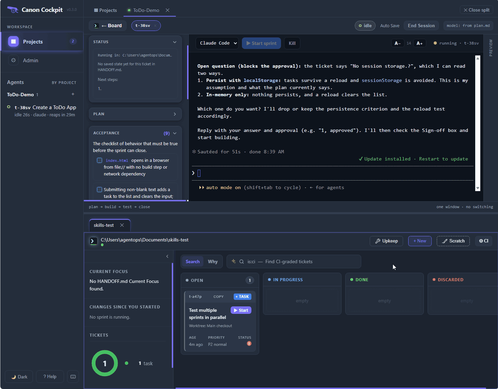
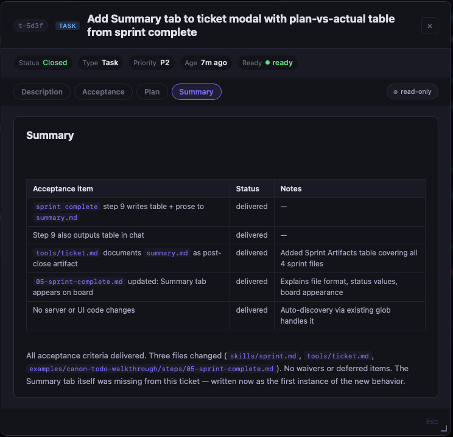
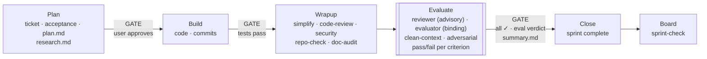

# canon

<div align="center">

### Plan. Build. See it.

Two commands and a local board. Your agent forgets — your repo shouldn't.

*Don't let your agent self-review.*

[](LICENSE)


</div>

[](docs/index.html)

<div align="center"><em>Your agent plans in the repo, and a second agent checks its work.</em></div>

## Install

**macOS / Linux**

```bash
curl -fsSL https://getcanon.dev/install.sh | bash
```

**Windows (PowerShell)** — canon's tools run in Git Bash; the installer adds Git for Windows with winget if it is missing (one admin dialog, where the default button is No: choose **Yes**)

```powershell
irm https://getcanon.dev/install.ps1 | iex
```

Then run `canon`: add a project, create a ticket, press Start. See the **[Quick start →](https://getcanon.dev/docs/quick-start.html)**, or **[docs/setup.md](docs/setup.md)** for requirements, the Windows notes and every option.

Prefer the terminal? Register the sprint skill in a project with `~/.canon/tools/skills.sh add sprint`.

To remove canon, run `canon uninstall` (it stops the Cockpit itself; running agent sessions make it refuse unless you add `--force`) (`--dry-run` prints the plan and changes nothing). It never deletes a git clone with uncommitted or unpushed work. See **[Uninstall →](https://getcanon.dev/docs/cli.html#uninstall-canon)**.

## The Daily Loop

```bash
sprint start "add OAuth login"   # agent: plan the work, create a local ticket
sprint-check                     # you/agent: open the board in your browser
sprint complete                  # agent: review, verify, close
```

Run these from the project root; in practice your agent runs `sprint start` and `sprint complete`. Setup wires the tools once; after that your agent does the work and canon keeps it in your repo — not your prompt history.

## What Makes canon Different

**The agent that wrote the code is the worst possible reviewer of that code.** canon makes self-review structurally impossible.

1. **A second agent, with no memory of building it.** Before a sprint closes, a fresh subagent — Read and Bash only, no implementation history — grades every acceptance criterion against the actual code, with a `file:line` cite per verdict. A `fail` blocks the close.
2. **The close gate is mechanical, not advisory.** The CLI refuses to close while an acceptance box is unchecked, `summary.md` is missing, the gates record is absent or the eval verdict isn't `pass:`. Gates don't make agents smarter — they make certain failures impossible.
3. **A delivery receipt you can't write prose around.** A plan-vs-actual table, one row per criterion: delivered, waived, deferred or partial.
4. **Decisions outlive the context window.** Plans, rejected alternatives, constraints and the acceptance bar live in `.tickets/` as plain markdown, read back at the next `sprint start`. A compaction, a new session, or you in six months all get the same thread.
5. **Cost you control.** Simple work stays light. The close gates stay mandatory but run on the model you set once in Admin > Model Tiers, overridable per ticket.
6. **One set of standards, every project.** Define them once; every project inherits them through symlinked skills directories (Claude Code, Codex and Pi in sync). canon holds itself to the same rule: a git pre-commit hook runs the test suite and blocks before commit.

## See It Work

| Eval Report | Acceptance and Wrapup Gates | Sprint Summary |
|---|---|---|
|  |  |  |
| Graded by an agent with no implementation history | Every box ticked, every gate recorded | Every criterion and its outcome, permanently on the ticket |

**Watch a sprint** (Windows, a demo project, waits sped up): [1. Add a project and plan](https://github.com/sunitghub/canon-skills/releases/download/demo-videos-2026-10/Part-1-add-and-plan.mp4) · [2. Approve and build](https://github.com/sunitghub/canon-skills/releases/download/demo-videos-2026-10/Part-2-approve-build.mp4) · [3. Close the sprint](https://github.com/sunitghub/canon-skills/releases/download/demo-videos-2026-10/Part-3-close.mp4)

## The Cockpit

`canon` opens the Cockpit, a local board that also runs the coding agent in an embedded terminal, so plan → build → close happens without leaving it.

- **Your agent, your choice.** Claude Code, Pi or Copilot CLI, each ticket optionally in its own git worktree, several sessions side by side.
- **A daemon that outlives the tab.** A small local daemon owns the terminals: refresh or close the tab and agents keep working, and one daemon serves all your projects. The Admin page shows its health and every live session.
- **Status at a glance.** Each session is working, done, idle or needs you, on cards, tabs and the sidebar.
- **Save & End.** One click saves the sprint's state to `HANDOFF.md` and ends the session cleanly.
- **Loopback-only and token-gated.** Agent control is never exposed off the machine.

**[Cockpit and board →](docs/sprint-check.md)** · **[Headless CI grading →](docs/headless-ci.md)** (reviewer, evaluator and security review against an open PR, unattended)

## What the Gates Actually Caught

Claims about process are cheap. Here is what the gates found across two sprints on a real project, an agentic app whose code *and tests* were largely AI-written. They never found a wrong number; they found what a test suite cannot reach.

**A test that could not fail.** The suite checked that a button was disabled when a flag was set:

```python
assert button.disabled == live_only     # both sides read the same list
```

Change the code and the expected answer changes with it, so the check agrees with itself, always. The fix is to state the expectation independently, then break the code on purpose: if no test complains, the test was decoration.

- **Safety code nobody had ever run.** Three defects sat in branches written to be defensive; the reviewer found them by *executing the failure case*, not by reading a branch that looked correct.
- **Evidence that had quietly gone stale.** Screenshots proving a feature worked were timestamped 13 minutes *before* the commit that replaced it. The evaluator compared file times against commit times and said so.
- **It also declines to over-reach.** It found a total corroborated for only 11 of its 17 members, and recorded the gap rather than failing a criterion nobody had set: *"Recorded here so the total is not mistaken for verified evidence."*

> The transferable lesson: **"the tests pass" is a claim, and it needs its own evidence.**

**[The full account →](docs/how-it-works.md#what-it-actually-caught)**

## How a Sprint Works


```mermaid
flowchart LR
    P["Plan\nticket · acceptance · plan.md\nresearch.md"]
    B["Build\ncode · commits"]
    W["Wrapup\nsimplify · code-review · security\nrepo-check · doc-audit"]
    E[["Evaluate\nreviewer (advisory) · evaluator (binding)\nclean-context · adversarial\npass/fail per criterion"]]
    C["Close\nsprint complete"]
    D["Board\nsprint-check"]

    P -->|"GATE\nuser approves"| B
    B -->|"GATE\ntests pass"| W
    W --> E
    E -->|"GATE\nall ✓ · eval verdict\nsummary.md"| C
    C --> D
```

High-risk sprints add orient, grill and impact analysis between Plan and Build. The double-bordered node is a reference doc or skill the agent runs; you don't invoke it. **[Full lifecycle →](docs/how-it-works.md)**

## Memory You Can Search

`git log` tells you what changed; `.tickets/` tells you why. **Why mode** on the board (or `tkt why <file>`) shows the tickets and plan decisions behind a file. **Learn mode** (`tkt learn <id>`) distills a closed sprint's findings into an unpromoted `learnings.md` that a fresh reviewer, never the author, promotes to the project's `PROMOTED.md`. **[How learnings flow →](docs/learnings.md)**

## More

- **[Full setup guide →](docs/setup.md)** — install, Windows notes, hook wiring, skill lifecycle, reference commands.
- **[Website →](https://getcanon.dev/docs/quick-start.html)** — Quick start, Cockpit and board, Sprint and gates, Keyboard, [CLI reference](https://getcanon.dev/docs/cli.html), Troubleshooting.
- **[Production incident playbook →](docs/production-incident-playbook.md)** and **[Retrieval architecture playbook →](docs/retrieval-architecture-playbook.md)**

## Contributing

Add or refine a skill — see **[CONTRIBUTING.md](CONTRIBUTING.md)**. For the full skill authoring lifecycle (lint → eval → register), see **[standards/skill-setup-std.md](standards/skill-setup-std.md)**.

---

> canon /ˈkænən/ — the standard your agent follows across projects.

*Make it canon.*
