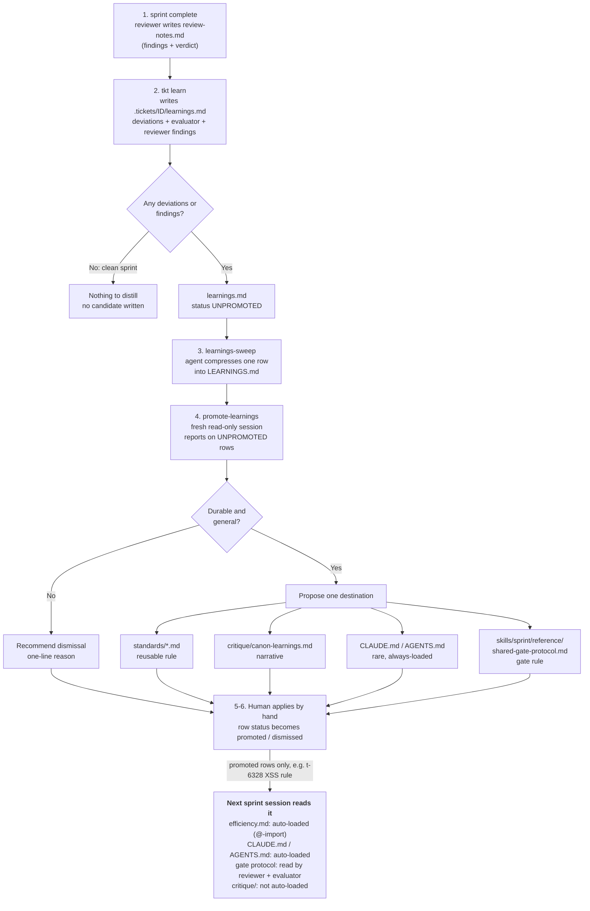
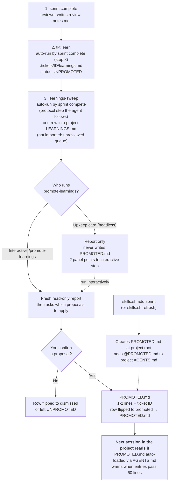

# How canon captures and promotes learnings

Worked example: ticket `t-6328` (board shows when a ticket's status diverges on an unmerged worktree branch).
Everything below is quoted from the real ticket files.

## 1. Mid-sprint: the reviewer catches a real bug

At `sprint complete`, a fresh-context reviewer with no implementation history reads the diff and writes
`.tickets/t-6328/review-notes.md`. Its first two findings:

- `app.html:2807` — `divergenceLine` puts `esc(info.long)` in a double-quoted `title="..."`, but `esc()` escapes
  only `& < >`, not `"`. A git branch name can legally contain `"`, so this is an attribute-breakout XSS.
- `sprint-check-app.spec.js:6432` — the ticket's own hostile-name test injects `` and never
  tries attribute breakout, so it passed straight through the bug.

Verdict: **NO** (advisory, not blocking). The author fixes it (`escAttr`) and the new test is shown to fail
without the fix. The independent evaluator then runs and passes.

## 2. Close: `tkt learn` writes a candidate file

`sprint complete` step 8 runs `tkt learn t-6328`, which writes `.tickets/t-6328/learnings.md`
(status `UNPROMOTED`). It is generated from the sprint's **deviations, evaluator findings and reviewer
findings**. The reviewer part is optional input: `review-notes.md` is absent on bugfix/demo closes, and
`tkt learn` behaves as before then.

For `t-6328` the evaluator found nothing, but the file now has a `## Reviewer findings` section quoting each
finding line from `review-notes.md` (severity/confidence tags kept, each line capped at 400 characters, the
full text stays in `review-notes.md`), plus a `- [ ] Lesson from the reviewer findings above` checkbox.
The XSS finding reaches the candidate mechanically. A reviewer "No findings." with no deviations and no
evaluator findings still writes nothing.

> **History.** Before `t-13b3`, `tkt learn` never opened `review-notes.md`: the `t-6328` candidate read
> "No findings" with blank lessons, and the XSS lesson only reached `LEARNINGS.md` because the closing agent
> hand-wrote it. Section 5's real run below was made against that older behavior.

## 3. Close: `learnings-sweep` adds one row to `LEARNINGS.md`

Right after `tkt learn`, the protocol tells the agent to run the `learnings-sweep` skill for `t-6328` (single-ticket mode; a skill, not a shell command).
It upserts one row into the root `LEARNINGS.md` index — newest first, status `UNPROMOTED`, linked back to the
source file.

- **Automatic in the sense that** every `sprint complete` does it without being asked. It is a protocol step
  the agent follows, not a CLI, hook, or close gate; it is never close-gated.
- **Agent-written.** The one-line Finding cell is compressed by the agent. By the skill's own rule the source
  is the candidate file: a filled-in lesson, else the most load-bearing evaluator or reviewer finding (a
  fixed reviewer defect outranks an evaluator "No findings. Notes…"). For `t-6328` that is the XSS finding,
  now present in the candidate — the agent compresses it rather than reaching outside the skill's source.

The row:

> `t-6328` — No evaluator findings, but the advisory reviewer caught an attribute-breakout XSS the ticket's own
> hostile-input test passed straight through: the board's `esc()` does not escape `"`, so escaped text placed
> inside `title="…"` is injectable — a hostile-name test must include attribute breakout, and be shown to fail
> without the fix. … | `UNPROMOTED`

## 4. Later, fresh session: `promote-learnings` reports on the queue (read-only)

The sprint author must not promote its own learnings — everything looks load-bearing to the agent that just
lived through it. So a separate, fresh reader runs `promote-learnings`:

1. Reads `LEARNINGS.md` and, for every `UNPROMOTED` row, the linked source `learnings.md` in full.
2. Judges each: durable and general (a class of mistake a *different* future sprint would hit), or a one-off?
3. For each durable row, proposes exactly one destination:
   - `standards/<file>.md` — a reusable rule, with example rule text;
   - `critique/canon-learnings.md` — a narrative, with an outline;
   - `CLAUDE.md` / `AGENTS.md` — rarely (always-loaded, so it must say why nothing narrower fits).
4. For each non-durable row, recommends dismissal with a one-line reason.

Output is a report only (Reviewed / Proposals / Next Steps). It never edits `LEARNINGS.md`, `standards/`,
`critique/`, `CLAUDE.md` or `AGENTS.md`. In canon, a human applies the proposals by hand and flips each row's
status away from `UNPROMOTED`. Another project that uses canon has one extra step, covered in
[In a project that uses canon](#in-a-project-that-uses-canon) below.

## 5. What the report actually said (real run over the 10-row queue)

Run by a fresh, read-only agent; it wrote no files. It read each row's `learnings.md`, `review-notes.md` and
`summary.md`, and checked `standards/` and `critique/` for duplicates. This run is what exposed the
reviewer-findings gap that `t-13b3` closes.

- **Where the lesson lived:** in all 10 rows the source `learnings.md` was a stub with blank "Candidate
  lessons". The lesson was in the one-line Finding cell; the evidence was in `review-notes.md` / `summary.md`.
- **`t-6328` was split in two:** the XSS half became a `standards/efficiency.md` testing rule (an escaping
  test must match the sink's context and include a quote-breakout payload); the real-git half became an extra
  example on the existing critique entry "Reproduce Against the Real Thing, Not a Stub".
- **Cross-cutting:** five rows (`t-6a45`, `t-8e73`, `t-2687`, `t-6328`, `t-7d83`) converged on one rule — a new
  guard needs a test that fails when the guard is reverted.
- **Dismissed:** `t-7e36` (one registry-specific gap; the general lesson already exists) and `t-3f4e` (no findings).

## 6. Promotion (a human decision, applied by hand)

Applied after the report, on the user's say-so — the report itself never writes:

| Ticket | Destination |
|---|---|
| t-6a45, t-8e73, t-2687, t-6328, t-7d83, t-4b5a | `standards/efficiency.md` Triggers (7 bullets: guard-revert, hostile input matches sink context, re-validate at point of use, what a fail-closed fall-through writes, re-check after `await`, sweep by concept, parse JSON before comparing) |
| t-15ee | `critique/canon-learnings.md` — new narrative "Read the Gate Before Writing the Cause" |
| t-6328 (real-git half) | `critique/canon-learnings.md` — second instance added to "Reproduce Against the Real Thing" |
| t-4c24 | `skills/sprint/reference/shared-gate-protocol.md` — no-tracked-diff sprints: explicit `Base ref`, verify live state |
| t-7e36, t-3f4e | dismissed |

Then each row's Status in `LEARNINGS.md` flips from `UNPROMOTED` to a code span naming the target, for example
`` `promoted → standards/efficiency.md` `` (a row with two targets lists both, comma-separated), or to `dismissed`.
The backticks make the value highlight in Emacs and other markdown-aware editors, and recording the target means
where a lesson went can be read from the row, without searching git history.

Ticket `t-075e` backfilled this for the 14 rows that were already `promoted` and had evidence of a target (the
ticket ID appears in the destination file, or in `git log -S`). Two older rows, `t-f15b` and `t-4d26`, have no such
evidence and still say only `promoted`.

**How the next sprint session sees it.** Promotion works only through files a session already loads. A rule in
`standards/efficiency.md` reaches every session through the `@` import in `~/.claude/CLAUDE.md`; `CLAUDE.md` /
`AGENTS.md` load at session start; `shared-gate-protocol.md` is read by the fresh reviewer and evaluator at
close. Other `standards/*.md` files and `critique/canon-learnings.md` are not auto-loaded. A lesson promoted
there is available on request but does not steer a session by itself.

**Example: a promoted row, end to end.** The `t-6328` row (status `promoted`) became this bullet in
`standards/efficiency.md`:

> A hostile-input test must match the sink's context: escaped text in `title="…"` needs a quote-breakout payload
> (`a"onmouseover="x`), not just ``.

Because `efficiency.md` is imported by `~/.claude/CLAUDE.md`, the next session that writes an escaping test
starts with that rule already in context, without anyone recalling the incident. A dismissed row such as `t-3f4e`
("no findings") changes nothing: it stays in `LEARNINGS.md` with status `dismissed` and is never loaded.

### Choosing the destination

There are four places a promoted rule can go. The test is *when would a future session make this mistake?*
Pick the narrowest home that is read at that moment: a rule that is always loaded costs tokens on every turn.

| If the lesson... | Destination | Example |
|---|---|---|
| applies to every session, whatever it is doing | `CLAUDE.md` / `AGENTS.md` (rare) | "Fail loudly, surface ambiguity" |
| is applied while writing code, tests, commits or reviews | `standards/efficiency.md` (auto-loaded) | `t-6328`: hostile-input test must match the sink's context |
| only bites at one workflow step or in one skill | that step's reference doc or `SKILL.md` | `t-4c24`: no-tracked-diff sprints need an explicit `Base ref` (`shared-gate-protocol.md`) |
| needs its incident to be understood | `critique/canon-learnings.md` | `t-15ee`: "Read the Gate Before Writing the Cause" |

Rules of thumb: grep the destination first and extend an existing rule instead of adding a second copy; keep
anything always-loaded to one or two lines; split a row that spans two moments (`t-6328` became a standards
rule and a critique example). Only `efficiency.md` is auto-loaded among the `standards/` files, so a rule
placed in another one needs a pointer from where it applies.

### In a project that uses canon

Everything above is canon's own flow, and canon's destinations (`standards/`, `critique/`,
`skills/sprint/reference/`) belong to canon. Another project reaches `skills/` through the `.claude/skills` and
`.agents/skills` links into canon's tree. If that project promoted a lesson into a skill's reference doc, the
lesson would land in canon and reach every project.

So each project that adds the sprint skill gets its own destination (`t-f65c`):

- `skills.sh add sprint` (and `skills.sh refresh`, for projects that added it earlier) creates a `PROMOTED.md` at
  the project root and adds one `@PROMOTED.md` line to the project's `AGENTS.md`. Claude Code then loads it on
  every session.
- `LEARNINGS.md` is not imported. It is an unreviewed queue, and loading it on every session would skip the
  fresh-reader judgment this flow exists for.
- To move the learnings, run `/promote-learnings` in an interactive session. After the report it asks which
  proposals to apply, writes only the ones you confirm into `PROMOTED.md` (one or two lines each, with the ticket
  ID), and flips each row to `` `promoted → PROMOTED.md` ``.
- The Upkeep card runs the same skill headlessly, and there it stays report-only: it never writes
  `PROMOTED.md`. The card's **?** panel points to the interactive step. A green **→ What to do next** link under
  its description jumps to that section, which is also shown in green (`t-f5ab`). The section begins with
  running `/promote-learnings` in an interactive session.

Because `PROMOTED.md` is always loaded, keep it short. The skill warns when its entries pass 60 lines.

## 7. The question: "Claude already has memory. Why a separate learnings flow?"

Fair question, and the two are complementary, not rivals. Claude Code's auto-memory (the per-project
`memory/` folder and its `MEMORY.md` index) and hand-edited `CLAUDE.md` files already carry knowledge
between sessions. They answer a different question from canon's flow.

| | Claude memory / `CLAUDE.md` | canon learnings flow |
|---|---|---|
| **Who writes it** | The working agent itself, mid-session, from what it recalls or what the user said | A reviewer and evaluator with no implementation history find it; `tkt learn` copies the finding text |
| **Who judges "durable?"** | The same agent that just lived through it | A separate fresh session (`promote-learnings`), then a human |
| **Evidence** | A one-line note; the proof is not attached | Each row links to `review-notes.md` / `summary.md` with quoted `file:line` text |
| **Where it lives** | Local to one user's machine (`~/.claude/projects/...`) | Files in the repo (`standards/`, gate protocol), reviewed and versioned like code |
| **Who benefits** | That user, in that Claude Code install | Every contributor, and other harnesses (Codex, Pi) that read the same files |
| **Failure it guards against** | Forgetting a preference or a project fact | Repeating a class of engineering mistake (the XSS test that never tried a quote breakout) |
| **Cost** | Instant, no ceremony | Only fires at sprint close, needs a human step, slower |

**Why canon's flow is more useful for engineering lessons:**

- **Independent evidence, not self-report.** An author tends to see everything it just did as load-bearing.
  Memory is the author's own summary; canon's candidate is what a fresh reviewer found in the diff.
- **A gate before a rule becomes standing context.** Rules that load into every session cost tokens and steer
  behavior everywhere. Requiring "durable and general" plus a human decision keeps that budget for lessons that
  survived scrutiny (this queue: 10 rows became 7 standards bullets, 2 critique entries, 1 gate-protocol note and 2 dismissals).
- **Reviewable and shared.** A promoted rule is a diff in a PR that a teammate can challenge or revert. A
  memory file is private and unreviewed.
- **Testable.** Several of the promoted rules describe tests (for example, a guard needs a test that fails when
  the guard is reverted), so a lesson can be enforced by the suite rather than only remembered.

**What memory does better, and canon does not try to replace:** user preferences, working style, pointers to
external systems, and anything worth keeping between sprints without ceremony. Memory can also go stale, so
recalled entries should be verified before being acted on. Use memory for "how this person works", canon's flow
for "what this codebase taught us".

## Flow at a glance

### Diagram 1: in canon itself

Promotion targets are canon's own files, and a human applies them by hand.

### Diagram 2: in a project that uses canon

Same capture steps, but the project's own files hold the queue, and the only promotion target is the project's
`PROMOTED.md`. Canon's `standards/`, `critique/` and skill references are never written from a project.

