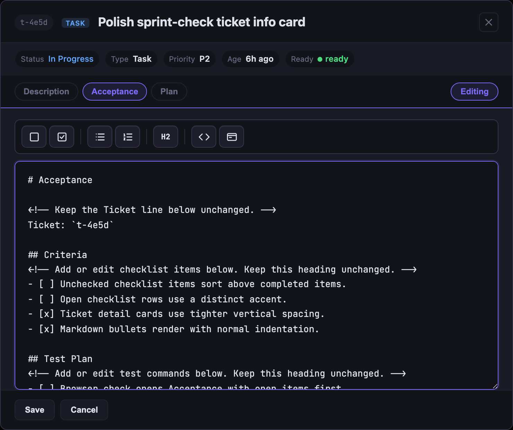

# Sprint-Check — Feature Tour

`sprint-check` opens a local kanban board from your project's `.tickets/` folder and `git log` — no hosted server, no account, no SaaS. Run it from your project root:

```bash
sprint-check
```

See the [README](../README.md#sprint-check--the-local-kanban-board) for the overview. This page walks through each feature with a screenshot.

## Dark Mode


Toggle between light and dark with the button in the top-right corner.

## Ticket Detail


Click any ticket to see its status, type, priority, readiness, description, and attached docs in one place.

## Edit Sprint Docs in Place



Open a ticket to read or edit its Description, Acceptance, Blueprint, Plan, and notes without leaving the board.

## Commit Intelligence


Click any commit in the sidebar to see what changed and which ticket it likely belongs to — matched by ticket ID in the commit message or by keyword when no ID is present.

## Create Tickets from the Board


`+ New ticket` opens a form pre-filled with a structured template. The title suggests a type automatically — feature, task, bug, chore, or epic — while leaving type, priority, and description editable before `Create`. The ticket lands in `.tickets/<id>/ticket.md`, immediately visible to your agent.

## Ticket Completeness


Hover a ticket card to see what's missing — usually description or sprint docs. The board surfaces gaps before they block your agent mid-sprint, with a direct prompt to add what's needed.

## Drag to Update Status


Drag any ticket card between columns to update its status instantly. No clicks, no dropdowns — the board writes the change back to `.tickets/` immediately.

## Attach Docs to a Ticket


Click `+ New doc` on any ticket to attach a structured document. The picker guides the normal sprint path — Acceptance → Blueprint → Plan — and keeps companion docs available when they fit:

| Doc | Add when | Use it to |
|---|---|---|
| **Acceptance** | Ticket has no Acceptance doc yet | Define binary done criteria and the test plan before implementation |
| **Blueprint** | Acceptance exists and the ticket is still being planned | Plan approach, scope, and open questions before building |
| **Plan** | Blueprint exists and the approach is approved | Capture the approved sprint brief before source edits begin |
| **Decisions** | A choice or trade-off should survive the session | Record choices made, trade-offs, and why alternatives were ruled out — visible to future agents |
| **QA** | Testing or closeout needs a checklist | Write the test plan and sign-off checklist before closing |
| **Notes** | Any status | Freeform scratchpad — research, links, observations, anything that doesn't fit the others |

Sprint docs land in `.tickets/<id>/` as markdown files and are read automatically by your agent after sprint start. Templates include comments that mark which headings and ticket ID lines should stay unchanged, and the editor toolbar inserts common Markdown such as checkboxes, bullets, numbered items, headings, inline code, and toggle blocks at the cursor.
