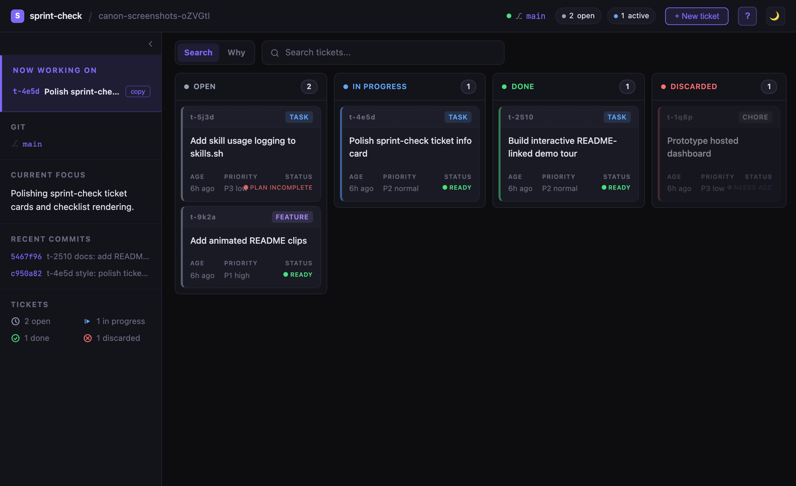
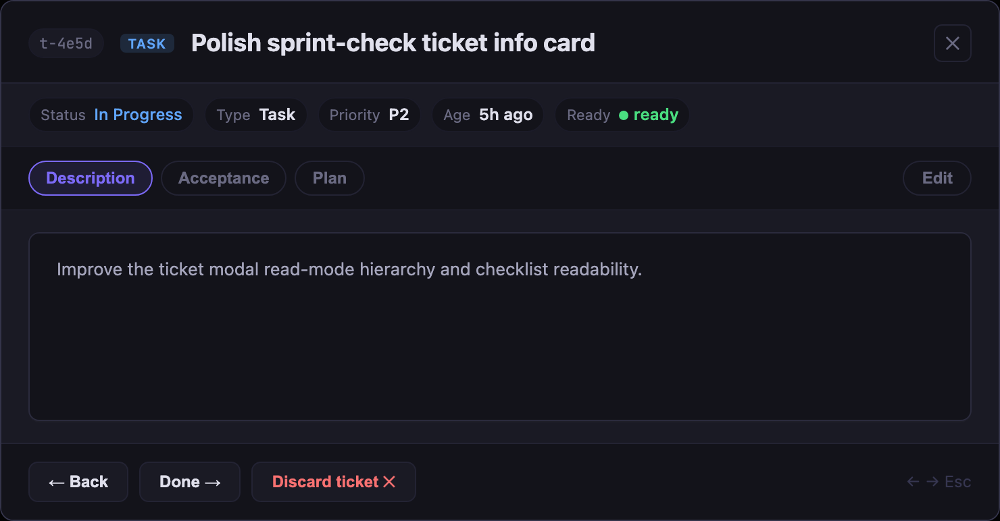
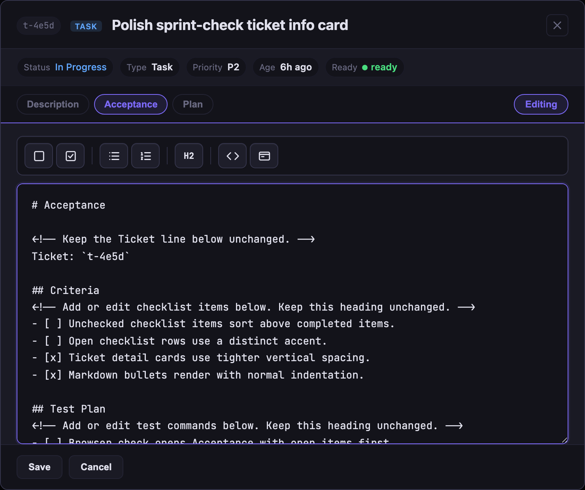
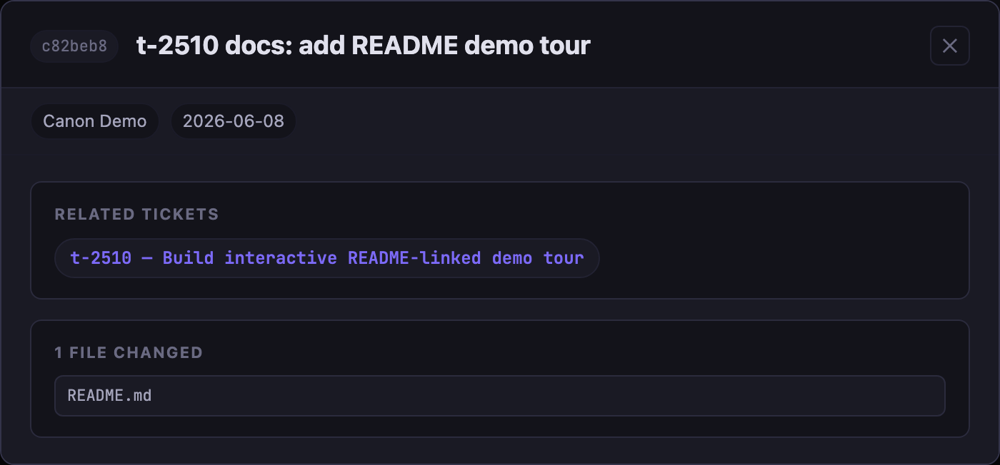
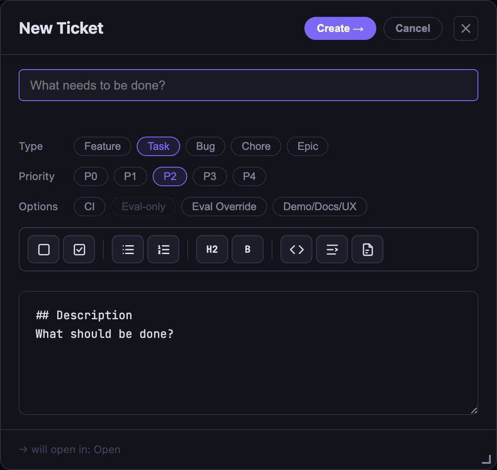
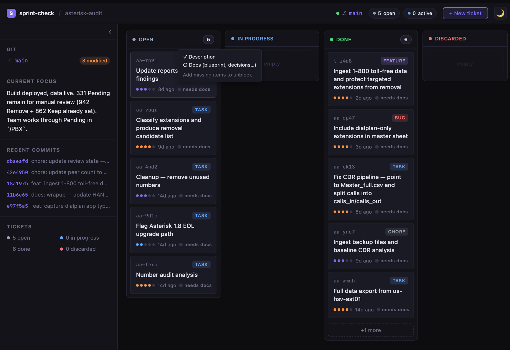
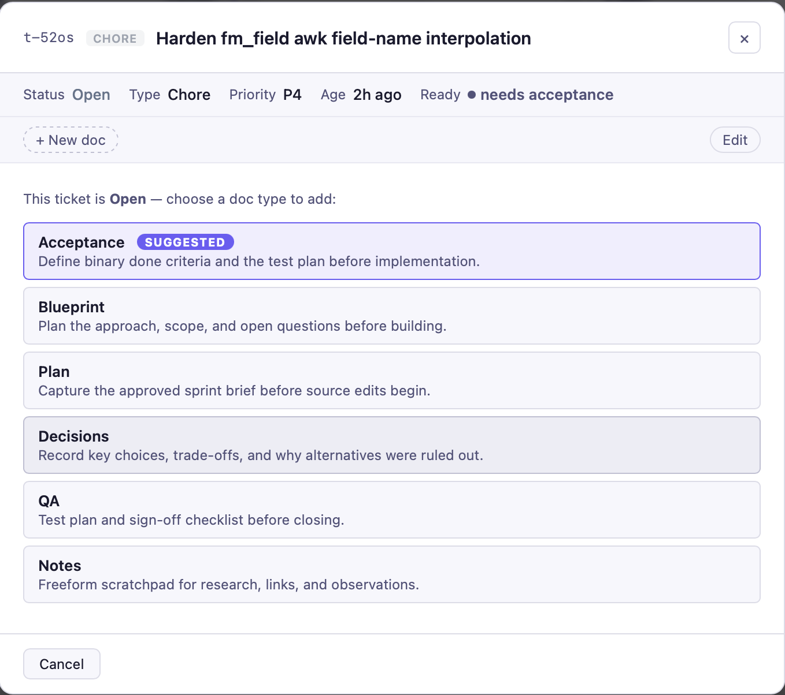

# Sprint-Check — Feature Tour

`sprint-check` opens a local kanban board from your project's `.tickets/` folder and `git log` — no hosted server, no account, no SaaS. Run it from your project root:

```bash
sprint-check
```

See the [README](../README.md#the-board) for the overview. This page walks through each feature with a screenshot.

## Dark Mode



Toggle between light and dark with the button in the top-right corner.

## Ticket Detail



Click any ticket to see its status, type, priority, readiness, description, and attached docs in one place.

Drag the bottom-right corner of the ticket detail modal to resize it when long Description, Acceptance, or Plan content needs more room. Press `Esc` to close the modal.

Closed and discarded tickets open read-only. Their sprint docs remain inspectable, but edit controls are hidden until the work is reopened or a new ticket is created.

## Edit Sprint Docs in Place



Open a ticket to read or edit its Description, Acceptance, and Plan without leaving the board. Docs with two or more `##` sections show a sticky jump bar at the top — click any heading to scroll straight to it.

## Ticket Search


Use the search box above the columns to find tickets by title, id, status, type, priority, description, doc names, or readiness labels such as `plan incomplete`. Matching tickets stay in their original lanes so status context is preserved. Press `Esc` or clear the field to restore the full board.

Switch the segmented control from `Search` to `Why` to ask why a file exists or
changed. Enter a project-relative file path and sprint-check scans git history,
matches tickets, and shows Plan decision excerpts above the board. You can also
type `why:path/to/file` as a shortcut.

## Commit Intelligence



Click any commit in the sidebar to see what changed and which ticket it likely belongs to — matched by ticket ID in the commit message or by keyword when no ID is present.

## Create Tickets from the Board



`+ New` opens a form pre-filled with a structured template. The title suggests a type automatically — feature, task, bug, chore, or epic — while leaving type, priority, and description editable before `Create`. The ticket lands in `.tickets/<id>/ticket.md`, immediately visible to your agent.

## Ticket Completeness



Every card shows a readiness indicator:

- **● ready** (green) — Acceptance and Plan both present; Acceptance has real items under `## Criteria` and `## Test Plan` with no unchecked box anywhere in `acceptance.md` (including `## QA`'s "Tested locally"), Plan has real notes under `## Approach`, and `plan.md ## Sign-off` has a checked approval item.
- **● unchecked items** (red) — Acceptance has real items under `## Criteria`/`## Test Plan`, but at least one box anywhere in the doc (including `## QA`) is still unchecked. This mirrors the CLI's `_gate_no_unchecked` close gate exactly.
- **● incomplete** (red) — Acceptance doc exists but the `## Criteria` or `## Test Plan` section has no checklist items. This mirrors a CLI-enforced `sprint complete` close gate. Opening the Acceptance tab shows an inline warning naming the empty sections.
- **● plan incomplete** (red) — Plan exists but `## Approach` is empty or still contains the template placeholder. This is board-surfaced early warning; the CLI also blocks close if `## Approach` has no real content. A short real approach is enough; Decisions can stay empty for simple work.
- **● needs acc / needs plan / needs signoff** (amber) — the next doc or approval item to add.

Click or hover the indicator for a checklist popover. Acceptance and Sign-off readiness mirror CLI close gates; Plan readiness is an early board signal so untouched templates show up while you're working. The board never judges whether a checked item is true — that remains agent-required verification and evaluator review.

## Drag to Update Status


Drag any ticket card between columns to update its status. The board enforces two gates: dragging to **Done** is blocked if any acceptance criteria checkbox is unchecked (a toast explains why); dragging to **In Progress** without an acceptance doc shows an amber warning but allows the move. All other drags apply immediately.

## Attach Docs to a Ticket



Click `+ New doc` on any ticket to attach a structured document. Two docs cover the full sprint:

| Doc | Add when | Use it to |
|---|---|---|
| **Acceptance** | First | `## Criteria` and `## Test Plan` sections both need checklist items — `sprint complete` blocks without them |
| **Plan** | After acceptance | Capture the approach and record decisions as you build — readable by future agents |

Sprint docs land in `.tickets/<id>/` as markdown files and are read automatically by your agent after sprint start. Templates include comments that mark which headings and ticket ID lines should stay unchanged, and the editor toolbar inserts common Markdown such as checkboxes, bullets, numbered items, headings, inline code, and toggle blocks at the cursor.

Once both Acceptance and Plan exist, `+ New doc` is hidden. Other workflow outputs are handled by the agent or by repo-local context files; they are not extra sprint docs to create from the board.

## How Sprint Works

One workflow command drives the lifecycle. The CLI handles deterministic state; the agent chooses the lightest tier that protects the work — trivial changes skip sprint, a `bugfix` (single logic file plus its covering test) runs eval-only (binding evaluator kept, advisory reviewer skipped), normal changes get a brief ticket/acceptance/plan path, and high-risk changes run the full sub-skill pipeline. The two diagrams on the [README](../README.md#how-sprint-works) show the start and complete flows.

Enforcement layers:

- **CLI-enforced:** ticket state, one active sprint, required sprint files, required checklist items, unchecked boxes, `summary.md`, `## Wrapup Gates`, plan Approach content, plan `## Sign-off` (present and approved), the visual-embed check (any mockup/visual filename referenced in `plan.md`/`acceptance.md` must resolve to a real embed whose target file was copied into the ticket's `visuals/`), the evaluator run-id field being present, and the eval verdict being `pass` (not just present — the verdict line must be `pass:`, and any criterion graded `partial` forces that line to `fail:`, so a non-`pass:` verdict blocks; there is no separate `partial:` verdict line).
- **Agent-required:** tier classification, orientation, gray-area resolution, impact analysis, wrapup review/audit steps, test judgment, acceptance judgment, and invoking clean-context eval.
- **Board-surfaced:** readiness indicators, inline warnings, ticket docs, commit/ticket context, and early visibility before the close gate runs.

Recommended order: create `acceptance.md` first to define Done, then `plan.md` to capture the approach and decisions. `sprint-check` suggests that order in `+ New doc`.

Only those markdown files are sprint docs the user or agent creates. The double-bordered steps in the diagrams are sub-skills used when the tier calls for them: `orient` reads the codebase and feeds findings into the Plan, `impact-analysis` rates risk and feeds the test plan (detailed below), and `capture` writes notable discoveries to `HANDOFF.md` when they appear mid-build. On `sprint complete`, `code-simplifier`, `code-reviewer`, `security-review`, `repo-check`, and `doc-audit` are considered in order, using skip rules for steps that do not apply. Then the `reviewer` (fresh subagent, advisory) and `eval` (fresh subagent, binding) gates run — both with no implementation history — and `eval` grades each acceptance criterion against the actual code from a clean context window; any `partial` criterion forces the verdict to `fail` (there's no separate non-blocking `partial` verdict), and either blocks close. These all run as part of the `sprint` workflow; they are not separate docs to create and not commands the user has to invoke.

### Impact Analysis — five dimensions

For high-risk work, `sprint start` rates the change across five risk dimensions and writes the result to the Plan:

| Dimension | Asks |
|---|---|
| **Audience** | Who and how many does this reach — one user, a tenant, everyone, or external systems? |
| **Reversibility** | Can it be undone, or does it delete, send, or write money permanently? |
| **Blast radius** | If it fails, is the damage contained or does it corrupt shared state? |
| **Trigger paths** | How many UI paths, API callers, or jobs reach the same handler? |
| **Cascade risk** | What downstream consumers — queues, tables, external APIs — react to the change? |

Each dimension is rated HIGH, MEDIUM, or LOW. The ratings aren't advisory: **every HIGH adds required mitigation to the acceptance plan** — a rollback test for permanent operations, a handler-binding grep and server-side auth check for multiple trigger paths, a per-consumer test for cascade risk, an audit-log requirement for broad audience — and the `sprint complete` gate refuses to close while any of those items is still unchecked in `acceptance.md`. The gate checks box state, not the work behind it — the agent verifies each mitigation actually holds before checking it. Normal-tier changes record that no high-risk trigger was found and proceed with a shorter plan.

**Regression carryover.** `sprint start` also scans `.tickets/` for closed tickets that touched the same files this sprint will modify, and adds one regression test per match. Past work that passed stays passing — the test obligation rides along automatically, so a later change can't silently break behavior an earlier ticket established.

## Cockpit — start & drive an agent in the browser (experimental, P1)

`cockpit` opens a single-window surface where you launch and drive a sprint agent
without leaving the browser — no second terminal.

```bash
cockpit            # open the cockpit
cockpit t-8a63     # open it with a ticket prefilled in the Start control
```

- **What it does (P1):** a background daemon (`tools/cockpit-daemon`) owns a real
  **PTY** running an interactive `claude` session on the ticket, and serves an
  embedded terminal (xterm.js) at `/cockpit`. Click **Start sprint** (or prefill a
  ticket) → the agent runs in-page; you type to it there. The agent keeps running
  if you close the tab and reattaches (scrollback replayed) when you reopen;
  **Kill** stops it cleanly with no orphaned process.
- **It is a real agent, with this project's own permissions.** The daemon execs
  `claude` with the ticket as a single prompt argument (`sprint start <id>`) —
  the same thing you would type at a terminal — so it can write files and run
  commands, and it prompts you in the embedded terminal exactly as it would in a
  real one. The daemon **never** overrides permission behavior: no
  `--permission-mode`, no bypass flag. Whatever that project is already
  configured to auto-approve, it auto-approves here too. If the ticket's
  `plan.md` carries a `Gate model:` value, the daemon passes it as `--model`;
  the *parse* is shared with `sprint-headless` (`tools/gate-model.sh`, pinned
  across the two runtimes by `tests/gate-model-parity.sh`), but the disposition on
  a malformed value differs on purpose: the daemon warns on stderr and starts on
  the default model, because a human is sitting in front of the terminal, whereas
  headless CI hard-fails the run. `session` and `default` both mean "no override".
- **"Needs you" status.** Because the agent inherits the project's permissions,
  it can end up blocked on a prompt while you're looking at another tab. The
  status dot turns red and pulses (**needs you**) as soon as that happens, and a
  tab attaching later is told the pending status too — so a reattach can't show
  green over an unanswered prompt. Typing clears it. The signal is Claude Code's
  own `Notification` hook, handed to the session via `claude --settings <file>`
  from the daemon's state dir: **the daemon writes nothing into your project**,
  which keeps `DECISIONS.md`'s 2026-07-02 "zero Claude Code hooks in a project's
  settings" intact. The hook's callback credential lives in a `0600` curl `-K`
  config file, so it never appears in `ps`.
- **Why a daemon:** the `sprint-check` board server is ephemeral and stdlib-only,
  and Go's stdlib has no PTY/WebSocket. The daemon is an isolated Go module
  (canon's one third-party-dep binary — see `DECISIONS.md` 2026-08-23); the board
  server stays pure stdlib.
- **Security:** binds **127.0.0.1 only**; every request checks loopback Host/Origin;
  a boot token gates session start and a per-session token gates stream/input/kill;
  ticket ids are validated `^t-[a-z0-9]{4}$` and exec'd as an argv slice (never a
  shell); tokens travel via a `0600` state file, never argv. Transport is stdlib
  **SSE (output) + POST (input)** — no WebSocket.
- **Platforms:** macOS/Linux and Windows (ConPTY). Runtime-verified on macOS;
  Windows validation is pending a Windows box. The interactive-`claude` spawn
  above is **macOS-only so far** — its behaviour under ConPTY is unverified and
  deliberately deferred.
- **Prerequisite:** `claude` must be on `PATH`. If it isn't, Start fails with the
  exec error surfaced in the terminal rather than hanging.
- **Board-integrated cockpit mode (P3):** every card shows **▶ Start** (OPEN) or
  **▶ Resume** (IN_PROGRESS) — click it to switch the board itself into cockpit
  mode: the kanban lanes collapse to a left ticket rail and an embedded
  terminal takes the center. The board never owns a PTY — it discovers a
  running `cockpit-daemon` via `daemon.json`, or launches one on demand
  (`/api/cockpit` in both `server.py` and `main.go`), with no secret ever
  passed via argv. **Esc / "← Board"** returns to the kanban view; only one
  sprint may be active at a time, so Start is disabled on other cards while a
  session is live. The rail can collapse to a 44px icon strip to maximize the
  terminal; the app-under-test preview slot is present but collapsed (richness
  is follow-up work, `t-b19b`).
- **Rail accordion (P3.1):** the ticket rail shows **Acceptance** and **Test
  Plan** as independent, collapsible accordion sections (both start collapsed).
  Both are **view-only** — no click-to-toggle, no write path to
  `acceptance.md` — so a human watching the agent work can't inadvertently
  check a box that isn't actually verified. The rail **polls** every 5s while
  the cockpit is open, so edits the running agent (or anyone else) makes to
  `acceptance.md` show up without closing/reopening the cockpit.
- **Scope:** P1 (this daemon + standalone `cockpit` launcher), P3 (the board
  integration above), and P3.1 (the rail accordion) are done. The preview pane
  and further visual polish are follow-up work — see `Future/Terminal-In-Board/`
  and tickets `t-8a63`/`t-ddc8`/`t-96a8`.
