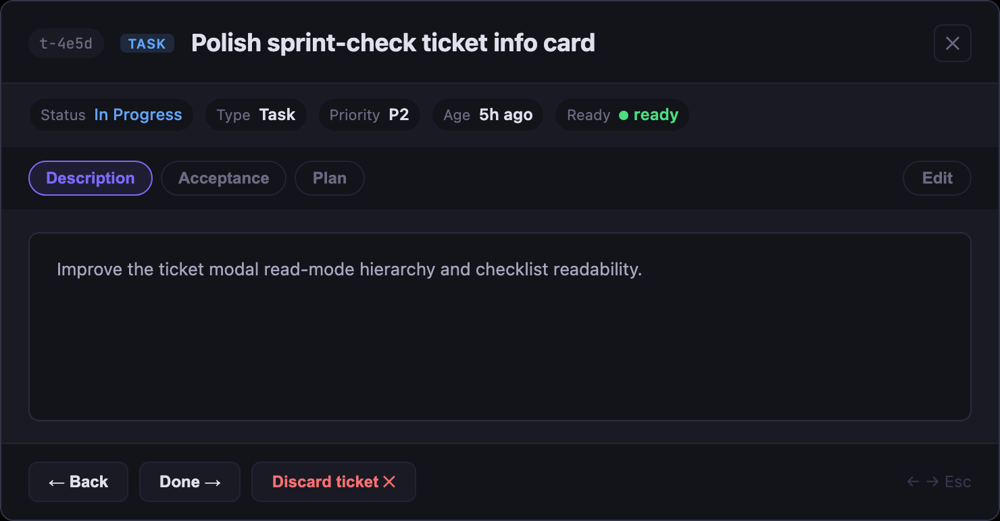
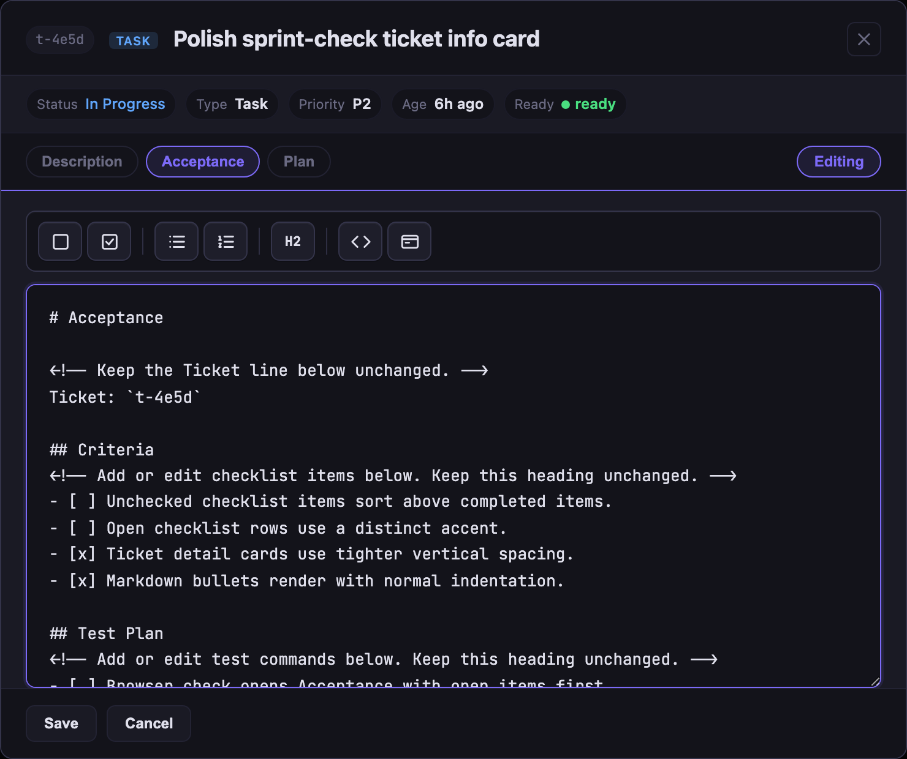
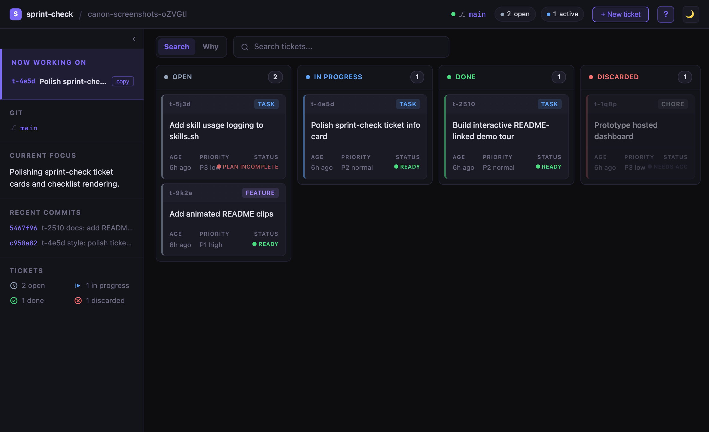
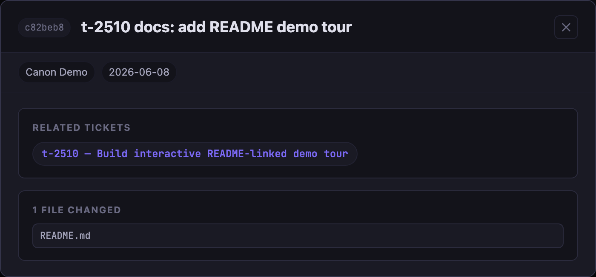
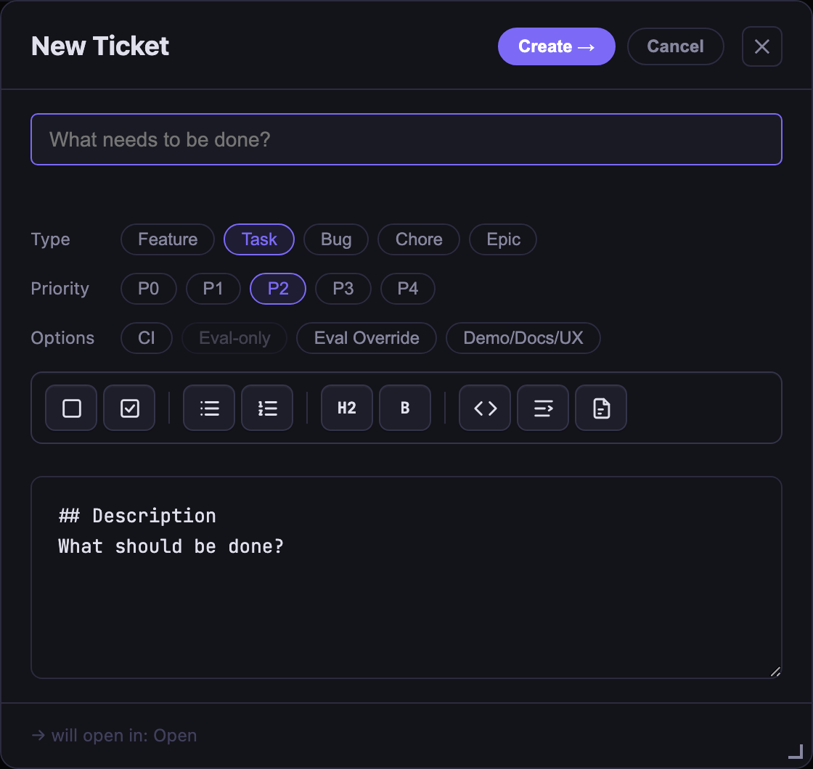
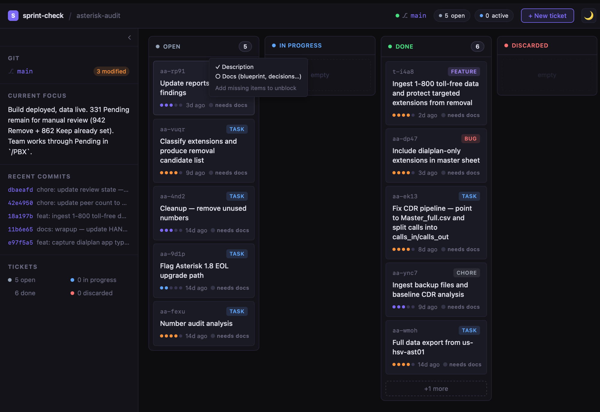
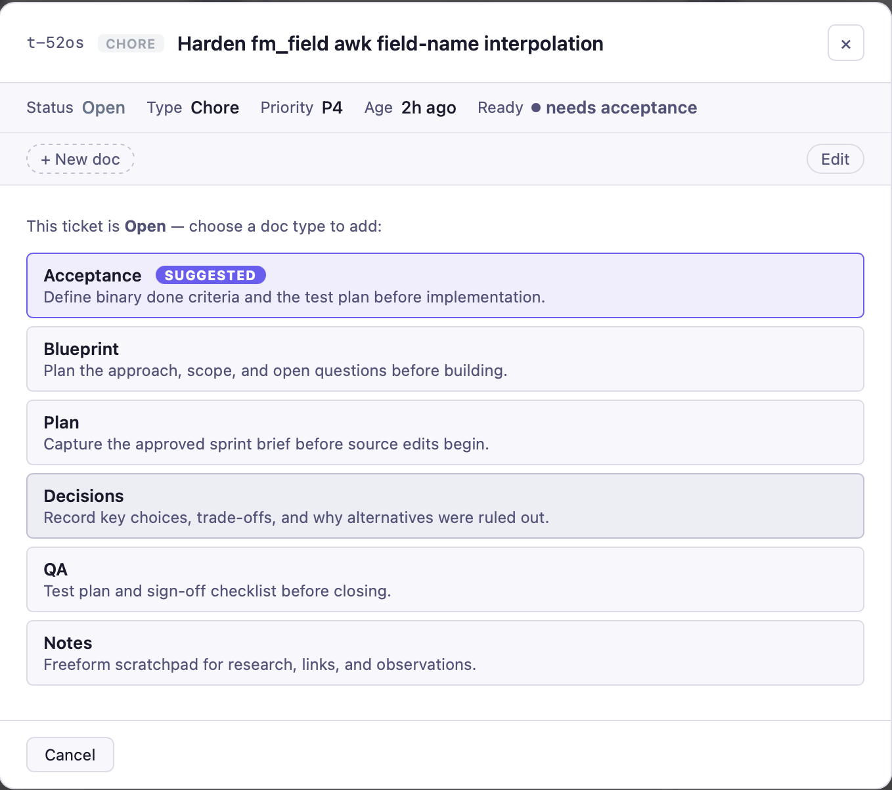

# Sprint-Check — Feature Tour

`sprint-check` opens a local kanban board from your project's `.tickets/` folder and `git log` — no hosted server, no account, no SaaS. Run it from your project root:

```bash
sprint-check
```

See the [README](../README.md#the-board) for the overview. This page walks through each feature with a screenshot.

## Dark Mode


Toggle between light and dark with the button in the top-right corner.

## Ticket Detail



Click any ticket to see its status, type, priority, readiness, description, and attached docs in one place.

Drag the bottom-right corner of the ticket detail modal to resize it when long Description, Acceptance, or Plan content needs more room. Press `Esc` to close the modal.

Closed and discarded tickets open read-only. Their sprint docs remain inspectable, but edit controls are hidden until the work is reopened or a new ticket is created.

**Status that differs on another branch.** The board always shows the checkout it was started from — with one exception: a ticket whose sprint runs in a worktree (its Cockpit lock, or its in-progress copy there) shows that worktree's **live** sprint docs (plan, acceptance, …) on its card and in the modal, labelled "Live from <branch> · edits save to its copy" (`t-e78b`). You can edit those docs from the board (`t-26f9`): the editor, the checkboxes, `+ New doc` (acceptance, plan and research only) and the Sign-off controls all save to **that worktree's copy**, never to this checkout's. Every save carries the version of the file it read, so a change the agent made in between is never overwritten silently: a checkbox or Sign-off change re-reads and re-applies once, and the editor keeps your text and offers **Reload theirs** or **Overwrite with mine**. While the ticket's agent session is `working` a note says your edit may collide; it never blocks the edit. Two limits remain: an agent that rewrites a whole file from stale text can still drop a board edit made in between (the guard protects the board's writes, not the agent's), and in the instant between the board's path checks and its write the agent could swap the ticket folder for a link, which can at worst create one temp file and replace one of the three docs there. The ticket's own fields follow the worktree too (`t-8be2`): its status (so the card sits in the lane the sprint is really in), its title, its Description and its Demo flag all come from, and save to, **that worktree's `ticket.md`**; this checkout's copy is not touched, and moving the card to *In progress* or back updates the worktree's `ACTIVE` the way `tkt start` / `tkt close` would. A Description save carries the version of the file it read and is refused if `ticket.md` changed since (your text is kept, with the same **Reload theirs** / **Overwrite with mine** choice); a status or Demo change edits one field of the file as it is at that moment. The board only writes a worktree that git lists for this project, never through a link, and refuses an unknown status; it also **reads** only through plain folders, so a link an agent put at `ticket.md` or `.tickets` shows this checkout's copy instead of whatever it points at. Closing from the board adds `tkt`'s `closed:` time line (and reopening removes it), because the pre-commit hook refuses a closed ticket without it. What binds a ticket to a worktree is its Cockpit lock (the board's **+ New** worktree writes it, or put the worktree's path in `.tickets/<id>/.cockpit-cwd` by hand) or, as a fallback, the in-progress copy found by the scan below. If your project tracks `.tickets/` in git and a live worktree (or an unmerged local branch) has itself *changed* a ticket's status — e.g. `sprint complete` closed it on `sprint/t-91mc` but that branch isn't merged yet — the card gets an amber line (`closed on sprint/t-91mc`) and the ticket's footer explains it (not for a ticket already bound to that worktree, whose card shows the worktree's status): "Showing this checkout's copy (open) — closed on sprint/t-91mc, not merged." Cards that match everywhere are unchanged. It is read-only, checks at most 8 unmerged branches, and is cached for 10 seconds (`SPRINT_CHECK_DIVERGENCE_TTL` seconds to change, `0` to disable). Where `.tickets/` is gitignored, worktrees can't see tickets at all, so nothing appears.

## Edit Sprint Docs in Place



Open a ticket to read or edit its Description, Acceptance, and Plan without leaving the board. Docs with two or more `##` sections show a sticky jump bar at the top — click any heading to scroll straight to it.

## Ticket Search



Use the search box above the columns to find tickets by title, id, status, type, priority, description, doc names, or readiness labels such as `plan incomplete`. Matching tickets stay in their original lanes so status context is preserved. Press `Esc` or clear the field to restore the full board.

Switch the segmented control from `Search` to `Why` to ask why a file exists or
changed. Enter a project-relative file path and sprint-check scans git history,
matches tickets, and shows Plan decision excerpts above the board. You can also
type `why:path/to/file` as a shortcut.

## Commit Intelligence



Click any commit in the sidebar to see what changed and which ticket it likely belongs to — matched by ticket ID in the commit message or by keyword when no ID is present.

## Create Tickets from the Board



`+ New` opens a form pre-filled with a structured template. The title suggests a type automatically — feature, task, bug, chore, or epic — while leaving type, priority, and description editable before `Create`. The ticket lands in `.tickets/<id>/ticket.md`, immediately visible to your agent.

A ticket can also carry maintenance skills via `tkt create --skills a,b` (or by hand-setting `skills: <csv>` in `ticket.md`'s frontmatter); `sprint start` on that ticket runs each selected skill as the sprint's work. The close tier follows what actually changed — a run whose output is only reports/`.md` takes the light close, while a `dead-code-cleanup` that deletes code is a normal-tier close with the binding evaluator; the "maintenance" label never skips the evaluator. For a quick, ticket-free check instead, see **Upkeep Dashboard** below.

## Upkeep Dashboard

**Upkeep** (the Upkeep button on a project's board, t-67ab — it shows that project only; each Projects card says how many checks have never run) runs `context-check`, `context-doctor`, `dead-code-cleanup`, or `promote-learnings` headlessly against that project — no ticket, no sprint gate, always read-only (a run only ever writes its own `.reports/<skill>_<timestamp>.md`; it never modifies or deletes anything else, even when `dead-code-cleanup` finds a confirmed-dead symbol). Pick a model (Claude models only for now: Haiku 4.5 default, Sonnet 5 available), click **Run** — a confirmation dialog names the model and notes the dispatch is a real LLM call that will incur API cost. Each report ends with its own **Next Steps**: the exact follow-up command or file edit a human would run to act on the findings, never auto-executed.

## Ticket Completeness



Every card shows a readiness indicator:

- **● ready** (green) — Acceptance and Plan both present; Acceptance has real items under `## Criteria` and `## Test Plan` with no unchecked box anywhere in `acceptance.md` (including `## QA`'s "Tested locally"), Plan has real notes under `## Approach`, and `plan.md ## Sign-off` has a checked approval item.
- **● unchecked items** (red) — Acceptance has real items under `## Criteria`/`## Test Plan`, but at least one box anywhere in the doc (including `## QA`) is still unchecked. This mirrors the CLI's `_gate_no_unchecked` close gate exactly.
- **● incomplete** (red) — Acceptance doc exists but the `## Criteria` or `## Test Plan` section has no checklist items. This mirrors a CLI-enforced `sprint complete` close gate. Opening the Acceptance tab shows an inline warning naming the empty sections.
- **● plan incomplete** (red) — Plan exists but `## Approach` is empty or still contains the template placeholder. This is board-surfaced early warning; the CLI also blocks close if `## Approach` has no real content. A short real approach is enough; Decisions can stay empty for simple work.
- **● needs acc / needs plan / needs signoff** (amber) — the next doc or approval item to add.

Click or hover the indicator for a checklist popover. Acceptance and Sign-off readiness mirror CLI close gates; Plan readiness is an early board signal so untouched templates show up while you're working. The board never judges whether a checked item is true — that remains agent-required verification and evaluator review.

## Drag to Update Status


Drag any ticket card between columns to update its status. The board enforces two gates: dragging to **Done** is blocked if any acceptance criteria checkbox is unchecked (a toast explains why); dragging to **In Progress** without an acceptance doc shows an amber warning but allows the move. All other drags apply immediately.

## Attach Docs to a Ticket



Click `+ New doc` on any ticket to attach a structured document. Two docs cover the full sprint:

| Doc | Add when | Use it to |
|---|---|---|
| **Acceptance** | First | `## Criteria` and `## Test Plan` sections both need checklist items — `sprint complete` blocks without them |
| **Plan** | After acceptance | Capture the approach and record decisions as you build — readable by future agents |

Sprint docs land in `.tickets/<id>/` as markdown files and are read automatically by your agent after sprint start. Templates include comments that mark which headings and ticket ID lines should stay unchanged, and the editor toolbar inserts common Markdown such as checkboxes, bullets, numbered items, headings, inline code, and toggle blocks at the cursor.

Once both Acceptance and Plan exist, `+ New doc` is hidden. Other workflow outputs are handled by the agent or by repo-local context files; they are not extra sprint docs to create from the board.

## How Sprint Works

One workflow command drives the lifecycle. The CLI handles deterministic state; the agent chooses the lightest tier that protects the work — trivial changes skip sprint, a `bugfix` (single logic file plus its covering test) runs eval-only (binding evaluator kept, advisory reviewer skipped), normal changes get a brief ticket/acceptance/plan path, and high-risk changes run the full planning pipeline. The two diagrams on the [README](../README.md#how-sprint-works) show the start and complete flows.

Enforcement layers:

- **CLI-enforced:** ticket state, one active sprint, required sprint files, required checklist items, unchecked boxes, `summary.md`, `## Wrapup Gates`, plan Approach content, plan `## Sign-off` (present and approved), the visual-embed check (any mockup/visual filename referenced in `plan.md`/`acceptance.md` must resolve to a real embed whose target file was copied into the ticket's `visuals/`), the evaluator run-id field being present, and the eval verdict being `pass` (not just present — the verdict line must be `pass:`, and any criterion graded `partial` or `not-run` forces that line to `fail:`, so a non-`pass:` verdict blocks; there is no separate `partial:`/`not-run:` verdict line).
- **Agent-required:** tier classification, orientation, gray-area resolution, impact analysis, wrapup review/audit steps, test judgment, acceptance judgment, and invoking clean-context eval.
- **Board-surfaced:** readiness indicators, inline warnings, ticket docs, commit/ticket context, and early visibility before the close gate runs.

Recommended order: create `acceptance.md` first to define Done, then `plan.md` to capture the approach and decisions. `sprint-check` suggests that order in `+ New doc`.

Only those markdown files are sprint docs the user or agent creates. The double-bordered steps in the diagrams are reference docs and skills used when the tier calls for them: `orient` reads the codebase and feeds findings into the Plan, `impact-analysis` rates risk and feeds the test plan (detailed below), and `capture` (a real skill) writes notable discoveries to `HANDOFF.md` when they appear mid-build. On `sprint complete`, `code-simplifier`, `code-reviewer`, `security-review`, `repo-check`, and `doc-audit` are considered in order, using skip rules for steps that do not apply. Then the `reviewer` (fresh subagent, advisory) and `eval` (fresh subagent, binding) gates run — both with no implementation history — and `eval` grades each acceptance criterion against the actual code from a clean context window; any `partial` or `not-run` criterion forces the verdict to `fail` (there's no separate non-blocking `partial`/`not-run` verdict), and either blocks close. These all run as part of the `sprint` workflow; they are not separate docs to create and not commands the user has to invoke.

### Impact Analysis — five dimensions

For high-risk work, `sprint start` rates the change across five risk dimensions and writes the result to the Plan:

| Dimension | Asks |
|---|---|
| **Audience** | Who and how many does this reach — one user, a tenant, everyone, or external systems? |
| **Reversibility** | Can it be undone, or does it delete, send, or write money permanently? |
| **Blast radius** | If it fails, is the damage contained or does it corrupt shared state? |
| **Trigger paths** | How many UI paths, API callers, or jobs reach the same handler? |
| **Cascade risk** | What downstream consumers — queues, tables, external APIs — react to the change? |

Each dimension is rated HIGH, MEDIUM, or LOW. The ratings aren't advisory: **every HIGH adds required mitigation to the acceptance plan** — a rollback test for permanent operations, a handler-binding grep and server-side auth check for multiple trigger paths, a per-consumer test for cascade risk, an audit-log requirement for broad audience — and the `sprint complete` gate refuses to close while any of those items is still unchecked in `acceptance.md`. The gate checks box state, not the work behind it — the agent verifies each mitigation actually holds before checking it. Normal-tier changes record that no high-risk trigger was found and proceed with a shorter plan.

**Regression carryover.** `sprint start` also scans `.tickets/` for closed tickets that touched the same files this sprint will modify, and adds one regression test per match. Past work that passed stays passing — the test obligation rides along automatically, so a later change can't silently break behavior an earlier ticket established.

## Cockpit — start & drive an agent in the browser

Every card on the board shows **▶ Start** (OPEN) or **▶ Resume** (IN_PROGRESS) —
click it to switch the board itself into cockpit mode and launch or resume a
sprint agent without leaving the browser — no second terminal.

- **What it does:** a background daemon (`tools/cockpit-daemon`) owns a real
  **PTY** running an interactive `claude` session on the ticket, and serves an
  embedded terminal (xterm.js). Click **Start sprint** (or **Resume**) → the
  agent runs in-page; you type to it there. The agent keeps running if you
  close the tab and reattaches (scrollback replayed) when you reopen;
  **Kill** stops it cleanly with no orphaned process. A reopened tab only
  reattaches once you press **Start sprint** again; until then **End Session**
  can't reach the still-running agent, so it says so (and leaves the tab open)
  instead of closing as if it had ended it.
- **It is a real agent, with this project's own permissions.** The daemon execs
  `claude` with the ticket as a single prompt argument (`sprint start <id>`) —
  the same thing you would type at a terminal — so it can write files and run
  commands, and it prompts you in the embedded terminal exactly as it would in a
  real one. The daemon **never** overrides permission behavior: no
  `--permission-mode`, no bypass flag. Whatever that project is already
  configured to auto-approve, it auto-approves here too. If the ticket's
  `plan.md` carries a `Gate model:` value, the daemon passes it as `--model`;
  the *parse* is shared with `sprint-headless` (`tools/gate-model.sh`, pinned
  across the two runtimes by `tests/gate-model-parity.sh`), but the disposition on
  a malformed value differs on purpose: the daemon warns on stderr and starts on
  the default model, because a human is sitting in front of the terminal, whereas
  headless CI hard-fails the run. `session` and `default` both mean "no override".
- **"Needs you" status.** Because the agent inherits the project's permissions,
  it can end up blocked on a prompt while you're looking at another tab. The
  status dot turns red and pulses (**needs you**) as soon as that happens, and a
  tab attaching later is told the pending status too — so a reattach can't show
  green over an unanswered prompt. Typing clears it. When the agent has finished
  and sits at its prompt, the status reads **done · waiting for your next
  prompt** instead (`t-824e`): questions (`permission_prompt`, `elicitation_*`,
  `agent_needs_input`) mean needs you, `idle_prompt`/`agent_completed` mean done,
  and other notifications change nothing. The daemon's `/sessions` turns this
  into one state per session — needs you, working (output or input in the last
  15 s), idle, or done — shown in the shell's Agents sidebar, the "N needs you"
  pill, a tab dot, the Projects cards, Admin's session table, the
  ticket cockpit's state chip and the board's cards (`t-28ec`: a state strip,
  **Answer ▸** / **Open ▸**, waiting cards first in In Progress). Colours follow
  Herdr's palette: needs you pink-red, working yellow, done teal, idle a hollow
  green ring. Admin's **Desktop notifications** switch (off by default, per
  browser) notifies you when a session starts waiting while the cockpit isn't in
  view; the browser asks for permission only when you turn it on. Copilot's needs you comes from its approval
  menu; Pi has no question signal (working/idle only). Claude Code's
  folder-trust prompt sends no notification, so it shows as idle. The signal is
  Claude Code's own `Notification` hook, handed to the session via `claude --settings <file>`
  from the daemon's state dir: **the daemon writes nothing into your project**,
  which keeps `DECISIONS.md`'s 2026-07-02 "zero Claude Code hooks in a project's
  settings" intact. The hook's callback credential lives in a `0600` curl `-K`
  config file, so it never appears in `ps`.
- **Git icon on each project card (`t-8d72`):** a git icon beside the project name shows whether the folder keeps a
  version history. Hover it for the state: *Git enabled — this project keeps a version history*; *Git not enabled —
  click to turn on version history*; or *Version history needs Git, which isn't installed on this computer*, where the
  icon is disabled. Only the "not enabled" icon is clickable: it asks you to confirm, then runs `git init` with one
  commit holding only a default `.gitignore` (`POST /api/track-changes`, `t-d538`). Nothing is uploaded and your files stay
  uncommitted. A folder that is already a repo, or sits inside one, is refused, and a folder inside iCloud Drive,
  Dropbox, OneDrive or Google Drive gets a sync warning first. The icon is optional: a folder without git is a
  first-class project (`t-5a4b`). An agent starts there with no git step; canon records what changed from a snapshot kept
  under `~/.canon/cockpit/changes/` (never inside the project), the End dialog says how many files the session changed,
  and the ticket's **Changes** panel lists them. **Restore original** puts back only files canon holds a copy of and never
  deletes a file the agent added. Several scratch sessions can share such a folder, with a warning, because copies cannot be
  merged back.
- **Scratch sessions (`t-47f1`):** **Scratch** on a Projects card (or the **+** on
  an Agents group) starts the plain agent in that project with no
  ticket, no sprint and no gates, marked with a scribble-and-pencil icon. Its per-session state lives in the
  daemon's state dir, never in `.tickets/`. Several per project (`t-e162`): the first
  runs in the main checkout; while that is busy (any live session there), the daemon
  gives the next one its own worktree on branch `scratch/<n>` at
  `<repo>/../<name>-worktrees/scratch-<n>`, and removes worktree and branch when the
  session ends only if nothing was done in it (no uncommitted changes, no new commits).
  The board's path bar has a **Scratch** too. An open scratch tab shows on the Agents
  rail as *not started* until its agent runs (`t-f553`). Click the scratch title to name it
  (`t-f553`); the rail, Admin and notifications show that name. **Promote to ticket**
  asks the agent to run `tkt create` with a summary of the session (you approve the
  command) and print `CANON_TICKET: <id>`; **Continue as <id>** then hands the
  conversation, agent and directory to that ticket (a scratch worktree carries over), ends
  the scratch session and opens the ticket, whose Start resumes the same Claude
  conversation with `sprint start <id>` (Copilot/Pi keep the directory but start fresh).
  Adopt takes only a new ticket (status open, no saved session), so a wrong id in the
  agent's output can't take over another ticket. The resume needs a saved transcript: a
  daemon launched from inside a Claude Code session inherits `CLAUDECODE`/`CLAUDE_CODE_*`,
  which stops the spawned `claude` from saving one — start the board from a plain shell.
  End asks **Save this session as a ticket?** — Save runs the same promote and ends
  without opening the ticket; **Just end** ends it. End guard (`t-86fe`): when the session
  has changed files (or worktree commits), End lists them and offers **Save as ticket, then
  end**, **Keep changes, end**, or **Discard changes, end** (a second click confirms; it
  stops the agent, then undoes tracked edits and deletes untracked files — ignored files
  stay; offered only if the checkout was clean when the session started). Whatever a
  scratch session leaves behind — on End or when the idle reaper ends it, which now
  happens even with changes — is noted in the main checkout's `HANDOFF.md` under
  `## Scratch` (after canon's managed block; nothing else in the file changes). The reaper
  never discards or commits.
- **Sessions interrupted by a daemon restart (`t-d9e6`):** the daemon keeps a small
  `sessions.json` of its live sessions in its state dir (0600; id, project, directory,
  agent — no tokens, no terminal content). A session that ends on purpose (Save & End,
  Kill, End, idle end) or whose agent exits leaves it; a daemon stop (Admin Stop/Restart,
  the stale-daemon replace) or crash doesn't. On the next start those become
  `interrupted.json` (7-day expiry), and the Canon Cockpit shell shows a banner — "N
  sessions were running when the daemon stopped" — with **Resume** / **Dismiss** each and
  **Resume all**. Resume opens that project's tab on the ticket, ready to resume the same
  conversation and directory with one click; nothing starts by itself. A ticket that is
  gone or closed, a directory that is gone, or a scratch session shows why it can't be
  resumed. The board reads and dismisses these via `/api/cockpit-interrupted*` — files
  only, never the daemon token. `canon wait` (the ticket's Part 2) is `t-180d`.
- **Why a daemon:** the `sprint-check` board server is ephemeral and stdlib-only,
  and Go's stdlib has no PTY/WebSocket. The daemon is an isolated Go module
  (canon's one third-party-dep binary — see `DECISIONS.md` 2026-08-23); the board
  server stays pure stdlib.
- **Security:** binds **127.0.0.1 only**; every request checks loopback Host/Origin;
  a boot token gates session start and a per-session token gates stream/input/kill;
  ticket ids are validated `^t-[a-z0-9]{4}$` and exec'd as an argv slice (never a
  shell); tokens travel via a `0600` state file, never argv. Transport is stdlib
  **SSE (output) + POST (input)** — no WebSocket.
- **Platforms:** macOS/Linux and Windows (ConPTY). Runtime-verified on macOS,
  and with interactive `claude` on a Windows 11 VM (2026-09-24). ConPTY keeps
  the output pipe open after the agent exits, so the daemon closes the PTY
  itself once the process has exited (after up to 2s for the last output to
  drain); without that an exited agent stayed "running" (`t-b999`).
- **Prerequisite:** `claude` must be on `PATH`. If it isn't, Start fails with the
  exec error surfaced in the terminal rather than hanging.
- **Cockpit mode:** the kanban lanes collapse to a left ticket rail and an
  embedded terminal takes the center. The board never owns
  a PTY — it discovers a running `cockpit-daemon` via `daemon.json`, or
  launches one on demand (`/api/cockpit` in both `server.py` and `main.go`),
  with no secret ever passed via argv. **Esc / "← Board"** returns to the
  kanban view; only one sprint may be active at a time, so Start is disabled
  on other cards while a session is live. The rail can collapse to a 44px icon
  strip to maximize the terminal; the app-under-test preview slot is present
  but collapsed (richness is follow-up work, `t-b19b`).
- **Rail accordion:** the ticket rail shows **Acceptance** and **Test
  Plan** as independent, collapsible accordion sections (both start collapsed).
  Both are **view-only** — no click-to-toggle, no write path to
  `acceptance.md` — so a human watching the agent work can't inadvertently
  check a box that isn't actually verified. The rail **polls** every 5s while
  the cockpit is open, so edits the running agent (or anyone else) makes to
  `acceptance.md` show up without closing/reopening the cockpit.
- **Several sessions, several agents:** one project can run more than one session at a time, and each session picks its
  own agent (Claude Code, Pi or Copilot CLI) — for example Claude Code on one ticket while Pi takes another. The Agents
  rail groups them by project and shows each one's state and agent. Give each ticket its own worktree (next bullet)
  so two sessions don't edit the same checkout.
- **Worktree picker (`t-cd06`):** the rail's **WORKTREE** accordion lets a
  sprint start inside a fresh or existing git worktree instead of always the
  main checkout — rows for **Main checkout (current)**, every real entry from
  `git worktree list --porcelain` (no cockpit-owned registry), and **+ New**
  (creates a sibling `<repo>-worktrees/<branch>` checkout via `git worktree
  add`, nebula's own convention). When there's a real choice, a fresh OPEN start
  gates the terminal — the daemon's own Start control — behind an explicit row pick.
  Main is preselected instead when it's the only worktree or the ticket chose
  **Main checkout** in New Ticket (the default, stored as `main-checkout`); a
  project that isn't a git repo has no WORKTREE section and no gate (`t-19d1`). An
  open ticket already in progress in a worktree shows in **IN PROGRESS** with
  **Resume**, which preselects that worktree. A worktree you
  chose in **New Ticket** is stored on the ticket (`worktree_preference`) and shown on
  the open card and in the ticket's meta row, but nothing is created until you click
  **+ New** here (which asks to confirm); for such a ticket the button is ready
  without editing the pre-filled name, whereas the default `sprint/<id>` suggestion
  stays inert. Resume doesn't
  need to re-ask, since the daemon persists the resolved cwd per ticket
  (`.tickets/<id>/.cockpit-cwd`) and reuses it automatically (falling back to
  re-resolving if that worktree was since deleted). A `.worktreeinclude`
  file at the project root (same convention as Claude Code's/Codex's own) copies
  matching gitignored files (e.g. `.env`) into a freshly created worktree. A git
  worktree only carries **committed** files, so when the ticket's own docs aren't
  committed yet (projects that track `.tickets/`), the rail says so under **+ New**,
  and **+ New** offers to commit them first (`t-d254`). The dialog lists the files
  by group: the ticket's docs are required, `.tickets/.gitignore` is recommended,
  session logs like `cockpit-sessions.md` are optional, and any other uncommitted
  files are listed but never included. It commits only the checked paths on the
  main checkout with a fixed `chore: add ticket <id>` message; anything you had
  staged stays staged. Undo with `git reset --soft HEAD~1`. The picker (and New Ticket's
  Worktree row) only offers worktrees this ticket can use (`t-2241`): Main, its own, and
  free ones. Any other worktree is collapsed under "N worktrees unavailable" with its
  reason: *in progress* (bound to an active ticket), *reserved* (an open ticket chose it),
  *uncommitted changes*, *branch not merged*, or *folder missing* (run `git worktree prune`). Once the
  ticket's own worktree is selected, the rail shows just that row plus **Change worktree**.
  The card/modal divergence note says "uncommitted changes in worktree" rather than
  "branch merged" when the worktree has unsaved work. Idle-reap
  is tiered by cwd: a worktree session keeps the 5-minute default, a session in its
  own project's main checkout (whichever project it runs in, `t-824e`) gets a longer
  30-minute safety net instead of never reaping. A session that needs you is never
  reaped; a done one is. Admin shows both timeouts, and the ticket cockpit shows the
  countdown next to End Session.
- **Preview pane (`t-b19b`, `t-533f`):** asks the agent for the ticket's
  deliverable and shows a static HTML file in a sandboxed iframe
  (`sandbox="allow-scripts"` only), so the untrusted page can't reach the
  daemon. The sandbox blocks forms and storage, so the pane says so and
  offers **Copy file link** — a `file:///` URL to paste into a real browser to
  use the app. It never opens the served preview URL itself: top-level, that
  page would share the daemon's origin. A deliverable that needs a dev server
  gets the command to run yourself instead.
- **Scope:** the board integration above, the rail accordion, the worktree
  picker, and the preview pane are done. Further visual polish is follow-up
  work — see `Future/Terminal-In-Board/` and tickets `t-8a63`/`t-ddc8`/`t-96a8`.
