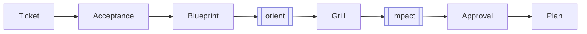

# 02 - Sprint Start

`sprint start` is where the agent plans the work *before* writing any code. You
describe the outcome; the agent drafts the planning docs and you review them on
the board.



> The double-bordered steps are sub-skills the agent runs for you: `orient` maps
> the codebase, `impact` rates risk. You don't invoke them.

## Step 1 - Open the empty board

```bash
sprint-check
```

Zero open, zero active, empty columns — the expected start for a new project.

## Step 2 - Describe the work

In your agent session:

```bash
sprint start "Build a simple Todo list"
```

The CLI creates the ticket and active state:

```text
.tickets/ACTIVE
.tickets/<id>/ticket.md
DECISIONS.md
HANDOFF.md
```

Then the agent takes over: it drafts **Acceptance** (binary done criteria + test
plan) and **Blueprint** (approach + files), maps the subsystem, and surfaces any
gray areas as questions.

Reload `sprint-check`. The ticket is In Progress and `not ready` — only
`ticket.md` plus the agent's drafts exist so far. Open it to read what the agent
proposed.

> Your agent's wording will differ from the samples below — that's expected. What
> stays constant: Acceptance is binary and testable, and `plan.md` is written only
> after you approve.

## Step 3 - Review what the agent drafted

The Acceptance the agent produces should read like this:

```markdown
## Criteria
- [ ] Users can add a non-empty Todo item.
- [ ] Blank Todo titles are ignored.
- [ ] Users can mark a Todo complete and back open.
- [ ] Todo behavior is covered by tests.

## Test Plan
- [ ] `npm test`
```

If a criterion is missing or wrong, tell the agent — don't hand-edit the doc
silently. The point is that the ticket reflects a shared understanding, not your
private edits.

## Step 4 - Answer the grill, then approve

The agent asks the gray-area questions that change what gets built. For this app,
for example: *"Should completed Todos be toggleable back to open?"*

Answer in chat:

```text
Yes, allow toggling completed Todos back open. Keep it framework-free. Approved.
```

On approval the agent writes `plan.md` — the approved brief it implements against.
The ticket stays In Progress, now with Acceptance, Blueprint, and Plan present and
ready to build.
