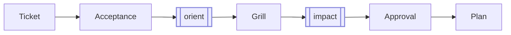

# 02 - Sprint Start

**What this step does:** The agent plans the work *before* writing any code. You
describe the outcome in one sentence; the agent drafts the done criteria and
test plan for you to review. Nothing is built until you approve.



Steps in plain English:
- **Acceptance** — the agent writes the checklist of "done" criteria and test commands.
- **Orient** *(runs automatically)* — the agent reads the codebase to understand what already exists.
- **Grill** — the agent asks you the questions that change what gets built (see Step 4 below).
- **Impact** *(runs automatically)* — the agent rates the risk of the change.
- **Approval** — you say "approved" and the agent locks in the plan.
- **Plan** — the final brief the agent implements against; only written after your approval.

## Step 1 - Open the empty board

```bash
sprint-check
```

Zero open, zero active, empty columns — the expected start for a new project.

## Step 2 - Describe the work

In your agent session:

```bash
sprint start "Build a simple Todo list"
```

The CLI creates the ticket and active state:

```text
.tickets/<id>/ticket.md
DECISIONS.md
HANDOFF.md
```

Then the agent takes over: it drafts **Acceptance** (done criteria + test plan)
reads the codebase, and surfaces gray-area questions. After approval, it writes
**Plan** (approach + decisions).

Reload `sprint-check`. The ticket is In Progress and `not ready` — only
`ticket.md` plus any drafted sprint docs exist so far. Open it to read what the
agent proposed.

> Your agent's wording will differ from the samples below — that's expected. What
> stays constant: Acceptance is binary and testable, and `plan.md` is written only
> after you approve.

## Step 3 - Review what the agent drafted

The Acceptance the agent produces should read like this:

```markdown
## Criteria
- [ ] Users can add a non-empty Todo item.
- [ ] Blank Todo titles are ignored.
- [ ] Users can mark a Todo complete and back open.

## Test Plan
- [ ] `npm test`
```

**What to look for:** Every item should be something you can verify by running
the app or running the tests — not vague prose. If a criterion is missing or
wrong, tell the agent in chat. Don't hand-edit the doc yourself; the point is
that acceptance reflects a shared agreement.

If the board shows `incomplete` on the card, it means the agent left an
Acceptance section empty. Tell the agent to fill it before you approve.

## Step 4 - Answer the grill, then approve

After drafting, the agent asks the questions that change what gets built. These
are the things that have no right answer without your input — for example:
*"Should completed Todos be toggleable back to open?"*

Answer in chat:

```text
Yes, allow toggling completed Todos back open. Keep it framework-free. Approved.
```

On approval the agent writes `plan.md` — the approved brief it implements
against. The ticket stays In Progress, now with Acceptance and Plan present and
ready to build.
