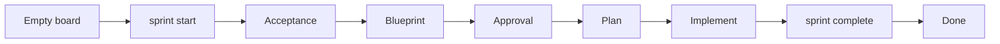

# 02 - Sprint Start

This step shows the planning flow before any app code changes.



Recommended doc order: create `Acceptance` first, then `Blueprint`, then create
`Plan` only after the approach is approved.

## Step 1 - Open the Empty Board

Type this in the command line from the walkthrough root:

```bash
sprint-check
```

The board should show 0 open tickets, 0 active tickets, and empty columns. This
is the expected start for a new project.

## Step 2 - Start the Sprint

Tell the agent this in chat, or run it from the walkthrough root:

```bash
sprint start "Build a simple Todo list"
```

The command prints the new ticket ID and creates:

```text
.tickets/ACTIVE
.tickets/<id>/
  ticket.md
DECISIONS.md
HANDOFF.md
```

Reload `sprint-check`. The ticket should appear in In Progress and show
`not ready`. That is correct: only `ticket.md` exists so far.

## Step 3 - Create Acceptance

Open the ticket in `sprint-check`, click `+ New doc`, and select `Acceptance`
when it is suggested.

Keep the ticket comment and `Ticket: \`...\`` line that sprint-check created; it
should contain the real ticket ID from `.tickets/<id>/ticket.md`. Replace the
rest of the template with:

```markdown
# Acceptance

<!-- Keep the Ticket line below unchanged. -->
Ticket: `<keep the existing id>`

## Criteria
The checklist of behavior that must be true before the sprint can close.
<!-- Add or edit checklist items below. Keep this heading unchanged. -->

- [ ] Users can add a non-empty Todo item.
- [ ] Blank Todo titles are ignored.
- [ ] Users can mark a Todo complete and back open.
- [ ] Todo behavior is covered by tests.

## Test Plan
The commands or checks that prove the criteria work.
<!-- Add or edit test commands below. Keep this heading unchanged. -->

- [ ] `npm test`
```

Save the doc. Reload the board and confirm the Acceptance tab exists.

## Step 4 - Create Blueprint

Click `+ New doc` again and select `Blueprint`.

Keep the ticket comment and existing `Ticket: \`...\`` line. Replace the rest of
the template with:

```markdown
# Blueprint

<!-- Keep the Ticket line below unchanged. -->
Ticket: `<keep the existing id>`

## Goal
The outcome this sprint is trying to achieve.
<!-- Add or edit the goal below. Keep this heading unchanged. -->

Build a dependency-free browser Todo app that supports adding and completing tasks.

## Approach
The small design choices the agent should use when building.
<!-- Add or edit approach notes below. Keep this heading unchanged. -->

- Keep Todo state in browser memory for this walkthrough.
- Create `package.json`, `src/app.js`, `src/index.html`, `src/styles.css`, and
  `tests/todo.test.mjs`.
- Add `npm test` and `npm run serve` scripts.
- Use a checkbox to toggle complete/open.
- Cover add, blank-title, and toggle behavior with `npm test`.
```

Save the doc. The ticket now has acceptance criteria and a blueprint. Next,
approve the approach and create the final Plan doc.

## Step 5 - Approve and Create Plan

Tell the agent this approval in chat:

```text
Allow completed Todos to be toggled back open. Approved.
```

Click `+ New doc` again and select `Plan`.

Keep the ticket comment and existing `Ticket: \`...\`` line. Replace the rest of
the template with:

```markdown
# Plan

<!-- Keep the Ticket line below unchanged. -->
Ticket: `<keep the existing id>`

## Sprint Brief
The approved sprint brief the agent implements after planning is approved.
<!-- Add or edit the approved brief below. Keep this heading unchanged. -->

Build a small dependency-free browser Todo app with add, complete/open, Node tests,
and npm scripts for testing and serving locally.

Approved:

- Completed Todos can be toggled back open.
- Keep the example framework-free.
```

Save the doc. The ticket is still In Progress, but it now has the docs needed
to implement and later close with `sprint complete`.
