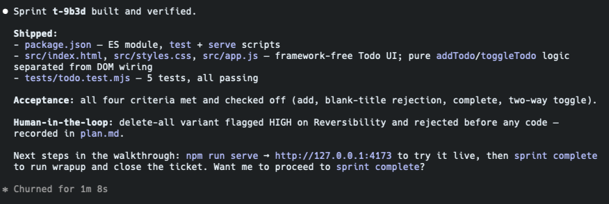
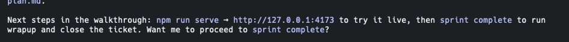
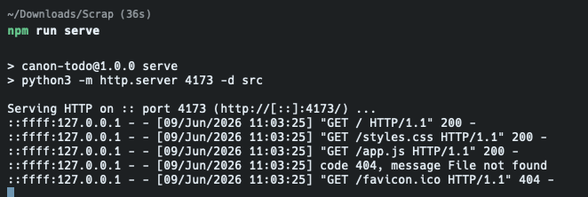
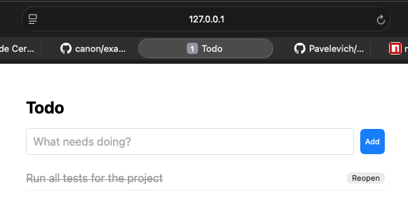
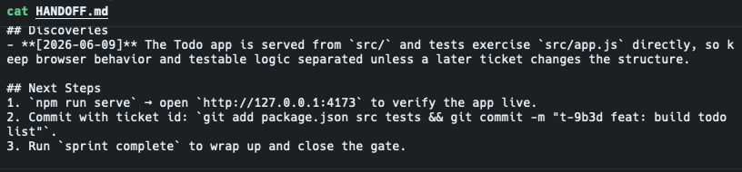

# 04 - Implementation

After approval, the agent implements against `.tickets/<id>/plan.md`.

For this walkthrough, the agent should create this small project layout:

```text
package.json
scripts/
  serve.mjs
src/
  index.html
  styles.css
  app.js
tests/
  todo.test.mjs
```

`package.json` should be an ES module package with:

```json
{
  "type": "module",
  "scripts": {
    "test": "node --test tests/*.test.mjs",
    "serve": "node scripts/serve.mjs"
  }
}
```

## Step 1 - Implement

Tell the agent to implement the approved plan. The app should stay small: add
Todo, ignore blank titles, and toggle complete/open.

Keep `sprint-check` open while the agent works. The ticket stays In Progress;
the readiness label should be `ready` once Acceptance and Plan both have useful
content, even before the unchecked acceptance items are done.

## Step 2 - Run the Test Plan

Type this in the command line after the agent creates `package.json`:

```bash
npm test
```

This is where Layer 2, knowledge capture, matters. Add one deliberate capture so
the walkthrough shows how canon preserves a useful discovery outside the chat
transcript. Tell the agent:

```text
Capture this: the Todo app lives in a single index.html file — markup, styles, and logic together — so there is no separate app.js to import in tests; test behavior through the DOM or extract logic into a module only if a later ticket calls for it.
```

The agent records that kind of discovery in `HANDOFF.md ## Discoveries`, where a
future session can recover it. Do not add another sprint doc; useful discoveries
feed the handoff context.

After tests pass, the agent produces a build summary confirming what shipped, all
acceptance criteria met, and the human-in-the-loop checkpoint recorded:



The agent will then ask whether to proceed to `sprint complete`:



**Say not yet.** There are walkthrough steps remaining before closeout. Reply:

```text
Not yet. I want to go through the remaining walkthrough steps first.
```

Before moving on, run the app to confirm it works in the browser:

```bash
npm run serve
```

The serve command uses Node, not Python, so the Windows workshop path stays
compatible with VS Code on Windows without WSL.



Then open `http://127.0.0.1:4173`:



The important canon habit is that tests come from `.tickets/<id>/acceptance.md`,
not from memory. If scope changes, update the ticket before treating the work as
done.

## Step 3 - Exit And Come Back

Simulate the thing canon is built for: losing the current chat context.

1. Tell the agent to wrap up the partial state:

```text
Pause here and update HANDOFF.md with current focus, in-progress files, the captured discovery, and next steps.
```

   Check `HANDOFF.md` to confirm the discovery and next steps were captured:

   ```bash
   cat HANDOFF.md
   ```

   

2. End the agent session.
3. Start a fresh agent session in `examples/canon-todo-walkthrough`.
4. Ask:

```text
Open sprint-check and tell me where the Todo sprint left off. Don't proceed yet — I want to review the state first.
```

---

**Next → [05-sprint-complete.md](05-sprint-complete.md)**

Expected result: the agent should know the active ticket, what was built, what
still needs testing, and the captured `index.html` structure discovery without you
re-explaining the sprint. `sprint-check` should show the same Current Focus in
the sidebar.

> **Important:** Do not say "resume" or "continue" here — that gives the agent
> permission to run wrapup and close the sprint. The goal is to verify it can
> re-orient from `HANDOFF.md` alone, not to finish the work.

If the board already has older tickets, the returning agent should use them as
bounded context: active and open tickets first, then only recent or file-related
closed tickets. The goal is "enough state to continue," not replaying the whole
project history.

## Step 4 - Update Acceptance

As criteria pass, have the agent update `.tickets/<id>/acceptance.md` from
unchecked to checked. Reload `sprint-check` so the ticket shows progress instead
of jumping straight from not ready to closeout. You can update the checkboxes in
the board's inline editor or let the agent edit the markdown file.

Do not check an item just because code was written. Check it only after the
behavior or command has been verified.

### Add a late criterion to drive a bug fix

Acceptance criteria can be added mid-sprint — they are the living definition of
done. Use this to catch a real edge case the original implementation likely missed.

In the sprint-check inline editor, find this criterion:

```
[ ] Whitespace-only todo titles (e.g. spaces or "  ") are rejected — no item is added
```

Also remove the duplicate below it (`[ ] Blank or whitespace-only Todo titles are ignored...`) — it says the same thing less precisely.

Then tell the agent:

```text
Verify all unchecked acceptance criteria and fix anything that fails.
```

The agent will inspect the guard condition in `index.html`, find that
`input.value === ""` passes whitespace through, fix it to use `.trim()`, and
check off the criterion. No Node or server required — this is a source fix
verified by code inspection.

This demonstrates two habits canon enforces:
- A late-added criterion is as binding as an original one — the sprint cannot
  close while it is unchecked
- The agent verifies behavior, not just code — it runs the case rather than
  assuming `.trim()` is present

## Step 5 - Commit With The Ticket Id

After tests pass, commit the Todo app with the ticket id in the message:

```bash
git add package.json src tests
git commit -m "t-xxxx feat: build todo list"
```

Reload `sprint-check` and click the commit in the sidebar. The commit panel
should show the changed files and connect the commit back to the ticket.

Now try the same history from the search surface:

1. Switch the board query mode from `Search` to `Why`.
2. Enter `index.html`.
3. Confirm the board shows the Todo ticket and any Plan decision excerpt that
   explains why that file exists.

This is the visual version of `tkt why src/app.js`: same archaeology goal, but
kept inside the sprint-check workflow.
