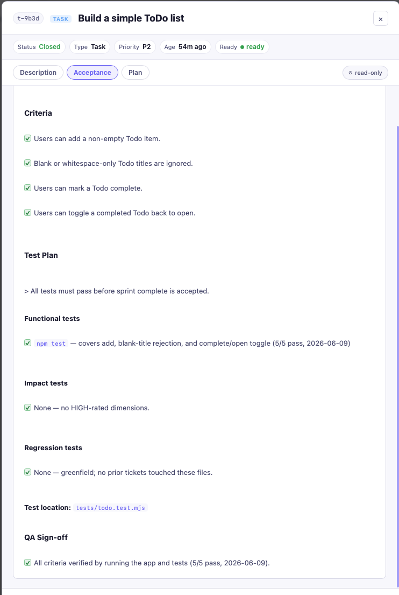
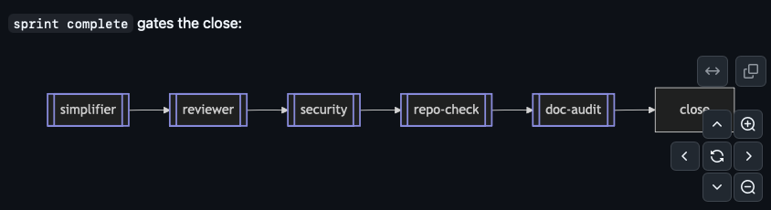
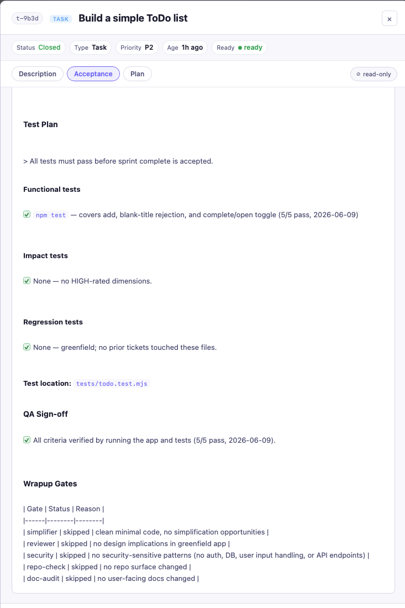

# 05 - Sprint Complete

**What this step does:** The CLI verifies acceptance is complete before closing
the ticket. It is a hard gate — the close command will print what is missing and
refuse to proceed until the doc is fixed.

## Step 1 - Confirm Acceptance

Before closing, `.tickets/<id>/acceptance.md` must have:
- At least one checked item under `## Criteria`
- At least one checked item under `## Test Plan`
- No unchecked items under `## Criteria` or `## Test Plan`

`.tickets/<id>/plan.md` should also have real notes under `## Approach`, not the
template placeholder.

Open the ticket on the board and check every item as it passes tests.

Before running `sprint complete`, open the ticket on the board and confirm all Acceptance items are checked — criteria, test plan, and QA sign-off:



## Step 2 - See the gate in action (try it early)

You can run the close command with unchecked or missing items to see the guard.

**If Test Plan is missing or empty:**

```
$ sprint complete
Sprint t-xxxx cannot close: acceptance.md ## Test Plan has no checklist items.
Add test commands to acceptance.md, then re-run.
```

Fix: open `acceptance.md` and add at least one test command under `## Test Plan`,
then check it.

**If items are still unchecked:**

```
$ sprint complete
Sprint t-xxxx is not complete. Unchecked acceptance/test items remain:
- [ ] npm test
```

Fix: run `npm test`, confirm it passes, then have the agent check that item.

The board's readiness indicator also reflects this:

- `incomplete` means Acceptance has missing checklist structure.
- `plan incomplete` means Plan still has an empty or placeholder approach.

These are early warnings you can act on before running `sprint complete`.

## Step 3 - Complete the Sprint

Tell the agent in chat:

```text
Sprint complete
```

The agent should:

- Verify each item in `.tickets/<id>/acceptance.md`.
- Run the wrapup path proportionally: simplifier/review/security/doc checks run
  only when they apply.
- Confirm the test command passed.
- Update `DECISIONS.md` only for durable non-obvious decisions.
- Update `HANDOFF.md` with follow-up work.
- Run `sprint complete` to close the active ticket.

Each gate in the wrapup pipeline either runs or is skipped based on what changed:



After wrapup, the agent appends a `## Wrapup Gates` section to `acceptance.md`
recording every gate's outcome. For this Todo sprint it should look like:

```markdown
## Wrapup Gates
| Gate | Status | Reason |
|------|--------|--------|
| simplifier | skipped | clean minimal code, no simplification opportunities |
| reviewer | skipped | no design implications in greenfield app |
| security | skipped | no security-sensitive patterns (no auth, DB, user input handling, or API endpoints) |
| repo-check | skipped | no repo surface changed |
| doc-audit | skipped | no user-facing docs changed |
```

Open the ticket's Acceptance tab on the board after close to confirm the section
is there. This makes `acceptance.md` the complete record: what was tested *and*
what quality gates ran.

After the wrapup gates, the agent writes `.tickets/<id>/summary.md` containing
a **plan-vs-actual table** and a one-paragraph close summary:

```markdown
# Summary

| Acceptance item | Status | Notes |
|---|---|---|
| App renders a list of todos | delivered | — |
| Add todo via input + button | delivered | — |
| Delete individual todo | delivered | — |
| npm test passes | delivered | — |

All acceptance criteria delivered. Tests passed via `npm test`. No waivers or
deferred items. Follow-up: none.
```

`Status` is one of: `delivered`, `waived`, `deferred`, or `partial`. Anything
other than `delivered` must have a reason in Notes — deviations cannot be
buried in prose and skipped in the table.

This file appears automatically as a **Summary** tab on the ticket board,
alongside Acceptance and Plan. Open the closed ticket on the board to see it —
read-only, like the other tabs on a closed ticket. It is the permanent record
of what was delivered versus what was planned, without having to scroll back
through the chat.

For this Todo sprint, impact analysis should have stayed light because there is
no broad audience, irreversible operation, shared-state blast radius, duplicate
trigger path, or downstream cascade. If any of those were HIGH, their mitigation
tests would already be in Acceptance, and closeout would not proceed until they
were checked. If HIGH-impact approval was required, the human checkpoint item
would be checked through the same gate.

Expected output when all items are checked:

```
Sprint t-xxxx is closed.
```

## Step 4 - Verify Done

Reload `sprint-check`. The Todo ticket should now appear in Done, with the same
Acceptance and Plan tabs still available in the detail view. The ticket is
read-only in the modal because closed work should not be edited in place.

Open the Acceptance tab to confirm the Wrapup Gates section is present at the bottom:



Use the search box to find the closed ticket by title or id. Then clear the
search and click the latest commit in the sidebar to confirm the final commit is
visible and connected to the ticket.
