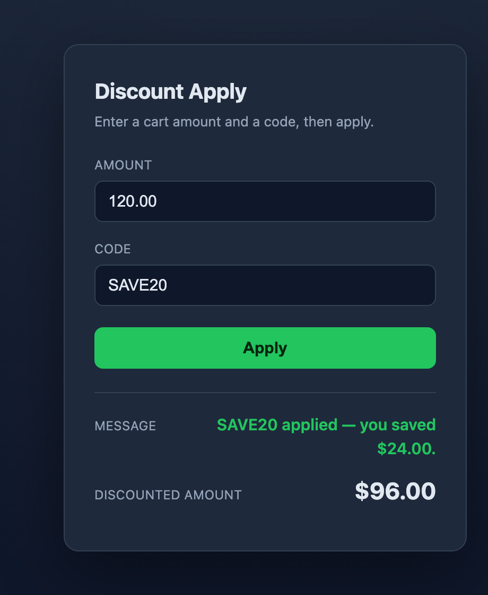
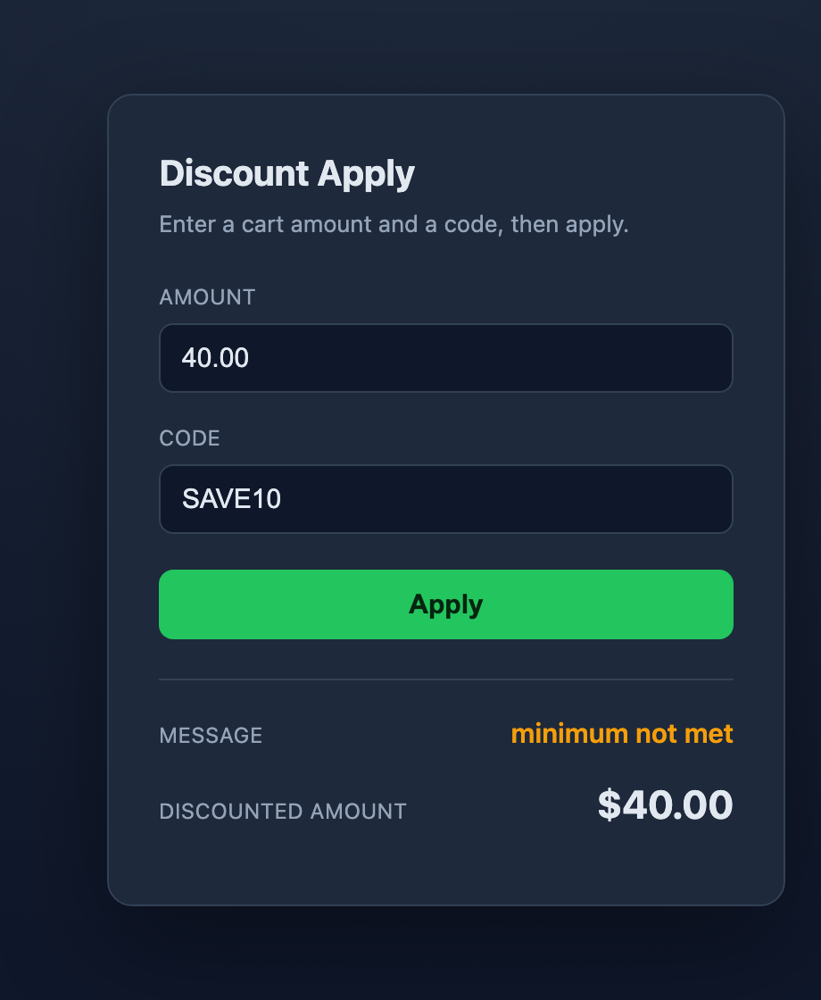
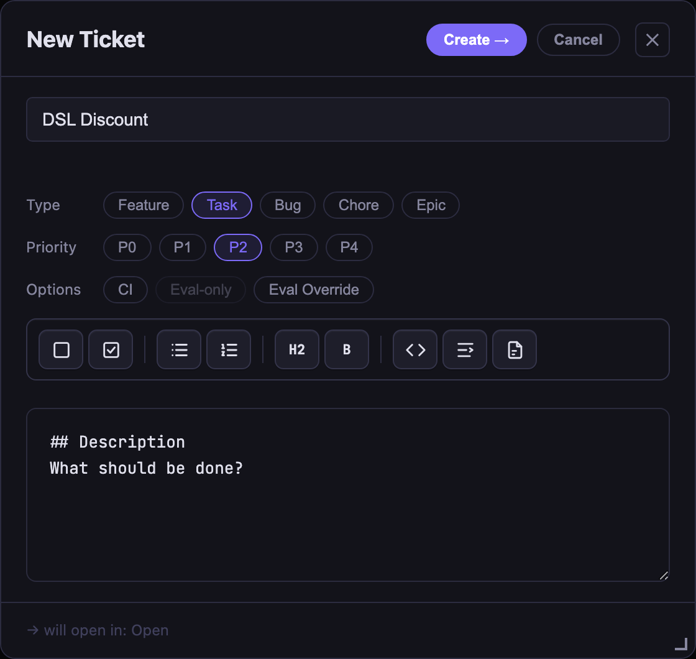
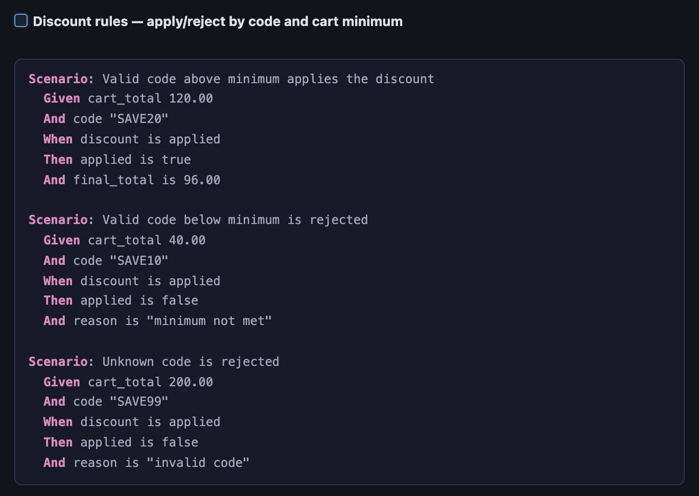
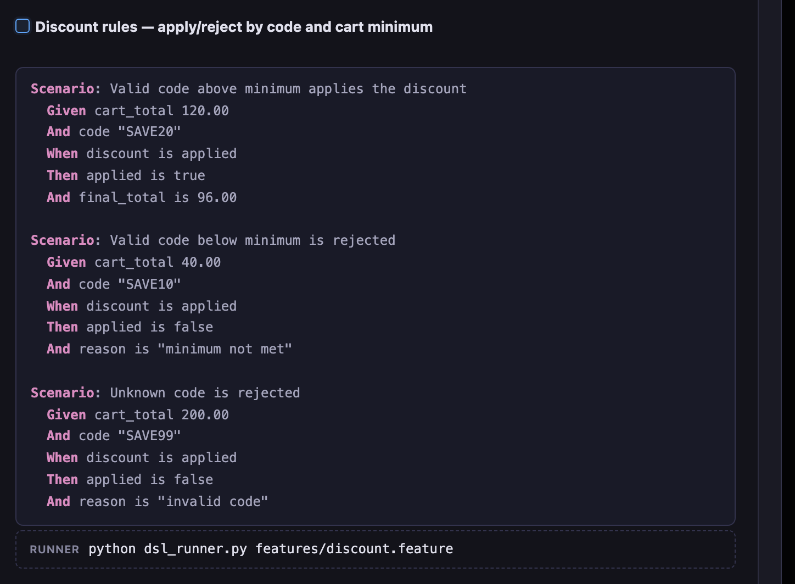

# DSL Spec Workshop — Executable Specs for Agentic Coding

## Purpose

Agentic coding tools are good at producing code that *looks* right. The open problem is proving it
*is* right — and most teams still answer that by having a person read the diff. This workshop teaches
the alternative in the order it should be learned: **you write a behavior scenario first**, in plain
`Given/When/Then`; **the agent then builds a runner that turns that scenario into a pass/fail
answer** and the code to satisfy it; and only then do you wrap it in something you can click. Finally
you break the code on purpose and watch the scenario — not a person, not the agent's own say-so —
catch it.

Teaching question this answers: **when an agent tells you its work is done, what actually checked
that, and could it be wrong?**

## New to BDD? The one-minute version

**BDD (Behavior-Driven Development)** writes the expected behavior *before* the code, in a form a
non-programmer can read:

```gherkin
Scenario: Valid code below minimum is rejected
  Given cart_total 40.00
  And code "SAVE10"
  When discount is applied
  Then applied is false
  And reason is "minimum not met"
```

That block is a **scenario**. A file of scenarios is a `.feature` file. On its own it's just
readable text — what makes it a *check* is a small program, a **runner**, that reads the scenario,
runs your code with the `Given` inputs, and compares the result to the `Then` lines, printing
`[PASS]`/`[FAIL]` and returning exit code `0`/`1`.

**The part newcomers get stuck on is "how do I build that runner?" — and the answer in this
workshop is: you don't hand-write it.** You author the scenario in a canon ticket's **Acceptance**,
add a one-time build instruction ("build a runner that validates this scenario"), and the agent
produces the `.feature`, the runner, and the rule — inferring the function straight from the
scenario, so you never write a function signature. canon's fresh evaluator then grades the work by
*running* that runner. You supply the intent and the behavior; the harness builds and checks the rest.

The rest of this README walks that arc end to end.

## What you'll build

A single-page **Discount Apply** app — one HTML file, plus a rule file and a runner, no framework and
no build. It has four controls: an **Amount** input, a **Code** input, a **Message** line, and a
**Discounted Amount** line, with an Apply button:

| Applied | Rejected |
|---|---|
|  |  |

Three small files, each with one job:

| File | Job |
|---|---|
| `specs/discount.feature` | the **scenarios** — the readable behavior contract |
| `app/discount.js` | the **rule** — `apply_discount(cartTotal, code) → { applied, final_total, reason }` |
| `app/dsl_runner.js` | the **runner** — checks the rule against the scenarios (`[PASS]`/`[FAIL]`, exit 0/1) |

The browser app (`app/index.html` + `app/app.js`) imports the *same* `discount.js`, so the thing you
click and the thing the scenario checks are one piece of code, not two copies that can drift.

### The rules

- `"SAVE10"` — 10% off, only if `cart_total >= 50`
- `"SAVE20"` — 20% off, only if `cart_total >= 100`
- any other code — not applied, `reason: "invalid code"`
- a valid code below its minimum — not applied, `reason: "minimum not met"`

Deliberately small. The point of this workshop is the spec/verification loop, not the business logic.

## Before you start

1. Install canon's sprint skill if you haven't: `~/.canon/tools/skills.sh add sprint` (see
   [`docs/setup.md`](../../docs/setup.md) for the full install guide).
2. Start the board so you can watch ticket state as you go: `sprint-check` (or `sprint-check-win` on
   Windows), then open the URL it prints (defaults to `http://127.0.0.1:8423`, auto-increments if busy).
3. Have your agent (Claude Code, Codex, or another canon-compatible agent) open in a terminal at a
   fresh project folder outside this `canon` repo (e.g. `~/DiscountApplyDemo`). Copy this example's
   `.gitignore` into it.

**Git terms used below**, if you're new to them: `main` is the default branch; a `commit` is a saved
snapshot; `HEAD` is "the commit you're currently on."

## Part 1 — Author the scenario, and have the agent build its runner

This is the BDD heart of the workshop: **the behavior and the instruction to check it come first;
the runner and the code are produced from that.**

1. **New Ticket.** On the board (`sprint-check`), click **+ New**, title it `Discount rules`, Type
   **Task**, Priority **P2**, then **Create →**.

   

2. **Author the scenario in Acceptance.** Open the card → **+ New doc → Acceptance**. Click the
   **Scenario** toolbar button and enter the three discount scenarios as one criterion. The editor's
   toolbar gives you the scenario blocks so you don't hand-type the fences:

   

   ````markdown
   ## Criteria
   - [ ] **Discount rules — apply/reject by code and cart minimum**
   ```gherkin
   Scenario: Valid code above minimum applies the discount
     Given cart_total 120.00
     And code "SAVE20"
     When discount is applied
     Then applied is true
     And final_total is 96.00

   Scenario: Valid code below minimum is rejected
     Given cart_total 40.00
     And code "SAVE10"
     When discount is applied
     Then applied is false
     And reason is "minimum not met"

   Scenario: Unknown code is rejected
     Given cart_total 200.00
     And code "SAVE99"
     When discount is applied
     Then applied is false
     And reason is "invalid code"
   ```

   ## Test Plan
   - [ ] <the agent writes the runner command here after it builds the runner — for this workshop that lands on `node dsl_runner.js specs/discount.feature` exits 0>
   ````

   You author only the scenario. You do **not** need to know the runner's filename, the `.feature`
   path, or the language, and you don't even have to type the Test Plan line: **the board seeds that
   placeholder automatically the moment you insert a scenario** (and again on save), so a first Save
   passes the "add a Test Plan item" check without a Save-then-reopen dance. The agent later replaces
   the placeholder with the real command once it builds the runner (that's why it's a placeholder,
   not a command you type).

   Save — the board renders the scenarios as a highlighted panel under the checkbox:

   

3. **You don't write the build instruction — `sprint start` seeds it.** The scenario **stays in
   Acceptance** (the source of truth), and that's all a non-engineer writes. When you
   `sprint start <id>` (step 4), canon seeds a standard build instruction into `plan.md` — from
   `start.md`'s scenario-backed rule — and the agent follows it: extract the scenario to a *derived*
   `specs/discount.feature`, **infer** the function from it (`Given` → inputs, `Then` → output fields,
   so you never write a signature), implement `app/discount.js`, build `app/dsl_runner.js`, and write
   the runner command into `## Test Plan` (the board already seeded a placeholder there). Default is
   JavaScript; for Python, just tell the agent to use `discount.py` with a Python runner.

   <details>
   <summary>The exact build instruction canon seeds — for reference (you don't hand it over)</summary>

   > - Treat the scenario(s) in Acceptance as the behavior contract.
   > - Extract them verbatim into `specs/discount.feature` (a *derived artifact* — Acceptance stays the source; don't hand-edit it).
   > - Infer the function under test: `Given` lines are the inputs, `Then` lines are the output fields. You choose the name and signature.
   > - Implement it in `app/discount.js`, and build `app/dsl_runner.js` — a small fixed-pattern Node runner that recognizes this `.feature`'s step shapes, prints `[PASS]`/`[FAIL]`, and exits `0` only if all pass.
   > - Write the runner command into `## Test Plan` yourself (one line per `.feature`); don't edit the spec to force a pass; ask if anything is ambiguous.

   </details>

   **Ordering** this preserves: the *scenario* (the `Then` expectations — the correctness bar) is what's
   locked at the sprint-start approval gate; the runner *command* is a mechanical pointer the agent
   fills during the build. (Reusing a runner that already exists? You can pre-fill or append
   `` `node dsl_runner.js specs/<new>.feature` exits 0 `` by hand — one Test Plan line per `.feature`.)

   Optionally, the runner command can travel *with* the spec: if you reference the scenario via a
   ` ```gherkin-file ` block with a `runner:` line, the board renders the resolved command as a chip
   beneath the panel (display only — the board never executes it):

   

4. **`sprint start <id>` and approve.** Point your agent at the ticket:

   > Start a sprint on ticket `<id>` (`sprint start <id>`) and follow the build instruction it seeds
   > into `plan.md` from the Acceptance scenario. Ask me anything ambiguous first; after I approve the
   > plan, build it — don't edit the spec or the runner to force a pass.

   Review the plan, then approve. The agent writes `specs/discount.feature` (from the Acceptance
   scenario), the inferred rule in `app/discount.js`, the runner `app/dsl_runner.js`, and fills the
   `## Test Plan` runner command to match.

5. **Run the runner yourself — two ways.** First, the **check** (this is the BDD gate — fixed
   inputs, expected outputs):

   ```bash
   node dsl_runner.js specs/discount.feature
   ```

   Three `[PASS]` lines and exit code 0. Second, **try the rule** on any amount and code you like —
   this just computes the result, it is *not* a pass/fail check (there's no expected value to compare
   against):

   ```bash
   $ node dsl_runner.js 120 SAVE20
     amount:           120
     code:             SAVE20
     applied:          true
     final_total:      96
     reason:           SAVE20 applied

   $ node dsl_runner.js 40 SAVE10
     amount:           40
     code:             SAVE10
     applied:          false
     final_total:      40
     reason:           minimum not met
   ```

   ![Terminal: node dsl_runner.js specs/discount.feature prints three green [PASS] lines and exits 0, then two try-it runs (120/SAVE20 → 96, 40/SAVE10 → minimum not met) print the computed applied/final_total/reason](images/runner-pass.png)

   That distinction is the lesson: **checking the scenarios** answers "does the code match the agreed
   behavior?"; **trying an input** just runs the rule. Only the first can fail.

## Part 2 — Sprint the browser app

Now that the rule and its check exist, wrap the rule in something you can click — reusing the exact
same `app/discount.js`, so the UI and the checked behavior can't diverge.

Give your agent:

> `sprint start "Create a Discount Apply app that runs in the browser"`. Build `app/index.html` +
> `app/app.js` with an **Amount** field, a **Code** field, a **Message** line, and a **Discounted
> Amount** line, plus an Apply button. Use the existing `app/discount.js` for the business rules —
> import it, don't reimplement `apply_discount`. Keep `node dsl_runner.js specs/discount.feature`
> passing.

Review and approve the plan, let it build, then open `app/index.html` in a browser: enter `120` and
`SAVE20`, click Apply, and confirm **$96.00** — the applied state shown at the top of this README.
Because the page imports `discount.js`, it's running the very rule the scenarios already vouch for.

## The live moment — break the rule, watch the check catch it

This is the payoff, and it's worth doing slowly in front of a group.

1. Open `app/discount.js` and comment out (or delete) the minimum-cart-total check — make every valid
   code apply regardless of cart size. Save, then re-run the check:

   ```bash
   node dsl_runner.js specs/discount.feature
   ```

   ```
   [PASS] Valid code above minimum applies the discount
   [FAIL] Valid code below minimum is rejected -- applied true != expected false; reason "SAVE10 applied" != expected "minimum not met"
   [PASS] Unknown code is rejected
   ```

   ![Terminal: after the minimum-cart check is removed, node dsl_runner.js specs/discount.feature prints [PASS], a red [FAIL] on "Valid code below minimum is rejected" naming the exact applied/reason mismatch, then [PASS], and exits 1](images/runner-break.png)

   An exact, specific mismatch — exit code 1. Reload `index.html` and you'll see the app now wrongly
   discounts a $40 cart with `SAVE10`, because the app and the check share `discount.js`.

2. **Grade it with the evaluator.** Run `sprint complete`. The fresh evaluator — Read and Bash only,
   no implementation history — grades the scenario-backed criterion by **running the Test Plan
   command and reading the exit code**, not by reading `discount.js` and judging whether it looks
   right. Against the broken rule it fails, naming the exact mismatch; fix `discount.js` and the same
   evaluator passes. Nobody read the diff to catch the regression — the scenario did.

3. Revert your edit and re-run to confirm three `[PASS]` lines and exit 0.

**Why the check could catch it:** it was written in Part 1, *before* the rule existed. That ordering
is what makes it a real check instead of a description of whatever the code happened to do.

> **Why the interactive close, not the headless gate?** canon's headless gate (`sprint-headless-eval`,
> the one CI uses) deliberately runs the evaluator with a **narrow tool allowlist** because it grades
> *untrusted* PR diffs — so it can't execute an arbitrary scenario runner and would mark the "runner
> exits 0" item *not-run*. The interactive `sprint complete` evaluator has the tools to run it, so
> scenario execution works there today. Letting the headless path run scenario runners safely is
> tracked as a separate improvement.

## The spec, annotated

```gherkin
Scenario: Valid code below minimum is rejected
  Given cart_total 40.00
  And code "SAVE10"
  When discount is applied
  Then applied is false
  And reason is "minimum not met"
```

Every line here is both **readable** (a non-engineer can confirm this rule is what they meant) and
**executable** (the runner runs it against the real function and gets a real answer). That
dual requirement is the whole pattern — a spec that's precise but unreadable is just code with extra
steps; a spec that's readable but unrun is just a comment.

## The runner, annotated

`app/dsl_runner.js` is intentionally small (~100 lines) and intentionally *not* a general Gherkin
engine — it recognizes only the five step shapes this spec file uses. That's a deliberate constraint,
not a shortcut: a parser this size can be read end to end and trusted; a general natural-language step
interpreter can't, and pointing one at live-edited text (in a workshop, or in production) is asking
for silent misparses. It has two modes — check the scenarios (`node dsl_runner.js
specs/discount.feature`, the pass/fail gate) and try one input (`node dsl_runner.js <amount> <code>`,
compute only) — and it never prints pass/fail for the ad-hoc mode, because an arbitrary input has no
expected value to compare against. If you outgrow this pattern, the fix is adding more recognized step
shapes, not switching to free-text parsing.

## Two runners, one spec (JavaScript or Python)

`specs/discount.feature` is plain, language-agnostic `Given/When/Then`, so a runner in any language
can execute it. This example also ships a Python twin for the headless-function flavor of the
workshop:

| You build | Runner | Command |
|---|---|---|
| `app/discount.js` (rule) + the HTML app | `app/dsl_runner.js` (Node) | `node dsl_runner.js specs/discount.feature` |
| `discount.py` (headless function) | `dsl_runner.py` (Python) | `python dsl_runner.py specs/discount.feature` |

Both grade the identical three scenarios with identical `[PASS]`/`[FAIL]` output and exit code. The
JavaScript path is the main one above (it's the one you can see and click); the Python path is the
original and is what canon's own docs reference — pick whichever you prefer.

## Test cases

| Scenario | cart_total | code | Expected `applied` | Expected result |
|---|---|---|---|---|
| Valid code, above minimum | 120.00 | `SAVE20` | `true` | `final_total: 96.00` |
| Valid code, below minimum | 40.00 | `SAVE10` | `false` | `reason: "minimum not met"` |
| Unknown code | 200.00 | `SAVE99` | `false` | `reason: "invalid code"` |

## What each case means in the business

The table above is the machine-facing contract. This companion table keeps the same cases legible to
the person who owns the pricing policy and explains what each result protects.

| Case | What to run or change | Expected result | Why it matters |
|---|---|---|---|
| Valid code above minimum | Run the saved spec with cart `120.00` and code `SAVE20`. | `[PASS]`; `applied: true`; final total `96.00`. | Confirms an approved promotion is applied at the correct threshold and amount. |
| Valid code below minimum | Run the saved spec with cart `40.00` and code `SAVE10`. | `[PASS]`; `applied: false`; reason `minimum not met`. | Prevents discounts from leaking below the commercial minimum and protects margin. |
| Unknown code | Run the saved spec with cart `200.00` and code `SAVE99`. | `[PASS]`; `applied: false`; reason `invalid code`. | Prevents an unapproved or mistyped code from changing the order total. |
| Deliberate implementation break | Remove the minimum-total check from `app/discount.js`, then rerun the spec. | The below-minimum scenario returns `[FAIL]` with the actual/expected mismatch. | Demonstrates that the written policy catches a regression without someone having to inspect the diff. |
| Restore the implementation | Put the minimum-total check back and rerun the spec. | Three `[PASS]` lines; exit code `0`. | Confirms the production behavior is back in agreement with the policy contract. |

## Where this pattern fits — and where it doesn't

Say this part out loud if you're running this as a group workshop; it's what keeps the exercise
honest instead of a sales pitch for DSLs:

- **Fits well:** anything with a checkable ground truth — this discount function, data validation,
  routing decisions, structured extraction, query generation. If you can write a `Then`, use one.
- **Doesn't fit:** open-ended output with no single right answer — "write a better error message,"
  "summarize this concisely." Forcing a spec there either flattens the task into a checklist that
  misses the point, or you end up building an LLM judge — which just moves "who verifies this" one
  level up, onto something that itself needs verifying.
- **The honest limit of *this* exercise specifically:** the runner proves the *code* matches the
  *spec*. It doesn't prove the spec matches what you actually meant — if the same person (or the same
  agent) writes both the implementation and the spec by watching the code run, you get a regression
  lock on today's behavior, not a correctness check against intent. The scenario in this workshop is
  authored in Part 1, before any code exists — that's what makes it a real check. In your own work,
  that means: write the spec first, or have someone other than the implementer sign off on it, before
  trusting it as proof of anything.

## "Isn't this just a unit test?"

Say yes first — for this exact bug, a unit-test equivalent would catch it too:

```js
test("below minimum is rejected", () => {
  const result = apply_discount(40.0, "SAVE10");
  expect(result.applied).toBe(false);
  expect(result.reason).toBe("minimum not met");
});
```

Same detection power, same mechanism. The DSL isn't a stronger test — the difference is *who could
have written it*. The `.feature` version only requires knowing the discount rule; the unit-test
version requires knowing the rule **and** the language (`expect`, object access, how to run the
suite). Whoever owns the pricing policy can write and sign off on the scenario directly, with zero
code literacy — the unit test needs a translation step from rule to assertion syntax, done by whoever
implements it, which is exactly where intent quietly drifts.

One counter to have ready: "isn't 'write the check before the code' just TDD?" Yes — concede it.
TDD gets you the ordering. It doesn't get you the readership: a test-first unit-test file is still
unreadable to whoever actually owns the rule. That gap matters more, not less, as rules move further
from engineering — pricing policy, compliance, CFIHOS conformance — cases where the person who knows
what "correct" means was never going to write the assertion.

## Suggested demonstration sequence (for instructors)

Condensed recap, for running this live in front of a group:

1. Show `specs/discount.feature` (or author it live on the board, Part 1) — read it aloud, confirm the
   room agrees on what "correct" means before any code exists.
2. Point out that the ticket *asks the agent to build the runner* — nobody in the room has to know how
   to test a `.feature`.
3. Let the agent build the `.feature` + `discount.js` + `dsl_runner.js`; run the checker, show green;
   `node dsl_runner.js 120 SAVE20` to poke the rule live.
4. Sprint the app (Part 2), open it, apply `SAVE20` → $96.00.
5. Break `discount.js` live, re-run the checker (and `sprint complete`), show the exact `[FAIL]` and
   the app now wrongly discounting $40, then revert and show green again. This is the whole point in
   about fifteen seconds.
6. Close on the honest-limit section above — name what this does and doesn't prove before anyone asks.

## Related material

- The real-world version of this pattern: a CFIHOS-style conformance engine for plant equipment data,
  with the same spec/runner/live-break structure, in `overtone_demo/scenarios.py` (separate repo).
- `posts/dsl-for-agentic-coding-session.md` in this repo — the talk this workshop is built from,
  including a longer treatment of the "where it doesn't fit" section above.
