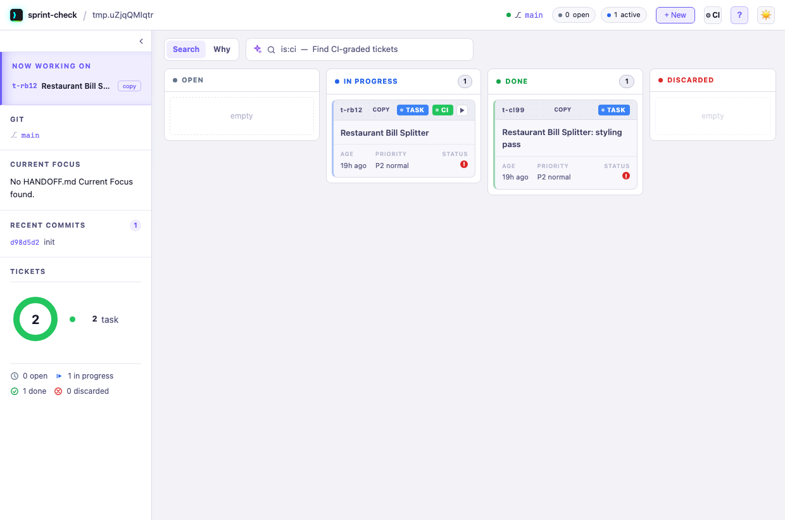
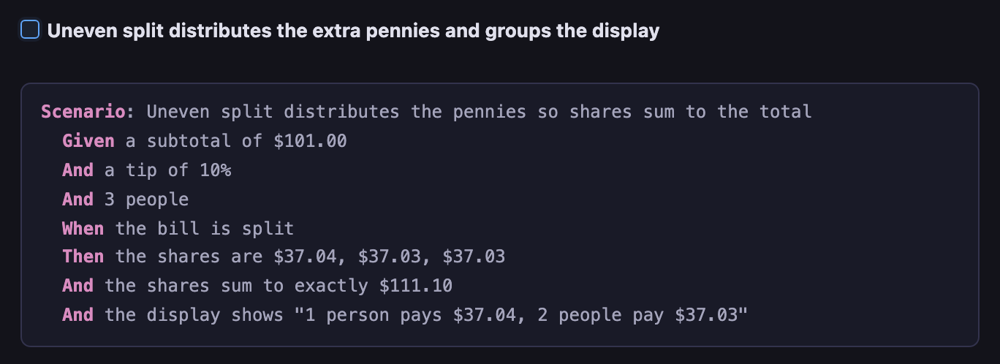
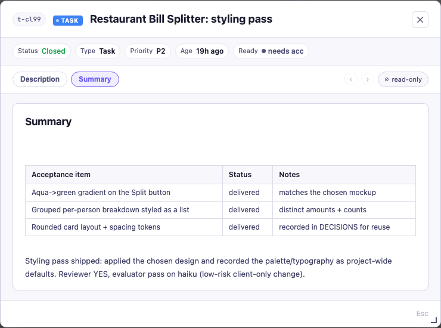
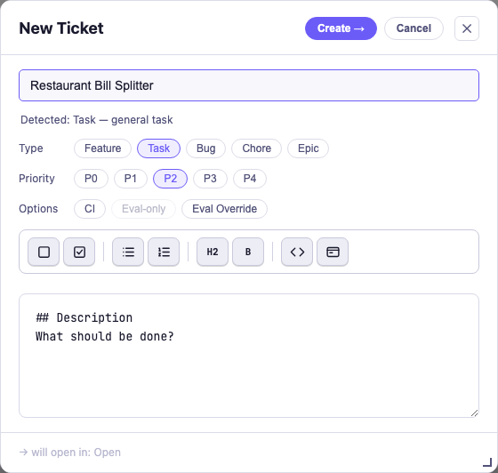
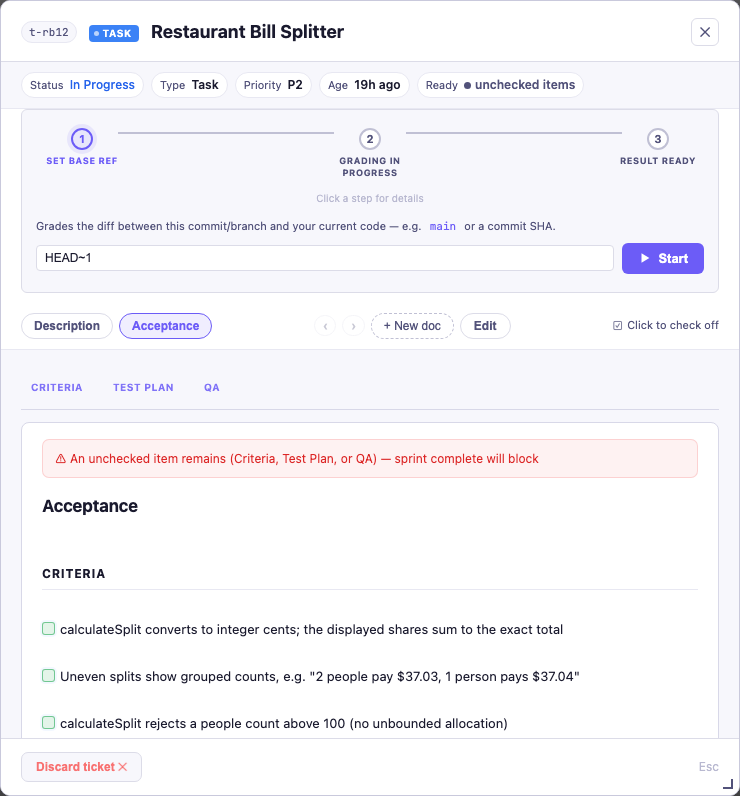
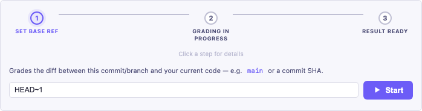

# Restaurant Bill Splitter Workshop Example

## Purpose

Use a restaurant bill-splitting app to demonstrate why agentic workflows need
explicit acceptance criteria and a fresh evaluator. The application should use
deterministic arithmetic; the evaluator should independently check whether the
implementation satisfies the numerical contract.

The teaching question is:

> Can a fresh evaluator detect plausible-looking but numerically incorrect code?

## Suggested app behavior

The app accepts:

- A subtotal in dollars and cents
- A tip percentage, defaulting to 10%, with 15% and 20% as additional choices
- A positive whole-number split count: 1, 2, 3, and so on

It displays the tip, total bill, and amount owed by each person.

The agent-generated acceptance criteria should include that the user can choose
the number of people splitting the bill and can choose a tip percentage. The
default tip is 10%; the other available choices are 15% and 20%.

The implementation must define its currency policy. The recommended policy is
to convert input to integer cents, calculate in cents, round the per-person
share to cents, and explicitly handle any remainder so the displayed shares sum
to the total bill.

## Before you start

You need canon installed and the board running:

1. Install canon and register the sprint skill in your project — see the **[setup guide](../../docs/setup.md)** (`skills.sh add sprint`).
2. Start the board in a terminal: `sprint-check` (macOS/Linux) or `sprint-check-win` (Windows). It opens `http://127.0.0.1:8423` — that's the board the screenshots below show.
3. Start your agent (Claude Code / Codex) in the project.

> The two walkthroughs below cover the same arc: **"Beginner-friendly workflow"** is the step-by-step path to follow; **"Suggested demonstration sequence"** is a condensed recap for instructors.

## Beginner-friendly workflow

1. Create a project folder named `RestaurantBillSplit` and open it in VS Code.
2. Initialize the Canon skills and sprint workflow as shown in the workshop. Also
   copy this example's own `.gitignore` into your project root — it keeps local
   install artifacts (`.claude/skills`, `.agents/`) out of git by default.
   Ticket docs and `HANDOFF.md` are deliberately *not* ignored here (unlike
   canon's own repo) — plain `git add`/`git commit` picks them up like any
   other project file, no separate force-add step to learn.
3. Create (or open) `AGENTS.md` in the project root and add this section, exactly as written:

   ```markdown
   ## Workshop Guidelines

   - Use vanilla HTML/CSS/JavaScript with no build step or external dependencies.
   - Support equal splits using subtotal, number of people, and exactly three tip options: 10% selected by default, with 15% and 20% as alternatives.
   - Do not add itemized splitting, tax, service charges, or persistence.
   - Keep bill calculations in an isolated deterministic function.
   - Do not start implementation or run `sprint complete` without explicit user approval.
   - Verification is manual by default; do not install test-automation frameworks or add a build step without asking. The one exception: a scenario-backed acceptance criterion (a Given/When/Then block) may carry a small **dependency-free** test — plain JavaScript run with `node`, no framework — that the agent generates to execute the scenario against the calculation function, with its command named in the Test Plan.
   ```

   This is project-local — it applies only inside this workshop folder, not to canon
   generally. Note what it deliberately does *not* say: nothing about input validation.
   That omission is intentional — asking for validation upfront would prevent the gap
   this workshop exists to demonstrate from ever appearing in Act 1.

4. Start a sprint with this prompt:

   `Create a Restaurant Bill Splitter app that runs in a browser.`

5. Let the agent generate its initial acceptance criteria and Test Plan. Review
   them, approve the plan, and allow the agent to implement the first version.

   Your board now shows the ticket — a `CI`-eligible card carries a green **CI** badge and a **▶** run button:

   

6. Open the implemented app and run the generated manual checks. The UI may
   appear to handle invalid input correctly because its parser functions guard
   the form fields. Now inspect the isolated `calculateSplit()` function: it
   assumes that callers have already provided valid values.

   Before moving on, check what the generated Test Plan actually tested. It's
   common for every case to use a subtotal and people count that divide evenly
   (for example, people = 4 with subtotals of 100, 110, 115, 120) — every one of
   those totals splits with no remainder. A fully-checked Test Plan built only
   from round, evenly-divisible inputs proves nothing about the remainder path:
   try a subtotal that doesn't divide evenly by the people count, such as $101
   split 3 ways, and check whether the displayed per-person amounts actually sum
   to the displayed total. This is the same author writing the code and picking
   its own test numbers — no incentive to reach for the input that would expose
   its own bug. That's what the fresh evaluator exists to catch independently.

   Try more than one non-evenly-divisible case, not just one, and compare the
   *display format* between them — not just the numbers. When shares differ,
   the app should show each distinct amount and how many people pay it, for
   example "1 person pays $37.04, 2 people pay $37.03" — not a single averaged
   "Per person: $X" line. It's possible for this to work for some inputs and
   silently fall back to a flat, incorrect average for others, if the grouped
   display only triggers under some condition rather than unconditionally
   whenever shares aren't identical. Testing only one case can hide that
   inconsistency; testing two or three different remainders exposes it.
7. Fix the remainder gap right now, before looking at anything else. Open
   **Acceptance**, and check the existing criteria for the per-person output —
   this is usually a wording problem, not a missing criterion. It's common for
   the generated text to say something like "per-person share (total / people)"
   — that's not vague, it's *precise*, and it precisely describes the bug: a
   single value from plain division, with no mention of "shares" (plural),
   remainder handling, or summing to the total. A fresh evaluator grading that
   criterion as written would likely call it a pass, because the code
   faithfully does compute `total / people` — the criterion itself encodes the
   wrong model of correct behavior, not an absent one.

   Leave that existing criterion as it is. Add **one new criterion** underneath it — but instead
   of prose, write it as an executable **Given/When/Then scenario**. In the Acceptance editor,
   click the **Scenario** toolbar button and fill in the block with the exact expected numbers:

   ```gherkin
   Scenario: Uneven split distributes the pennies so shares sum to the total
     Given a subtotal of $101.00
     And a tip of 10%
     And 3 people
     When the bill is split
     Then the shares are $37.04, $37.03, $37.03
     And the shares sum to exactly $111.10
     And the display shows "1 person pays $37.04, 2 people pay $37.03"
   ```

   The board renders it as a highlighted panel under its checkbox — this is what a student sees on
   the **Acceptance** tab:

   

   An earlier draft of this workshop split the remainder rule into *two* prose criteria — one for the
   pennies-summing arithmetic, one for the grouped display — kept separate so a reviewer could tell
   which half failed, since a single prose criterion can only report "partial." An executable
   scenario removes that trade-off: when it fails, the runner names the exact `Then` step that didn't
   hold (e.g. "shares sum to 111.09, expected 111.10"), so one scenario stays precise about *what*
   broke. The concrete numbers are baked into the `Then` steps, so a wrong-but-plausible flat average
   has nowhere to hide. This doesn't retire the fresh evaluator — it still grades every other
   criterion by independent judgment; the scenario just makes *this* one deterministic, caught by the
   check and corroborated by the evaluator running it.
8. Add the other discovered requirement to the ticket: open **Acceptance**,
   choose **Edit**, add a new checkbox under **Criteria** for each, and save:

   `Calling calculateSplit() directly with an invalid subtotal or invalid people count must return a validation result and never produce NaN, Infinity, or a misleading calculation.`

   `The app and calculateSplit() must reject split counts above a defined maximum, such as 100, and must never allocate an unbounded number of shares.`

   This is subtle: normal UI testing may miss it because the UI validates first,
   while the fresh evaluator can inspect whether the deterministic function
   protects its own contract. The maximum also protects against excessive
   memory allocation or a browser freeze from a maliciously large people count.

   Check the UI parser too, not just the function: it likely enforces "positive"
   but not "at most the maximum." A fix that only guards `calculateSplit()` still
   leaves the UI's own front door unlocked — the second criterion says "the app
   *and* `calculateSplit()`" for exactly this reason. Both layers need the same
   cap; catching only one is a common, plausible-looking half-fix.
9. Ask the agent:

   `Update the plan and Test Plan for the requirements I just added. For the new remainder scenario, generate a small dependency-free test (plain JavaScript run with node, no framework) that executes its Given/When/Then against calculateSplit(), and put the exact command on the Test Plan line. Also add the validation and resource-limit criteria. Do not implement yet; wait for my approval.`

   You're no longer hand-writing the check — the agent generates the test *from the scenario*, and at
   `sprint complete` the fresh evaluator **runs** that command and grades on its exit code rather than
   reading the code and judging. That "run it, report the boolean" step is what makes the remainder
   bug impossible to wave past.

10. Review the updated plan, then reply:

    `Approve the updated plan. Do not implement yet.`

11. Run `sprint complete` before fixing the new requirements. The security
    reviewer should flag the unbounded share-allocation risk, and the fresh
    evaluator should fail the related criteria with code evidence.
12. Ask the agent to implement the approved validation and maximum-count
    changes, then manually rerun the original bill-splitting checks. Test the
    safe boundary, such as 100 people and then 101 people; do not enter an
    enormous value that could freeze the browser.
13. Run `sprint complete` again and confirm that the evaluator now passes.

    The ticket moves to the **DONE** lane and its **Summary** tab records what was delivered vs. planned:

    


> **Scenario criteria — prose vs. executable.** You just used one in step 7: the remainder rule
> written as an executable `Given/When/Then` scenario the evaluator *runs* (the Acceptance editor's
> **Scenario** and **Scenario from file** toolbar buttons author these). Most of this workshop's
> criteria stay *prose* — a numerical result a fresh evaluator judges — and that mix is the lesson:
> use a scenario where a machine can answer pass/fail deterministically, prose where independent
> judgment is what you want. To go deeper on the executable-spec pattern end to end, do the
> **[DSL spec workshop](../dsl-discount-spec/README.md)** next — same fail → fix → pass loop, built
> entirely around a spec.

## Separate the probabilistic and deterministic paths

The language model may interpret the user’s request, collect missing inputs,
and explain the result. It should not calculate the bill in free-form text.

This is what's commonly called **tool use** or **function calling**: the
model orchestrates and explains, but a deterministic function computes. The
alternative — the model generating the numeric answer itself as part of its
own text — is **probabilistic**: sampled token-by-token, capable of producing
a wrong number that reads as confident and correct, and not guaranteed to
repeat identically on the same inputs.

Put the arithmetic in ordinary application code or behind a calculator/tool
boundary. A suitable interface is:

```text
calculate_bill(subtotal_cents, tip_percent, split_count)
```

The function or tool should return structured data, for example:

```json
{
  "subtotal_cents": 10000,
  "tip_cents": 1500,
  "total_cents": 11500,
  "shares_cents": [5750, 5750]
}
```

The agent can then explain those returned values without changing them. The
calculation function and executable tests remain authoritative; the evaluator
is an independent review layer.

## Acceptance criteria

- A `$100.00` subtotal with a 15% tip and 2 people produces a `$115.00` total
  and `$57.50` per person.
- A `$100.00` subtotal with a 15% tip and 3 people produces a `$115.00` total.
  The app documents and consistently applies its cent-rounding/remainder policy
  for the three shares.
- A `$10.00` subtotal with a 15% tip and 3 people produces an `$11.50` total;
  the displayed shares contain two `$3.83` amounts and one `$3.84` amount, in
  a deterministic order, and sum exactly to `$11.50`.
- A split count of 1 produces one share equal to the full total.
- Split counts must be positive whole numbers; zero, negative, fractional, blank,
  and non-numeric values are rejected.
- The tip is applied exactly once to the subtotal.
- Displayed shares are currency values and sum to the displayed total under the
  documented rounding policy.
- The calculation does not rely on an LLM call to perform the arithmetic.

## Test cases for the evaluator

The acceptance test plan should include at least these cases:

| Subtotal | Tip | People | Expected total | Expected result |
|---:|---:|---:|---:|---|
| $100.00 | 15% | 1 | $115.00 | One share of $115.00 |
| $100.00 | 15% | 2 | $115.00 | Two shares of $57.50 |
| $100.00 | 15% | 3 | $115.00 | Three shares following the stated remainder policy |
| $10.00 | 15% | 3 | $11.50 | Two shares of $3.83 and one share of $3.84 |
| Direct `calculateSplit()` call with invalid input | — | — | Validation result | No `NaN`, `Infinity`, or misleading calculation |
| People count above maximum, such as 101 | — | — | Rejected | No unbounded share allocation |
| $0.00 | 15% | 2 | $0.00 | Two shares of $0.00 |
| $12.34 | 15% | 2 | Policy-defined | Shares sum to the displayed total |

## Suggested demonstration sequence

1. Ask the coding agent to build the app from the behavior and criteria above.
2. Run the app and perform the manual checks.
3. Inspect the deterministic function and add the direct-input and maximum-count criteria.
4. Ask the agent to update the plan and Test Plan, then approve the change.
5. Run the security review and evaluator before fixing the function; inspect their evidence.
6. Implement the approved validation and resource-limit changes, then rerun both gates.

## Example evaluator finding

The evaluator may report that the boundary criterion fails because
`calculateSplit()` assumes valid inputs and does not guard against invalid
values, even though the UI parser prevents those values during normal use. It
should cite the function and explain the contract gap. The security reviewer
may also flag the user-controlled loop that can allocate an unbounded shares
array. These are example findings, not guaranteed results; each reviewer grades
the implementation it actually finds.

## Session 2: headless CLI grading (optional, local, no CI)

Session 1 ran the reviewer, evaluator, and security-review gates
*interactively* — inside a live chat, as part of `sprint complete`. This session
shows those same gates can also run *non-interactively*, from a plain terminal.
This is the same mechanism a CI pipeline would run against a pull request (see
`docs/headless-ci.md`) — here you run it locally, so no GitHub repository,
Actions workflow, or per-student API secret is needed. Your already-authenticated
local `claude` CLI is enough.

The quickest path uses `sprint-headless-eval` — one spec file, one command, one
verdict. A full three-gate ceremony using `sprint-headless` (reviewer + evaluator
+ security-review against a real ticket) is shown further below for completeness.

### Quick path: board-centric eval

Create a ticket from the board, add acceptance criteria via the UI, then grade
the existing code headlessly — no hand-written spec file, no plan approval, no
full sprint ceremony. This is the lowest-friction way to demonstrate the
fail → fix → pass cycle using `sprint-headless-eval`.

**Starting state:** Session 1's code is committed and working (the bill splitter
with remainder handling). The `calculateSplit()` function does *not* yet enforce
an upper limit on the people count — that gap is what this session exposes.

> **Git terms used below:**
> - `main` — the default branch; think of it as "the last known-good version."
> - `commit` — a saved snapshot of your project's files, like a checkpoint.
> - `HEAD` — whatever commit you're currently on (your latest checkpoint).

1. Open the board (`sprint-check`) and click **+ New**. Fill in the form:

   - **Title:** `Guard against upper limits in app & calculateSplit() function.`
   - **Type:** Task
   - **Priority:** P2
   - Toggle **CI** on (this marks the ticket for headless grading)

   

   Click **Create →**. The ticket appears on the board as a new card.

2. On the ticket detail, click **+ New doc** → **Acceptance**. In the editor,
   add one criterion and one test plan item:

   ```markdown
   ## Criteria

   - [ ] The app and calculateSplit() must reject split counts above a defined
     maximum, such as 100, and must never allocate an unbounded number of shares.

   ## Test Plan

   - [ ] Calling calculateSplit() with people = 101 returns a validation error
     and does not allocate a 101-element shares array
   ```

   Click **Save**. The board indicator changes from `● incomplete` to
   `● needs acc` or `● ready` once both sections have checklist items.

   The ticket's **Acceptance** tab renders the criteria as a checklist (the CI grading panel sits at the top of the ticket):

   


3. Commit the ticket so the evaluator can read it:

   ```bash
   git add -f .tickets/
   git commit -m "Add upper-limit acceptance criterion"
   ```

   Or in the chat: *"Commit the current staged files."* — the agent will
   pick an appropriate commit message automatically.

4. Grade the code as it stands — the function has no max-count guard yet:

   ```bash
   sprint-headless-eval <id>
   ```

   (Replace `<id>` with your ticket ID, e.g. `t-a1b2`.) Passing the ticket id
   grades that ticket's `.tickets/<id>/acceptance.md` and writes `eval-report.md`
   back into the ticket folder. `--base-ref` defaults to `origin/main` (then
   `main`) — the mainline your change is compared against — so you don't need to
   pass it locally; add `--base-ref <ref>` to override.

   The evaluator inspects `calculateSplit()`, finds no upper-bound check, and
   reports `HEADLESS_VERDICT: FAIL` with `file:line` evidence citing the
   unguarded code. An `eval-report.md` appears in the ticket folder with
   per-criterion pass/fail verdicts.

   > You can also run this from the board: enter a base ref in the **Set base
   > ref** field on the ticket's CI panel and click **▶ Start**.

   


5. Switch to your chat agent and tell it to implement the fix:

   ```
   Implement the acceptance criteria in the open ticket — add a max split
   count of 100 to both calculateSplit() and the UI. Commit when done.
   ```

   The agent reads `.tickets/<id>/acceptance.md`, sees the unchecked criterion,
   adds the guard to `calculateSplit()` (returning a validation error for
   `people > 100`) and updates the UI validator to reject values above 100.
   It commits the implementation.

6. Re-grade the same ticket:

   ```bash
   sprint-headless-eval <id>
   ```

   Confirm `HEADLESS_VERDICT: PASS` (exit 0). The evaluator now finds the
   guard in both `calculateSplit()` and the UI, and passes all criteria.

**What this demonstrated:**

- Creating a ticket and acceptance criteria entirely from the board UI.
- Using `sprint-headless-eval` to grade existing code against those criteria.
- The fail → implement → pass cycle: a fresh evaluator catches the gap, the
  chat agent fixes it, and the same evaluator confirms the fix.
- The same `acceptance.md` file serves double duty: the agent reads it to know
  what to build, and the evaluator reads it to know what to grade.

This path runs only the evaluator (~30–40k tokens). See `docs/headless-ci.md` →
"Lightweight Spec-Driven Gate" for the full reference and GitHub Actions recipe.

### Full three-gate ceremony (advanced)

If you want to replay all three gates (reviewer + evaluator + security-review)
against a real ticket — the same protocols the interactive `sprint complete`
used — use `sprint-headless`. This requires the ticket lifecycle to be set up.

> If you've used the sprint-check board's "Start grading" button on a `ci: true`
> card instead, this is the exact same flow — the button runs `sprint-headless`
> underneath, mapped to its own 3-step display: steps 1-2 below are "Set base
> ref", step 4 is "Grading in progress", and step 5 is "Result ready".

Prerequisites: the ticket from Session 1 is closed, its
`plan.md`/`acceptance.md` were approved, and the evaluator passed interactively.
Note that ticket's ID (for example `t-a1b2`) — you'll need it below.

1. Record the current commit as your base ref:

   ```
   git rev-parse HEAD
   ```

   Copy the SHA.

2. Mark the ticket CI-eligible:

   ```
   tkt ci <your-ticket-id> on
   ```

   This flips `ci: true` in the ticket's frontmatter and commits the ticket's
   docs itself (`git add -f .tickets/<your-ticket-id>/` + a commit).

3. Introduce the bug and commit:

   ```
   git commit -am "chore: temporarily reintroduce remainder bug for grading demo"
   ```

4. Run full headless grading:

   ```
   sprint-headless <your-ticket-id> --base-ref <sha-from-step-1>
   ```

   This dispatches fresh reviewer, evaluator, and security-review subagents
   against the diff. No code is written or edited; this call only grades.

5. Read the output. The full findings print to stdout, ending in exactly one
   line: `HEADLESS_VERDICT: PASS` or `HEADLESS_VERDICT: FAIL`. Exit code `0`
   means all three gates passed; `1` means a gate failed. Confirm the
   evaluator reports `fail:` on the remainder-sum criterion.

6. Revert the bug and rerun:

   ```
   git revert --no-edit HEAD
   sprint-headless <your-ticket-id> --base-ref <sha-from-step-1>
   ```

   Confirm all three gates pass and `HEADLESS_VERDICT: PASS` prints with
   exit code `0`.

The full ceremony costs ~100k+ tokens (three subagents) but provides advisory
reviewer findings and security-review coverage alongside the binding evaluator.

## Session 3 (GitHub Actions, instructor demo)

Sessions 1–2 ran the gate *interactively* or from a *local* terminal. This session wires the
**same** `sprint-headless-eval` gate into **GitHub Actions**, so opening a PR grades it
automatically and posts a **red ❌ / green ✓ check** on the PR. This is best run as an
instructor-led demo — it needs a repo secret and spends real API tokens per PR event, so most
students should stay on the local flow above.

> **The whole point:** the gate stops being something a human remembers to run and becomes a
> mechanical check on every PR. A change that violates an acceptance criterion gets a red check;
> fixing it turns the check green. With branch protection on, red **blocks the merge**.

### Prerequisites

- The app on a GitHub repo (public or private) with **Actions enabled**.
- An **`ANTHROPIC_API_KEY`** repo secret:
  ```bash
  gh secret set ANTHROPIC_API_KEY   # paste the key when prompted (never commit it)
  ```
- A committed spec file with the criteria to grade (reuse `specs/max-people.md` from Session 2).
- *(Optional, to actually block merges):* a branch-protection rule on `main` that requires the
  `grade` status check to pass.

### 1. Add the workflow (on `main`)

Commit `.github/workflows/canon-gate.yml`. This is the exact workflow used to produce the run
below — verified end to end:

> **Shortcut:** the sprint-check board's **⚙ CI** ("Set up CI gate") button writes a `canon-gate.yml`
> for you (from a shipped template; it refuses if one exists). Note it writes the **ticket-driven,
> gate-aware** version — it grades the canon ticket referenced in the PR body (`Closes: t-xxxx`),
> dispatching `sprint-headless-eval`/`sprint-headless` by the ticket's `gate`, and **skips** PRs that
> reference no ticket. This restaurant example is **spec-driven** (no canon ticket), so use the block
> below instead of the board-generated file. Either way you add the `ANTHROPIC_API_KEY` secret and push.

```yaml
name: canon gate

on:
  pull_request:
    types: [opened, synchronize, reopened]

jobs:
  grade:
    runs-on: ubuntu-latest
    steps:
      - name: Checkout the PR
        uses: actions/checkout@v4
        with:
          fetch-depth: 0            # full history — the gate diffs against the base SHA

      - name: Checkout canon
        uses: actions/checkout@v4
        with:
          repository: sunitghub/canon-skills
          path: canon

      - name: Add canon tools to PATH
        run: echo "$GITHUB_WORKSPACE/canon/tools" >> "$GITHUB_PATH"

      - name: Make canon skills resolvable to the gate
        run: |
          mkdir -p .claude
          ln -sfn "$GITHUB_WORKSPACE/canon/skills" .claude/skills

      - name: Install Claude Code CLI
        run: npm install -g @anthropic-ai/claude-code

      - name: Headless canon gate (spec-driven evaluator)
        run: sprint-headless-eval specs/max-people.md --base-ref "${{ github.event.pull_request.base.sha }}"
        env:
          ANTHROPIC_API_KEY: ${{ secrets.ANTHROPIC_API_KEY }}
```

Why it's built this way:
- **`fetch-depth: 0`** — the gate runs `git diff <base-sha> HEAD`; a shallow checkout has no base
  to diff against.
- **Two checkouts** — the PR being graded, plus canon itself (from the public `canon-skills`) so
  `sprint-headless-eval` and the evaluator protocol exist. `canon/tools` goes on `$GITHUB_PATH`;
  `.claude/skills` is symlinked to the checked-out `canon/skills` so the gate resolves
  `sprint/reference/eval.md`.
- **`--base-ref …base.sha`** — the PR's base commit is a guaranteed ancestor of the checked-out
  merge commit, so the diff is exactly the PR's changes.
- **`npm install -g @anthropic-ai/claude-code`** — installs the `claude` CLI the gate shells out
  to (a few seconds on `ubuntu-latest`; Node and `python3` are preinstalled).

### 2. Open a PR that violates the spec → watch it go red

Branch from `main`, make a change that breaks an existing criterion (e.g. delete the `people > 100`
cap), and open a PR. Actions runs the workflow automatically:

```bash
gh pr checks <pr-number> --watch     # or the PR's Checks tab
```

The evaluator reads the PR diff, sees the cap is gone, and the `grade` check fails —
`HEADLESS_VERDICT: FAIL`, exit 1, **red ❌**. (In a real run the evaluator even noted the cap was
*removed*, not just missing: *"the upper bound on people was deleted, not added."*)

### 3. Push the fix → green → merge

Restore the guard and push to the same branch. Actions re-runs on `synchronize`, the evaluator now
finds the cap short-circuiting before the loop, the `grade` check passes (**green ✓**), and — with
branch protection on — the merge button unlocks. Merge it; if the PR body had `Closes #<issue>`,
GitHub closes the linked issue.

### What to expect / notes

- A run takes ~2–3 minutes (checkout + `npm install` + one evaluator dispatch, ~30–40k tokens).
- **Model / cost control.** By default the evaluator runs on whatever model `claude` defaults to
  on the runner (Sonnet/Opus). To force a cheaper model, add `--model haiku` to the gate step
  (`sprint-headless-eval specs/max-people.md --base-ref … --model haiku`), or set
  `ANTHROPIC_MODEL: claude-haiku-4-5` in the step's `env:`. For the full `sprint-headless <ticket>`
  path, put `| Gate model: haiku` on the ticket's committed `plan.md` `## Sign-off` line — the same
  field the board's **Plan** tab Model dropdown edits — and headless honors it. The model applies to
  the dispatched evaluator subagent, not just the orchestrator. The verdict and `file:line` evidence
  print in the step log and the job summary.
- A harmless `Node.js 20 is deprecated … forced to run on Node.js 24` annotation may appear from
  `actions/checkout@v4` — it doesn't affect the gate.
- `sprint-headless-eval` grades the spec's criteria only. For the full reviewer + evaluator +
  security-review pipeline against a real ticket, swap in `sprint-headless <ticket-id> --base-ref …`
  (see `docs/headless-ci.md`) — heavier, and it needs the ticket committed via `tkt ci <id> on`.
- **No auto-waivers:** a criterion that genuinely can't be verified in CI correctly fails the run.
  Unblocking is human-only, outside CI — a dated waiver in `acceptance.md` plus a hand-edited
  `eval_override: true`. No `tkt` command or agent may flip that flag.

## Important limitation

A fresh evaluator is not automatically a mathematically reliable oracle. Vague
criteria such as “calculate the bill correctly” are insufficient. Concrete
input/output examples, invariants, and a rounding policy make numerical grading
auditable. For production financial behavior, executable tests and a trusted
calculation implementation should remain authoritative; the evaluator is an
additional independent review layer.
