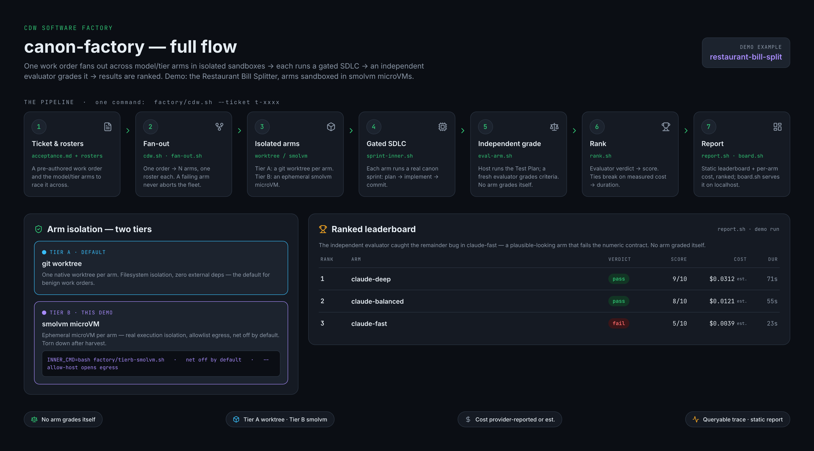
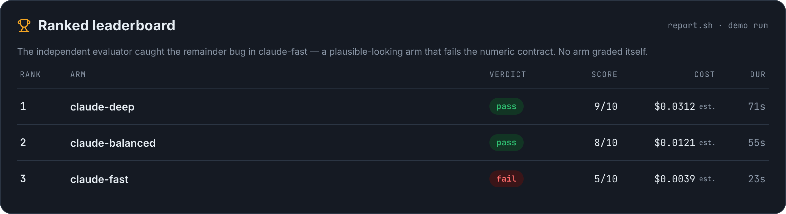
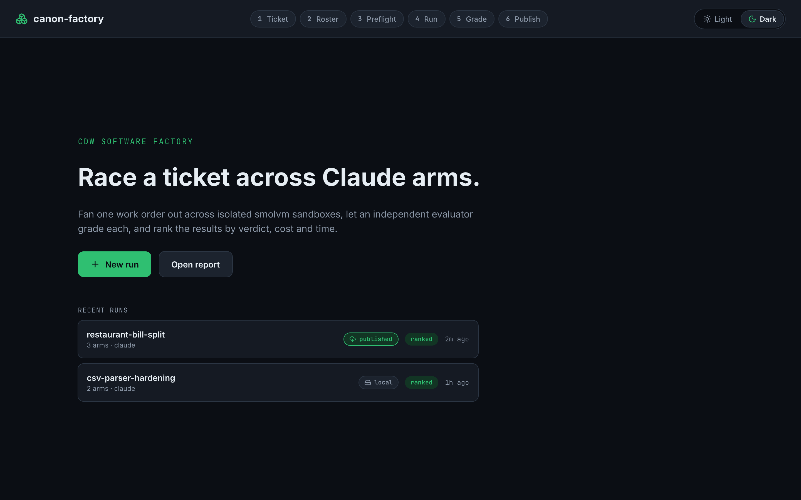
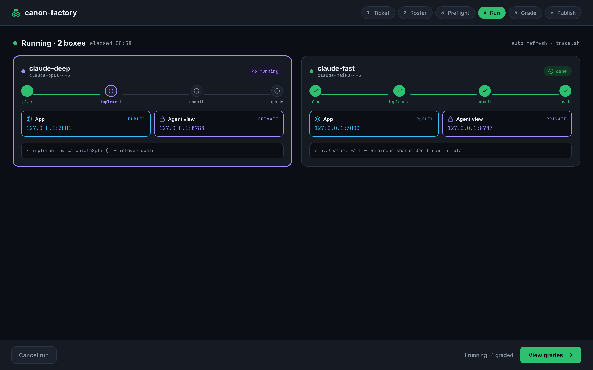
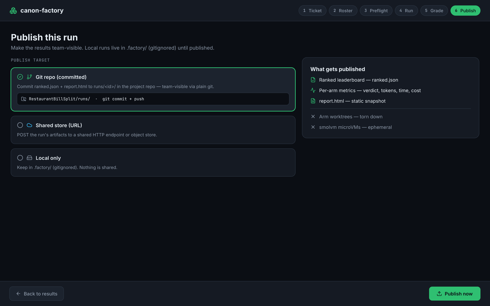

# Restaurant Bill Splitter — canon-factory full-flow demo

This walkthrough takes the same **Restaurant Bill Splitter** example from the
[README](README.md) and runs it through the **canon-factory** software factory end to end:
one work order **fans out** across several model/tier arms, each arm runs in an **isolated
sandbox** (Tier A git worktree, or a **smolvm** microVM for Tier B), an **independent
evaluator** grades every arm, and the results are **ranked** into a leaderboard.

Where the README demonstrates a *single* agent and the human-in-the-loop sprint, this demo
shows the **fleet**: many arms racing the same ticket, and a fresh grader deciding the winner —
so the remainder bug the workshop is built around becomes a *ranking signal*, not something you
have to hunt for by hand.



> **Why this example?** The bill splitter has a deterministic numeric contract (per-person
> shares must sum to the total, even when the split doesn't divide evenly). That makes it the
> perfect fan-out demo: a plausible-looking arm that uses flat `total / people` division will
> *look* right and still fail the contract — and the independent evaluator is what catches it.

---

## What you'll see

| Stage | Script | What happens |
|---|---|---|
| Ticket & rosters | `acceptance.md` + a roster file | A pre-authored work order + which model tiers to race. |
| Fan-out | `factory/cdw.sh` | One ticket → N arms, one roster each. A failing arm never aborts the fleet. |
| Isolated arms | `git worktree` / `factory/tierb-smolvm.sh` | Tier A: a worktree per arm. **Tier B: an ephemeral smolvm microVM.** |
| Gated SDLC | `factory/sprint-inner.sh` | Each arm runs a real canon sprint: plan → implement → commit. |
| Independent grade | `factory/eval-arm.sh` | Host runs the Test Plan; a **fresh** evaluator grades the criteria. No arm grades itself. |
| Rank | `factory/rank.sh` | Evaluator verdict → score; ties break on measured cost → duration. |
| Report | `factory/report.sh` / `factory/board.sh` | Static, ranked leaderboard with per-arm cost. |
| Publish | `factory/ui.sh` (Publish step) | Commit a run's `ranked.json`+`report.html` to `runs/<id>/` to share it (confirm-gated; never pushed). |

**Two ways to drive this:** the **CLI** (Steps 1–6 below), or the **Factory UI** wizard
(`factory/ui.sh` — see "Drive the whole flow from the Factory UI" at the end). Both run the same
pipeline; the UI is the click-through for demos.

---

## Prerequisites

1. **canon** and **canon-factory** checked out side by side. Run every `factory/…` command
   below from the root of your **canon-factory** checkout.
2. **A roster + a provider key.** The default `factory/rosters.conf` runs local `claude -p`
   arms. To race *paid* model tiers, use `factory/rosters.tiers.conf` (OpenAI-compatible) or —
   for an Anthropic-only shop — `factory/rosters.claude.conf`, and drop your key in the matching
   `.factory/*.key` file (e.g. `printf 'ANTHROPIC_API_KEY=sk-ant-…\n' > .factory/anthropic.key`).

   > 💸 **Spend:** `rosters.tiers.conf`, `rosters.zen-grades.conf` and `rosters.claude.conf` make
   > **real, paid API calls**, and the LLM-judge fallback also uses a paid (zero-retention) model
   > (~$0.0001/arm). `cdw.sh` prints the roster file and every selected arm *before* anything runs.
3. **smolvm** (only for the Tier B section):

   ```bash
   curl -sSL https://smolmachines.com/install.sh | bash
   ```

   On macOS you also need the one-time host deps `e2fsprogs` and `libepoxy`
   (see `Docs/Sandbox-Choices.md`).

---

## Step 1 — Author the ticket (the grading contract)

The strongest version of this demo dispatches a **pre-authored ticket** so every arm is graded
against the *same fixed criteria* — the factory re-installs those criteria before grading, so no
arm can quietly weaken its own contract.

Create a ticket in your canon-factory checkout and give it acceptance criteria that pin the
**remainder** behavior (the bug the workshop exists to expose):

```bash
tkt create "Restaurant Bill Splitter"      # prints a ticket id, e.g. t-abcd
```

Edit `.tickets/t-abcd/acceptance.md`. Keep the everyday behavior as prose criteria; make the
**correctness-critical** remainder criterion *scenario-backed* by nesting a Given/When/Then block
**directly under that criterion** — that is what turns it into a deterministic, exit-code check
instead of a prose reading:

````markdown
## Criteria
- [ ] Accepts a subtotal, a tip % (10% default; 15% and 20% offered), and a whole-number split count.
- [ ] Displays tip, total, and each person's share.
- [ ] Per-person shares are computed in integer cents and **sum exactly to the displayed total**,
      including when the bill does not divide evenly:
  ```gherkin
  Scenario: $101.00 split 3 ways, no tip
    Given a subtotal of 101.00 and 0% tip and 3 people
    When the bill is split
    Then the shares are 33.66, 33.66, 33.67 and sum to 101.00
  ```

## Test Plan
- [ ] manual: enter $101.00 / 0% / 3 people and confirm the displayed shares and their sum.
- [ ] `node dsl_runner.js specs/split.feature` exits 0 against the calculation function.
````

The scenario **backs** that third criterion — it is not a separate checklist item, and it does not
duplicate a prose version of the same rule. The evaluator grades that criterion by **running** the
scenario (reading the exit code); the first two criteria stay prose and are graded by reading / manual QA.

**Scenario-backing is optional.** canon ships no runner — a scenario-backed criterion needs a small
fixed-pattern `dsl_runner` (see `examples/dsl-discount-spec/`), its command named in the Test Plan, and
it must be locked at approval time (never authored alongside the code it checks). For a quick demo
without a runner, drop the Gherkin and write the same criterion as **precise prose** — the fresh
evaluator still catches the flat-division bug by reading it:

```markdown
- [ ] For $101.00 split 3 ways with no tip, the shares are $33.66, $33.66, $33.67 and sum to $101.00
      (integer-cent math; distinct shares shown when they differ — e.g. "1 person pays $33.67, 2 pay $33.66").
```

Either way, an arm that ships flat `total / people` division passes the first two criteria and
**fails** the remainder one — the gap the workshop exists to expose.

---

## Step 2 — Fan out across model tiers

One command dispatches the ticket to every arm in the roster, ranks the results, ingests the
trace, and writes the report:

```bash
# Anthropic-only shop: race Claude fast / balanced / deep
factory/cdw.sh --ticket t-abcd --rosters-file factory/rosters.claude.conf

# …or the generic OpenAI-compatible tiers
factory/cdw.sh --ticket t-abcd --rosters-file factory/rosters.tiers.conf
```

Each arm gets its **own git worktree** (Tier A isolation — filesystem, zero external deps), runs
the same work order, and never sees the other arms. A failing arm is recorded and skipped; it
never aborts the fleet.

Add `--rosters claude-fast,claude-deep` to race only a subset, or `--keep` to keep the arm
worktrees around for inspection.

### Race effort levels (same model, different depth)

Effort — Claude's `output_config.effort` (`max`/`xhigh`/`high`/`medium`/`low`) — controls how many
tokens the model spends thinking and acting. It's a **second axis**: `factory/rosters.claude-effort.conf`
races **one** model across effort levels, so the leaderboard answers "what's the cheapest effort that
still passes?"

```bash
factory/cdw.sh --ticket t-abcd --rosters-file factory/rosters.claude-effort.conf
```

Cost scales with it for free (the price map is keyed by model id, so higher effort → more tokens →
higher `est.` cost). Unset effort == the API default `high`; level availability varies by model
(`xhigh` = Opus 4.7+/Sonnet 5/Fable 5; `max` = 4.6+). To set effort on any roster line directly:
`bash factory/llm-messages.sh <model> --effort <level>`.

---

## Step 3 — Run the arms inside a smolvm microVM (Tier B)

Tier A is filesystem isolation, not execution isolation. When a work order needs **real
sandboxing** — untrusted execution, network egress control, a served port — opt an arm into
**Tier B**, which runs its work order inside an **ephemeral smolvm microVM** that is torn down
automatically afterward.

The Tier B adapter is `factory/tierb-smolvm.sh`, wired in as `run-arm.sh`'s `INNER_CMD`:

```bash
# One arm, executed inside an ephemeral microVM. Net is OFF by default.
INNER_CMD="bash factory/tierb-smolvm.sh" \
TIERB_VM_CMD="node dsl_runner.js specs/split.feature" \
  factory/run-arm.sh --ticket t-abcd --arm smolvm-verify --keep
```

Egress is **allowlist-only** — the microVM has *no* network unless you name the hosts it may
reach:

```bash
# Allow just the model endpoint, nothing else
INNER_CMD="bash factory/tierb-smolvm.sh" \
TIERB_ALLOW_HOSTS="api.anthropic.com" \
TIERB_VM_CMD="bash factory/llm-messages.sh claude-sonnet-4-5" \
  factory/run-arm.sh --ticket t-abcd --arm smolvm-claude
```

Key Tier B knobs (all optional):

| Env | Meaning |
|---|---|
| `TIERB_ALLOW_HOSTS` | CSV egress allowlist. Unset = **no network** (the default). |
| `TIERB_VM_CMD` | Command run inside the VM (receives the work order on stdin). |
| `TIERB_FROM` | A pre-baked `.smolmachine` artifact — the correct source for **net-off** arms (a registry image pull would itself need egress). |
| `TIERB_PORT` | Forward a guest port to `127.0.0.1` (for a served app / live URL). |
| `TIERB_TIMEOUT` | Max in-VM runtime (default `300s`). |

The microVM is a **foreground** run with no name and no `--detach`, so it is torn down on every
exit path — success, failure, or interrupt. Nothing leaks.

> To run the *whole fan-out* inside microVMs, point each roster line's command at
> `factory/tierb-smolvm.sh` (the roster command **is** the arm's `INNER_CMD`). For a demo, running
> one Tier B arm alongside the Tier A fleet is the clearest way to show the isolation boundary.

---

## Step 4 — Independent grading (the moat)

Grading is a **separate tier** from doing the work — that's what makes the leaderboard trustworthy.
For each arm, `factory/eval-arm.sh`:

1. Runs the arm's **Test Plan on the host** (so runtime behavior is real, not self-reported), then
2. Calls a **fresh evaluator** scoped to the ticket's `## Criteria` — with the criteria
   **re-installed** from your Step 1 ticket, so an arm can't grade itself against a weakened contract.

The combined verdict is *host-tests-not-fail* **AND** *fresh-gate PASS*. This is where the arm that
shipped flat `total / people` division gets caught: it passes the everyday criteria and **fails**
the remainder scenario — exactly the gap the workshop is about.

---

## Step 5 — The ranked leaderboard

`factory/rank.sh` turns each arm's evaluator verdict into a score and ranks the fleet. Equal scores
break on **measured cost**, then **duration**, then name — so a cheaper or faster arm wins a tie, and
ranking never depends on an arm's name. `cdw.sh` runs this for you and writes a self-contained static
HTML report.



Notice the **`est.`** markers on cost: Anthropic's API returns tokens but no dollar figure, so
cost for Claude arms is *estimated* from a dated price map and clearly flagged — never passed off
as a provider bill (provider-reported cost always wins when a provider returns one).

Open the report, or serve the live board on localhost:

```bash
# Static file written into the flow folder by cdw.sh
open .factory/fanouts/<fanout-id>/report.html

# …or serve the fleet board (127.0.0.1 only, no auth surface off-box)
factory/board.sh serve
```

---

## Step 6 — Read the fleet, don't babysit it

Every run and fan-out is ingested into a queryable trace. Read it instead of watching logs:

```bash
factory/trace.sh runs --limit 10     # recent arms: verdict, duration, tokens, cost
factory/trace.sh cost                # per-roster spend + latency rollup
factory/trace.sh sql "SELECT arm, eval_verdict, cost, cost_source FROM runs ORDER BY run_id DESC LIMIT 10"
```

---

## Drive the whole flow from the Factory UI (`factory/ui.sh`)

Prefer clicking to typing — or want a cleaner demo? `factory/ui.sh` serves the same pipeline as a
localhost wizard.

```bash
factory/ui.sh serve      # prints http://127.0.0.1:8788/ and a one-time token
```

It binds **127.0.0.1 only** (no off-box surface) and mints a **local token** that gates the
launch/publish actions — a blind cross-site POST is rejected. The wizard walks the same stages:



1. **Ticket** — point it at your repo and pick the bill-splitter ticket (with a criteria preview).
2. **Roster** — choose the Claude arms (`claude-fast`/`balanced`/`deep`) and, optionally, an **effort
   level per arm** (max/xhigh/high/medium/low; default = the roster's own). Paid arms are flagged. On
   launch the UI writes an ephemeral roster with your effort choices — no `.conf` editing, and the
   command body always comes from the known roster (a UI effort value can't inject a command).
3. **Preflight** — confirm what will launch.
4. **Run** — starts `cdw.sh` in the background and tracks status. Before spawning, it validates the
   ticket id + roster names against the known set (no request string ever becomes a command).



5. **Grade** — the ranked leaderboard, **read** from `rank.sh`/`trace.sh` — the UI computes no score
   of its own (the fresh evaluator remains the single binding grader). Toggle **Light/Dark** any time.

### Publish a run (share the results)

Local runs live in `.factory/` (gitignored). To make one team-visible, use the **Publish** step:



- Choose **Git repo (committed)** as the target.
- **Preview** shows exactly what will be written (`ranked.json` + `report.html`).
- **Confirm** copies them to `runs/<fanout-id>/` and does `git add`+`commit` — it **never `git push`es**
  (you push when you're ready). Other targets keep the run local.

> Live per-VM stage streaming (the App/Agent-view ports sketched on the Run screen) is a planned next
> increment; today the Run view polls coarse status from the trace.

---

## Demo talk track (≈5 minutes)

1. **Show the ticket** — point out the remainder scenario; it's the trap.
2. **Run it** — via `cdw.sh` (read the roster + arm list it prints *before* spending) or the
   `factory/ui.sh` wizard; let it fan out.
3. **Call out isolation** — each arm is its own worktree; show the Tier B microVM run and the
   net-off / allowlist egress.
4. **Land on the leaderboard** — the fast/cheap arm *looks* fine but the fresh evaluator failed it
   on the remainder contract. No arm graded itself.
5. **Close on cost + publish** — the `est.` markers (honest dated estimates for Claude arms; real
   provider cost when reported), then **Publish** the winning run to share it.

---

## Cleanup

```bash
# Arm worktrees/branches are tidied automatically unless you passed --keep:
git worktree prune
# smolvm microVMs are ephemeral and self-teardown; nothing to remove.
```

Outputs under `.worktrees/` and `.factory/` are gitignored. Keys live in `.factory/*.key`.
