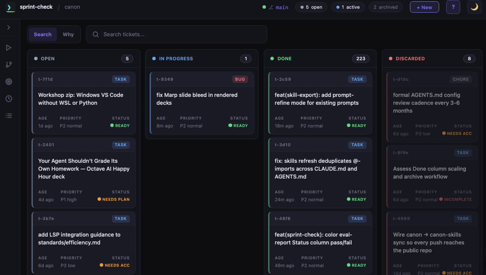
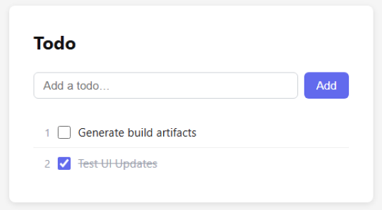

Context Hygiene

The hidden tax your agent pays before writing a single line of code

---

## You think you have this

200,000

tokens. Nice big window. Feels unlimited.

---

## One sentence, many tokens

Unbelievable.

What you type

  
Un | believable | .

  

    ~1
    ~1
    ~1
  

  This is an approximation: tokenizers split text into pieces, not characters, and the exact split depends on the model and input.

---

## The Model is stateless

No memory between turns. Every request resends the context it needs.

  

    
1

    
<strong style="color:#B2B8C4;">System prompt</strong> ~14k

  

  

    
2

    
<strong style="color:#F46600;">Conversation history</strong>

  

  

    
3

    
<strong style="color:#4FFF00;">Your new message</strong>

  

## The compounding tax

Turn 1

1×

Turn 5

3×

Turn 10

6×

Turn 20

degrades

---

## The fix: fresh context per phase

1 · Research

System Instructions

Instructions + Tools

/research_codebase

Task() × 3

Write()

→ research.md · HUMAN REVIEW

<svg width="28" height="20" viewBox="0 0 28 20"><path d="M2 10 L22 10" stroke="#6F7480" stroke-width="2" fill="none" stroke-linecap="round"/><path d="M16 4 L24 10 L16 16" stroke="#6F7480" stroke-width="2" fill="none" stroke-linecap="round" stroke-linejoin="round"/></svg>

2 · Planning

System Instructions

Instructions + Tools

/create_plan ./research.md

Read(research.md)

Task() × 3 · Write()

→ plan.md · HUMAN REVIEW

<svg width="28" height="20" viewBox="0 0 28 20"><path d="M2 10 L22 10" stroke="#6F7480" stroke-width="2" fill="none" stroke-linecap="round"/><path d="M16 4 L24 10 L16 16" stroke="#6F7480" stroke-width="2" fill="none" stroke-linecap="round" stroke-linejoin="round"/></svg>

3 · Implementation

System Instructions

Instructions + Tools

/implement_plan ./plan.md

Read() · Edit() · Write()

MultiEdit() · Task() · …

Ships ✓

---

## Where context bloat comes from

1

<strong style="font-size:0.82em;">Repeating things in full</strong>

If the agent repeats long text instead of pointing to the key part, that text gets paid for again later.

Fix: summarize and point to the key line.

2

<strong style="font-size:0.82em;">Unused tools</strong>

Tools that are loaded but not used still take up space and attention.

Fix: keep only the tools the task needs.

3

<strong style="font-size:0.82em;">Stuff outside the repo</strong>

Settings, memory, and imported notes can quietly add weight every session.

Fix: check what loads automatically.

4

<strong style="font-size:0.82em;">Reading the same thing twice</strong>

If the agent keeps going back to the same source, it burns time and context on repetition.

Fix: reference what was already read.

---

## Monitor what auto-loads

Connected tools

Claude Code: MCP servers and hooks. Claude Desktop: connectors and project tools. Keep only what the work needs.

Memory and long chats

Old context can quietly shape new answers. Trim stale memory, restart long chats, and keep reusable notes short.

Project instructions

Claude Code has <code>CLAUDE.md</code>; Desktop has project instructions and attached docs. Keep them short and current.

The pattern is the same in both products: auto-loaded instructions, tools, and memory can grow without you noticing.

Claude Code gives you more knobs; Desktop hides more of them.

---

## Agent guardrails

Rules a user or team can put in Claude Code's <code>CLAUDE.md</code> or Desktop project instructions

Don't do this

Read everything when you only need one part.

Search the whole project when a smaller area is enough.

Copy long files into the response instead of summarizing.

Do this instead

Ask for the specific line, section, or detail you need.

Limit searches to the relevant file or folder.

Cite what matters instead of repeating the full source.

---

## Audit your load

→Claude Code: run <code>/context-check</code> to list imported files and line counts

→Claude Code: size registered skills and always-loaded instructions

→Claude Desktop: review project instructions, attachments, connectors, and long chats

→Flags files where <strong>less than half</strong> the content is usually relevant

→Catches <strong>cross-file redundancy</strong> — same rule in two places

Run periodically. In Desktop, do the same review manually.

---

## Five rules for context hygiene

  

    
1

    
<strong>Keep it tight from the first turn</strong> — verbose output today is a tax on every future turn

  

  

    
2

    
<strong>Always-on vs on-demand</strong> — load sub-skills at the step that needs them, not at session start

  

  

    
3

    
<strong>Reference, don't repeat</strong> — point to the source instead of echoing content already in context

  

  

    
4

    
<strong>Keep tools on demand</strong> — don't load tools or skills "just in case"

  

  

    
5

    
<strong>Measure before optimizing</strong> — audit what is loaded before guessing what's bloated

  

---

## Hands-on: app development with an agentic harness

1

Sprint Tickets

Scope that survives the chat.

2

Kanban Board

Status you can inspect.

3

Close Gates

Proof before done.

4

Continuity

Resume with context intact.

Harness view

App result

Build, verify, close.

A practical workshop for shipping a small app with tickets, board state, close gates, and restartable sessions.

